## Foreword

This is the Business Edition of the AI PMO book. It is written for the people who
run projects and portfolios — PMO leads, project-controls and commercial managers,
and the executives they report to. Its promise is simple: for every capability AI
PMO provides, you will understand *what question it answers*, the *formula in plain
terms*, *why that method is the right one* (the standard behind it), and a *worked
example*. There is almost no code here; its companion, the Technical Edition,
covers how everything is built.

The book follows a deliberate arc. It opens with the problem AI PMO exists to solve
— the seam between the cost system and the schedule — and the discipline that keeps
the product in its lane. It then walks the **money story** end to end: earned value,
forecasting, revenue recognition, cash flow, margin, and change. From there it turns
to risk, issues and performance; to how the intelligence is made legible; and
finally to the standards and governance that keep every number defensible.

A note on the figures: worked examples use a synthetic demonstration portfolio, not
any real project or organisation.

## How to read this book

Each capability has a Business chapter here and a counterpart in the Technical
Edition; cross-references connect the two (for example, A5 ↔ B12). Chapters are
self-contained, but the money-story chapters (A5–A10) are best read in order, as
each builds on the last.

# Part I — Why AI PMO Exists

## The Problem AI PMO Solves

### The seam between the cost system and the schedule

*Business Edition · Chapter A1 — the opening chapter*

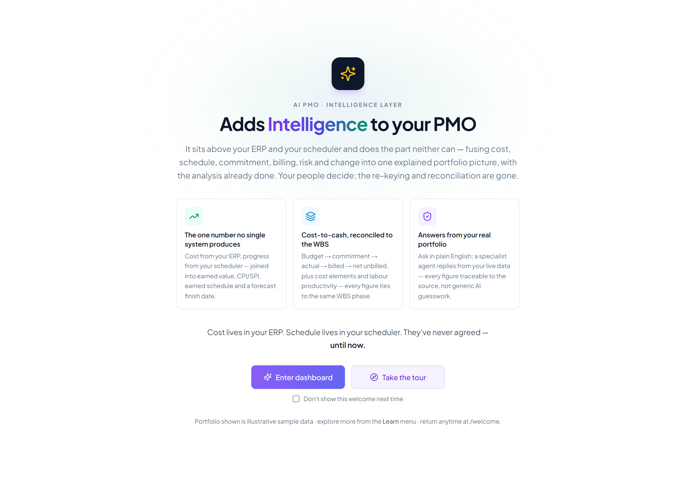

### Two systems of record, one project

Every large EPC contractor runs its projects on two authoritative systems that do
not talk to each other in the way the work demands.

On one side sits the **ERP — SAP Project System (PS)**: the system of record for
the **commercials** — the WBS, the budget, commitments and purchase orders, actual
cost, billing, and revenue recognition. It knows, to the cent, what the project
has cost and what it is owed.

On the other side sits the **scheduler — Primavera P6 or Microsoft Project**: the
system of record for **time** — the activity network, the logic, the critical
path, and physical progress. It knows when things happen and how far along they
are.

Both are excellent at their jobs. Neither, on its own, can tell you whether the
project is actually *healthy* — because health lives in the **combination**.

### The seam is where the answers live

The questions executives and project controls leads actually ask all sit across
the seam between cost and time:

- *Are we getting value for the money we've spent?* — needs cost (SAP) **and**
  progress (scheduler).
- *What will this finish at, and when?* — needs the cost run-rate **and** the
  schedule trajectory.
- *How much revenue can we book, and how much cash will it tie up?* — needs
  contract and cost **and** billing timing.
- *Is our risk and change exposure eroding the margin we sold?* — needs the
  commercial baseline **and** the live registers.

None of these can be answered inside either system alone. In most organisations
they are answered — slowly, monthly — by an analyst exporting both systems into a
spreadsheet, reconciling them by hand, and writing a narrative. That spreadsheet
*is* the missing layer. It is fragile, late, person-dependent, and invisible to
everyone but its author.

### What AI PMO is

AI PMO is that missing layer, built properly: an **AI-assisted PMO intelligence
layer** that sits across the SAP PS ↔ scheduler seam, joins the two systems on the
WBS code, and **synthesises** the answers — earned value, forecasts, revenue
recognition, cash flow, margin bridges, risk and change exposure — with a
plain-language narrative and recommendations on top.

It does not replace either system of record. It consumes their authoritative data
and produces the decision-grade synthesis neither can produce alone.

### What AI PMO is not

It is not an ERP and not a scheduler. It does not own the cost ledger, run the
critical-path engine, or store transactional truth. The discipline that keeps it
honest — covered in A4 — is that a capability belongs in AI PMO only if it is
**synthesised** from a system of record or **consumed** from a named source. The
moment it would need to *own* transactional data, it has left its lane.

### Why now

Two things make this layer buildable today that weren't a few years ago: the data
in SAP PS and the schedulers is now reliably accessible through modern APIs, and
large language models can turn reconciled numbers into the narrative and
recommendations that used to require a senior analyst. AI PMO is what you get when
you point those two capabilities at the seam that every EPC business already feels
but few have systematised.

The rest of the Business Edition walks the capabilities that layer provides —
starting with the money story (A5–A10), then risk, issues and performance
(A11–A13), how the intelligence is presented (A14–A16), and the justification and
governance that keep it disciplined (A17–A19).

## What belongs in AI PMO — scope, boundaries, and the capability map

*A capability chapter for the AI PMO book. It defines what the product is for, the single test that keeps it focused, and an honest map of EPC controls coverage — so every future "can we add X?" can be answered on principle rather than appetite.*

### The intent, in one paragraph

AI PMO is the **synthesis and decision layer** over a project's systems of record. It does not own transactional data. SAP PS owns cost, commitment, actuals, the WBS and revenue; the scheduler (Primavera P6 / Microsoft Project) owns activities, logic, dates and progress. AI PMO **reads both, joins them on the WBS code, and produces what neither can alone** — earned value, forecasting to EAC, variance and change narrative, risk and trend intelligence, recommendations, cross‑project roll‑ups, and the AI agents. Its value is being the analytical layer that a controls team would otherwise hand‑assemble over weeks. The day it becomes the place where people *do the work* — enter punch items, log incidents, sign inspection plans — it has stopped being AI PMO and started being a worse version of tools that already exist.

### The scope test

Every proposed capability must pass one test, and it is the same provenance model the product is built on. The capability must be either:

- **Synthesised** by AI PMO from data that already exists in a system of record, or
- **Consumed** from a named system of record (SAP, the scheduler, or another).

If a capability is *neither* synthesis *nor* attributable to a source system, it is scope creep. Tagging every data point with its `source_system` is not just provenance for the dashboard — it is the discipline that protects the product.

### Three buckets

Applying the test sorts any capability into one of three responses.

**1. Build it — synthesis (core AI PMO).** Reads SAP and/or the scheduler and produces analysis neither system gives you. This is where AI PMO should keep getting deeper: earned value and forecasting (done), the change & trend register (done), cash‑flow forecasting, and the schedule‑analytics frontier — critical path and float, schedule quality (DCMA‑style), and probabilistic P50/P80 finish. These deepen the spine without widening the footprint.

**2. Consume it — a read‑only connector (don't own).** The disciplines with **no home in SAP or the scheduler** — engineering deliverables, completions/turnover, HSE, quality — live in *specialist* systems (Aconex / ProjectWise, WinPCS / GoCompletions, Enablon / Intelex, a QMS). The right move is the **same integration pattern already built**: ingest a feed and synthesise it (fold deliverable % into progress and EV; surface HSE leading indicators and NCR counts on the dashboard). AI PMO stays the synthesis layer; the source of truth stays the specialist tool. This is the honest answer for any capability not covered by SAP or the scheduler — **make it a connector, not a module.**

**3. Don't own it — out of scope.** The scheduling *engine* itself (read P6's CPM output; never recalculate the network), the cost ledger (SAP), and above all **operational field workflow** — executing punch lists, HSE incident case management, inspection sign‑offs. Those need dedicated, often mobile, workflow tools. Consume a summary metric for reporting if it helps; never rebuild the workflow.

### The EPC capability map

| Controls discipline | Coverage | Disposition |
| --- | --- | --- |
| Cost control / earned value / forecast to EAC | Full | Core (built) |
| Change & trend, claims recovery | Trend register built | Core (built) |
| Risk & issues | Full (EMV, contingency, lifecycle) | Core (built) |
| Cash‑flow forecast | Gap | **Build — synthesis** |
| Schedule analytics (critical path, float, DCMA quality, P50/P80 finish) | Consumes dates / % only | **Build — synthesis** (highest‑value gap) |
| Progress measurement (rules of credit) | Task % drives EV | Build — synthesis |
| Procurement expediting (delivery vs need‑date) | Commitment only | Build — synthesis (SAP × scheduler join) |
| Engineering deliverables / document control | None | **Consume** (EDMS connector) |
| Completions / commissioning | Milestones only | **Consume** (completions‑system connector) |
| HSE incidents & indicators | Role only | **Consume** (EHS connector) |
| Quality (NCR, ITP) | Partial via issues | **Consume** (QMS connector) |
| Interface register | None | Thin register (no system; feeds schedule risk) |
| Construction field workflow (IWP execution) | — | **Out of scope** |
| Scheduling engine / cost ledger | Consumed | **Out of scope** (consume only) |

### The thin‑register exception

There is one justified exception to "don't own": a lightweight **register of record** is acceptable when (a) the organisation genuinely has *no* system for it, **and** (b) it directly feeds cost, schedule or risk synthesis. The **trend register** qualifies — most firms run trends in spreadsheets, and it feeds the forecast. The **interface register** would qualify — often spreadsheets, and it feeds schedule risk. HSE incidents and punch lists do **not** qualify: they have systems and they are operational. Hold that line.

### Why restraint is the product

The temptation with a gap analysis is to fill every gap until the tool does everything adequately and nothing exceptionally — at which point it competes with mature point solutions it cannot beat, and the one thing that made it valuable (the synthesis nobody else does) is buried under modules. So the honest answer to "what should be in AI PMO" is narrow on purpose: **the synthesis, a growing set of read‑only connectors to whatever the organisation already runs, and only the rare controls register that has no home and feeds the spine.** Everything else it consumes or ignores. That restraint is not a limitation of the product — it *is* the product.

## The EPC Project-Controls Capability Map

*Who owns what across SAP PS, the scheduler, AI PMO — and what still lives offline*

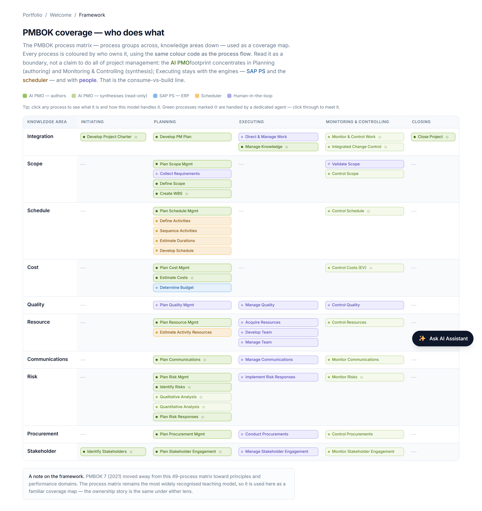

### Purpose

Most "where does AI PMO fit?" conversations stall because nobody has written
down the **whole** capability surface of an EPC project first. The PMBOK
knowledge areas are too generic; a single tool's brochure is too narrow. This
chapter lays out the full set of project-controls and delivery capabilities an
EPC organisation actually runs, and assigns each one to the system that should
own it:

- **SAP PS (ERP)** — the system of record for cost, commitment, revenue and the
  controlling structure.
- **Scheduler (Primavera P6 / MS Project)** — the system of record for time,
  logic and physical progress.
- **AI PMO** — the synthesis and decision layer that sits across the seam
  between the two and turns their data into earned value, forecasts, narrative
  and recommendations.
- **Offline** — capabilities no core system owns today; they live in specialist
  point tools or in spreadsheets. Flagging these honestly is the point of the
  exercise: it shows the integration frontier and stops AI PMO from quietly
  claiming work it does not do.

The map doubles as a scoping instrument. Every future "can we add X?" can be
answered by finding X on this map and reading off whether it is *owned*
elsewhere (so AI PMO **synthesises** or **consumes** it) or genuinely
*unowned* (so it stays offline, or — rarely — becomes a thin register).

### How to read the map

Each capability is marked in four columns.

**System-of-record markers (SAP PS, Scheduler):**

- **Owns** — authoritative source; the master record lives here.
- **Supports** — holds or handles part of the capability, but is not the master.
- **—** — not applicable.

**AI PMO role** (its discipline is never to own transactional data, only to act on it):

- **Synthesise** — derives intelligence (EV, forecast, variance, margin,
  narrative) from data already in a system of record. AI PMO owns the
  *computation*, never the inputs.
- **Consume** — reads a feed from a specialist system and presents or
  synthesises on top of it; the source of truth stays in that system.
- **Author→Book** — AI proposes (e.g., a scope-true WBS), a human approves, and
  it is *booked* into the system of record, which then owns it. The upstream
  bookend.
- **Register** — AI PMO owns a deliberately lightweight register, used **only**
  where no system exists *and* the data feeds cost/schedule/risk synthesis (the
  trend register is the canonical case). The narrow exception, not the rule.
- **—** — no role.

**Offline / specialist** — names the kind of point tool or manual method that
holds the capability today when no core system does.

> **A note on the SAP-vs-scheduler boundary.** SAP PS *can* hold networks and
> dates, and a scheduler *can* hold costs — but in mainstream EPC practice the
> cost/commercial system of record is SAP PS and the schedule system of record
> is P6 or MS Project, joined on the WBS code. This map assumes that common
> split. An organisation running SAP-only or scheduler-only shifts a few rows,
> but the AI PMO and Offline columns are unaffected.

---

### 1. Project structure & scope

| Capability | SAP PS | P6 / MSP | AI PMO | Offline / specialist |
| --- | --- | --- | --- | --- |
| Project definition & WBS (control structure) | **Owns** | — | Author→Book | — |
| Activity / schedule breakdown | — | **Owns** | — | — |
| Scope baseline / statement of work | Supports | — | Synthesise (scope-true WBS) | Contract & SoW documents |
| Scope-change identification | — | — | Synthesise (trend) | — |
| Deliverables / document register | — | — | Consume | EDMS (Aconex, ProjectWise, SharePoint) |

### 2. Estimating & budgeting

| Capability | SAP PS | P6 / MSP | AI PMO | Offline / specialist |
| --- | --- | --- | --- | --- |
| Conceptual / detailed estimate | — | — | — | Estimating tool (e.g. CCS Candy, spreadsheets) |
| Cost breakdown structure (CBS) | **Owns** | — | — | — |
| Approved budget baseline (BAC) | **Owns** | — | Synthesise (estimate→budget reconciliation) | — |
| Contingency / management reserve | Supports | — | Synthesise (risk-based sizing) | Risk tool |
| Cost loading of the WBS | **Owns** | — | — | — |

### 3. Planning & scheduling

| Capability | SAP PS | P6 / MSP | AI PMO | Offline / specialist |
| --- | --- | --- | --- | --- |
| CPM network / logic | — | **Owns** | — | — |
| Baseline schedule | — | **Owns** | — | — |
| Critical path & float analysis | — | **Owns** | Synthesise (read & flag) | — |
| Resource-loaded schedule | — | **Owns** | — | — |
| Schedule levelling | — | **Owns** | — | — |
| Progress measurement / rules of credit | — | Supports | Synthesise | Progress tool / spreadsheet |
| Schedule quality (DCMA 14-point) | — | — | Synthesise *(future)* | Acumen Fuse / spreadsheet |
| Quantitative schedule risk analysis (P50/P80) | — | Supports | Synthesise *(future)* | Safran Risk / Primavera Risk / @RISK |

### 4. Cost control

| Capability | SAP PS | P6 / MSP | AI PMO | Offline / specialist |
| --- | --- | --- | --- | --- |
| Commitments / PO tracking | **Owns** | — | Synthesise | — |
| Actual cost capture (FI/CO) | **Owns** | — | — | — |
| Accruals / cost-to-date | **Owns** | — | Synthesise | — |
| Cost by element / value category | **Owns** | — | Synthesise | — |
| Forecast cost (ETC / EAC) | Supports | — | **Synthesise (flagship)** | — |
| Cash-flow forecast & funding exposure | Supports | Supports | **Synthesise** | — |

### 5. Earned value management

| Capability | SAP PS | P6 / MSP | AI PMO | Offline / specialist |
| --- | --- | --- | --- | --- |
| PV / EV / AC | Supports (AC) | Supports (progress) | **Synthesise** | — |
| CPI / SPI & variances | — | — | **Synthesise** | — |
| Earned schedule (ES, SPI(t)) | — | — | Synthesise | — |
| Performance measurement baseline (PMB) | Supports | Supports | Synthesise | — |
| EV by WBS branch | — | — | Synthesise | — |

### 6. Progress & productivity

| Capability | SAP PS | P6 / MSP | AI PMO | Offline / specialist |
| --- | --- | --- | --- | --- |
| Physical / quantity progress | — | Supports | Synthesise | Quantity tracking / spreadsheet |
| Labour hours (actual) | **Owns** (CATS) | — | Synthesise | — |
| Productivity factors (PF) | — | — | Synthesise | Spreadsheet |
| Performance dashboards | — | — | Synthesise | — |

### 7. Change & trend management

| Capability | SAP PS | P6 / MSP | AI PMO | Offline / specialist |
| --- | --- | --- | --- | --- |
| Trend register | — | — | **Register** | (historically spreadsheet) |
| Change orders / variations (commercial) | **Owns** | — | Synthesise | — |
| Unfunded / absorbed change | Supports | — | Synthesise | — |
| Margin impact of change | — | — | Synthesise | — |
| Recovery confidence / revenue-at-risk | — | — | Synthesise | — |

### 8. Risk & opportunity management

| Capability | SAP PS | P6 / MSP | AI PMO | Offline / specialist |
| --- | --- | --- | --- | --- |
| Risk register | — | — | **Register** | Risk tool (Predict!, ARM) |
| Qualitative assessment (P×I) | — | — | Synthesise | Risk tool |
| Quantitative risk analysis (QRA / EMV) | — | — | Synthesise | @RISK / Safran |
| Risk-based contingency (P50/P80) | — | — | Synthesise | Risk tool |
| Mitigation actions & residual risk | — | — | Synthesise + Register | — |

### 9. Issues & actions

| Capability | SAP PS | P6 / MSP | AI PMO | Offline / specialist |
| --- | --- | --- | --- | --- |
| Issue log | — | — | **Register** | Spreadsheet |
| Action / commitment tracking | — | — | Register | Spreadsheet |
| Cross-party action assignment | — | — | Register | — |

### 10. Procurement & contracts

| Capability | SAP PS | P6 / MSP | AI PMO | Offline / specialist |
| --- | --- | --- | --- | --- |
| Purchase requisition / PO | **Owns** | — | Consume | — |
| Vendor master / management | **Owns** | — | — | — |
| Materials management / inventory | **Owns** (MM) | — | — | — |
| Expediting / delivery tracking | Supports | — | Consume | Expediting tool / spreadsheet |
| Subcontract administration | Supports | — | Synthesise | CLM / spreadsheet |
| Contract & claims management | Supports | — | Synthesise | Contract-lifecycle tool |

### 11. Revenue & commercial (Results Analysis)

| Capability | SAP PS | P6 / MSP | AI PMO | Offline / specialist |
| --- | --- | --- | --- | --- |
| Revenue recognition (IFRS 15 / cost-based POC) | **Owns** (RA) | — | Synthesise | — |
| Billing / invoicing / payment applications | **Owns** | — | Synthesise | — |
| WIP / contract asset & liability | **Owns** | — | Synthesise | — |
| Margin bridge (as-sold → as-built) | Supports | — | Synthesise | — |

### 12. Resource management

| Capability | SAP PS | P6 / MSP | AI PMO | Offline / specialist |
| --- | --- | --- | --- | --- |
| Resource demand (from schedule) | — | **Owns** | Synthesise | — |
| Resource actuals (timesheets) | **Owns** (CATS) | — | Synthesise | — |
| Resource levelling / availability | — | Owns | — | HR system / spreadsheet |
| Portfolio resource view | — | — | Synthesise | — |

### 13. Document & data management

| Capability | SAP PS | P6 / MSP | AI PMO | Offline / specialist |
| --- | --- | --- | --- | --- |
| Engineering deliverables register | — | — | Consume | EDMS (Aconex, ProjectWise, SharePoint) |
| Transmittals / RFIs / submittals | — | — | Consume | EDMS |
| Master data & numbering standards | Supports | — | — | EDMS / standards |

### 14. Quality (QA / QC)

| Capability | SAP PS | P6 / MSP | AI PMO | Offline / specialist |
| --- | --- | --- | --- | --- |
| ITP / inspection records | — | — | Consume | QMS / completions tool |
| NCR / corrective-action management | — | — | Consume | QMS |
| Quality dashboards | — | — | Synthesise (from feed) | QMS |

### 15. HSE / safety

| Capability | SAP PS | P6 / MSP | AI PMO | Offline / specialist |
| --- | --- | --- | --- | --- |
| Incident / near-miss management | — | — | Consume | HSE system (Enablon, Intelex) |
| Observations / permit-to-work | — | — | Consume | HSE system |
| Leading & lagging HSE metrics | — | — | Synthesise (from feed) | HSE system |

### 16. Interface & coordination management

| Capability | SAP PS | P6 / MSP | AI PMO | Offline / specialist |
| --- | --- | --- | --- | --- |
| Interface register | — | — | Register *(candidate)* | Spreadsheet / interface tool |
| Interface-point status & forecast | — | — | Synthesise | — |

### 17. Completions & handover

| Capability | SAP PS | P6 / MSP | AI PMO | Offline / specialist |
| --- | --- | --- | --- | --- |
| Systems / subsystems completion | — | — | Consume | Completions tool (WinPCS, GoCompletions) |
| Punch-list management | — | — | Consume | Completions tool |
| MC / RFSU / handover dossiers | — | — | Consume | Completions tool / EDMS |

### 18. Reporting, governance & stakeholder

| Capability | SAP PS | P6 / MSP | AI PMO | Offline / specialist |
| --- | --- | --- | --- | --- |
| Period status reports | — | — | **Synthesise** | — |
| Executive & portfolio dashboards | — | — | Synthesise | — |
| Stage-gate / governance reviews | Supports | — | Synthesise (narrative) | Governance documents |
| Stakeholder / communications register | — | — | Register *(candidate)* | Spreadsheet |
| Lessons learned / knowledge capture | — | — | Synthesise + Register | Spreadsheet / KM system |

### 19. Portfolio & multi-project

| Capability | SAP PS | P6 / MSP | AI PMO | Offline / specialist |
| --- | --- | --- | --- | --- |
| Portfolio cost / EV roll-up | — | — | **Synthesise** | — |
| Portfolio cash-flow & funding | — | — | Synthesise | — |
| Cross-project resource demand | — | — | Synthesise | — |
| Portfolio risk / change exposure | — | — | Synthesise | — |
| Benchmarking & trend analytics | — | — | Synthesise | — |

---

### What still lives offline — the gap list

The "Offline / specialist" column is the honest part of the map. Grouped by what
*should* happen to each item:

**A. Future "consume" connectors (a specialist system already owns it; AI PMO
should read its feed and synthesise on top).** This is the largest group and the
natural next integration frontier:

- Engineering deliverables / EDMS (Aconex, ProjectWise, SharePoint)
- Quality records — ITPs, NCRs, CARs (QMS)
- HSE — incidents, observations, permits (Enablon, Intelex)
- Completions & handover — systems completion, punch lists, MC/RFSU
- Expediting / delivery tracking
- Contract & claims management (contract-lifecycle tools)
- Schedule-risk and schedule-quality outputs (Safran/Primavera Risk, Acumen Fuse)

For all of these the rule holds: **AI PMO consumes, it does not own.** The
specialist tool remains the system of record; AI PMO adds the cross-discipline
synthesis (e.g. linking an open NCR or a slipping deliverable to the cost and
schedule impact those disciplines never see).

**B. Stay-offline / specialist engines (AI PMO uses the outputs, never replaces
the engine).** Some work is genuinely specialist and should remain so:

- Detailed estimating (estimating software)
- Quantitative cost/schedule risk *simulation* (Monte Carlo engines)

AI PMO consumes their results (an estimate basis, a P80 number) but building a
Monte Carlo engine or an estimating database would be scope creep.

**C. Thin-register candidates (no system exists, and the data feeds
cost/schedule/risk synthesis).** A small set qualifies for the narrow
"Register" exception — the same logic that justified the trend register:

- Interface register
- Stakeholder / communications register
- Lessons-learned capture

These are optional. AI PMO should only absorb them where the alternative is a
spreadsheet *and* the content drives downstream synthesis; otherwise they stay
offline.

### At a glance

Reading down the columns tells the story of the operating model:

- **SAP PS owns** the cost, commitment, revenue and structural records — the
  *what it cost and what we're owed* spine.
- **The scheduler owns** logic, dates, float and progress — the *when* spine.
- **AI PMO owns almost nothing transactional.** Its column is overwhelmingly
  **Synthesise**, with a single upstream **Author→Book** hook, a handful of
  **Consume** feeds, and a deliberately short list of thin **Registers**. That
  is the design working as intended: the value is in the synthesis across the
  seam, not in re-owning data the core systems already hold.
- **The Offline column is the roadmap.** Most of it is "consume later"; a little
  of it is "leave it to the specialists"; a sliver is "absorb as a thin
  register." Nothing on it is a reason to turn AI PMO into an ERP or a scheduler.

### How this map governs scope

This is the test, restated against the full surface: a capability belongs in AI
PMO only if it is **synthesised** from a system of record, **consumed** from a
named specialist system, or — rarely — held as a **thin register** because no
system exists and it feeds synthesis. Everything else is owned by SAP PS, owned
by the scheduler, or honestly marked offline until a connector earns its place.
The map keeps the product pointed at its actual job: making a dense, multi-system
EPC project legible and decision-ready, without pretending to be the systems
underneath it.

# Part II — The Money Story

## Earned Value, in Plain Terms

### The three numbers that say whether a project is really on track

*Business Edition · Chapter A5 — the flagship synthesis; pairs with the Technical Edition's earned-value library*

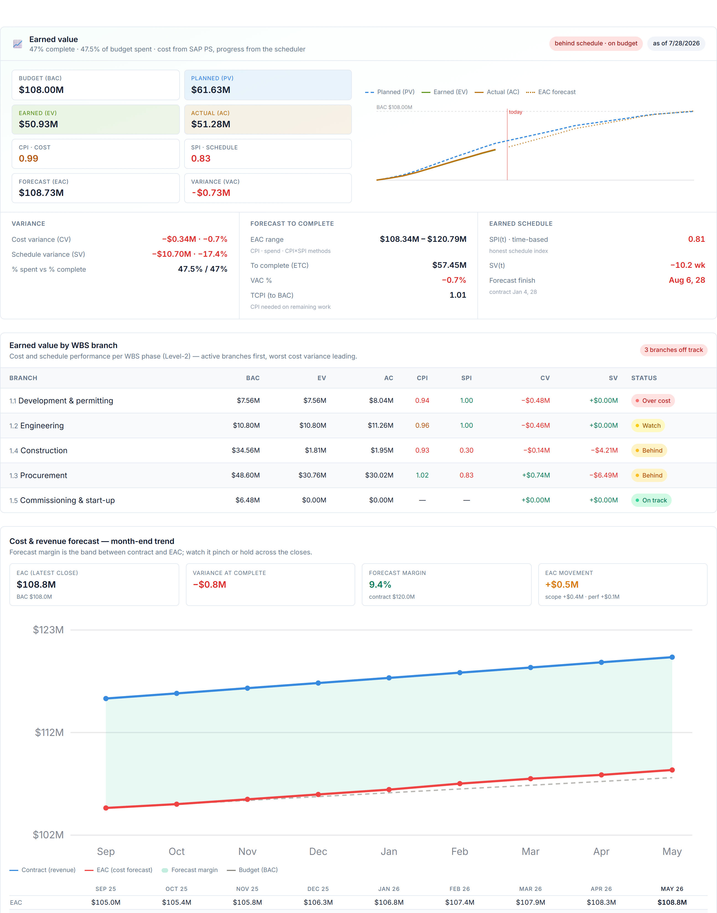

### The question this answers

"Are we on track?" usually gets answered with one of two half-truths: *"we've spent
60% of the budget"* (which says nothing about how much work that bought) or *"we're
60% done"* (which says nothing about what it cost). Earned value is the method that
puts the two together into one honest answer. It is AI PMO's flagship capability
because it is the purest example of synthesis across the seam: cost from SAP,
progress from the scheduler, judgement from neither alone.

### Three numbers

Earned value rests on three figures, all expressed in money:

- **Planned Value (PV)** — the budgeted cost of the work you *planned* to have done
  by now. The baseline.
- **Earned Value (EV)** — the budgeted cost of the work you have *actually* done.
  Physical progress, priced at budget. *This is the number neither system holds:*
  it comes from applying the scheduler's progress to SAP's budget.
- **Actual Cost (AC)** — what that work actually cost. From SAP.

The trick is that all three are in the same unit — budgeted dollars — so they can
be compared directly. EV is the pivot: it translates "how much work" into "how much
that work was worth," which is what lets cost and schedule finally be compared on
one scale.

### Two indices

From the three numbers come the two ratios that summarise health:

- **Cost Performance Index (CPI) = EV ÷ AC.** Above 1.0, the work is costing less
  than budgeted; below 1.0, more. *"For every dollar spent, how many dollars of
  work did we get?"*
- **Schedule Performance Index (SPI) = EV ÷ PV.** Above 1.0, ahead of plan; below,
  behind. *"How much of the planned work have we actually accomplished?"*

A CPI of 0.92 and an SPI of 0.96 is an instantly readable verdict: somewhat over
cost, slightly behind — and, importantly, a verdict a spreadsheet reconciliation
would have taken a week to produce.

### Earned schedule: time, in time units

Classic SPI has a known flaw — at the very end of a project it always drifts to 1.0
even if the job finishes late, because EV inevitably catches PV. **Earned schedule**
fixes this by measuring schedule performance in *time* rather than dollars: it asks
*at what past date was today's earned value the plan?* and reports the gap in weeks.
AI PMO computes it alongside SPI so the schedule read stays honest right through to
completion.

### Down to the WBS

A portfolio-level CPI hides as much as it reveals. AI PMO breaks earned value down
to each WBS branch, so "the project is at 0.92" becomes "engineering is fine,
procurement is carrying the overrun" — turning a headline into an actionable
location. The same synthesis runs up to the portfolio and down to the branch.

### Why this matters

Earned value is the one number that cannot be gamed by looking at cost or schedule
alone, and it is the foundation the rest of the money story builds on: the forecast
(A6) extrapolates it, variance analysis (A13) reads its gaps, and revenue
recognition (A7) deliberately stands apart from it. It is the difference between
*reporting activity* and *measuring performance.*

### A worked example

Illustratively, mid-project: planned to have completed $100M of work (PV), actually
completed $96M (EV), and spent $104M to do it (AC).

- **SPI = 96 ÷ 100 = 0.96** — 4% behind plan.
- **CPI = 96 ÷ 104 = 0.92** — getting 92 cents of work per dollar spent; 8% over.
- Read together: the project is modestly behind and meaningfully over cost — a
  cost problem more than a schedule one, which points the response at productivity
  and rates, not just sequence.

### How AI PMO implements it

This is synthesis in its clearest form. AI PMO takes the budget and actual cost
from SAP PS and the physical progress from the scheduler, joins them on the WBS
code, and computes PV/EV/AC, CPI/SPI, earned schedule, and the per-branch
breakdown — rolling up to the portfolio and down to the WBS. It owns none of the
inputs; the entire value is in the join and the computation neither system performs
on its own.

### What it does not do

It does not set the budget, record the cost, or measure the physical progress —
those are SAP's and the scheduler's. It computes the one number that requires both.

---

*Cross-reference: implemented in the Technical Edition's earned-value library
(PV/EV/AC; CPI = EV/AC; SPI = EV/PV; earned schedule; per-WBS rollup). The
foundation for A6 (Forecasting), A13 (Variance), and the counterpoint to A7
(Revenue recognition).*

## Forecasting cost & revenue to EAC — the monthly cycle

*A capability chapter for the AI PMO book. Covers how cost and revenue are forecast month over month to determine the Estimate at Complete, why the process is structured the way it is, and how AI PMO implements it.*

### The question the cycle answers

Every month a project must answer one question honestly: *given what we now know, what will this cost to finish, what will we be paid, and what margin will we land?* The Estimate at Complete (EAC) is the cost half of that answer, recognised revenue is the income half, and the difference is the forecast margin. Doing this well, on a fixed cadence, is the single most important discipline in project controls — because the absolute number matters less than **how it moves, and why.**

### The core identity

EAC is not a calculation, it is a **re‑forecast**:

> **EAC = actual cost to date (AC) + estimate to complete (ETC)**

The actuals are a fact from the ledger. All the judgement sits in the ETC — the forward look. The monthly job is to refresh the actuals and the progress, then **re‑estimate the ETC**, and read off the EAC, the variance at complete (VAC = BAC − EAC), and the trend versus last month.

### Forecasting the ETC

Two registers of method are used together:

- **Bottom‑up re‑estimate (the authoritative forecast).** Cost engineers re‑estimate the remaining work package by package — remaining quantities at current rates, open commitments still to run off, and an allowance for scope not yet committed. This is the EAC of record because it reflects what the delivery team actually knows.
- **Earned‑value formulaic EAC (the check, not the forecast).** Three quick extrapolations bracket the bottom‑up number:
  - `EAC = BAC ÷ CPI` — today's cost efficiency continues (typical),
  - `EAC = AC + (BAC − EV)` — the remainder runs at plan (optimistic),
  - `EAC = AC + (BAC − EV) ÷ (CPI × SPI)` — both cost and schedule pressure persist (pessimistic).

If the bottom‑up EAC falls outside the bracket the formulas produce, someone is being optimistic — that is the signal to challenge it. The reality test is the **To‑Complete Performance Index**:

> **TCPI = (BAC − EV) ÷ (EAC − AC)**

— the cost efficiency the *remaining* work must achieve to hit the chosen EAC. If the TCPI is well above the run‑rate CPI, the forecast is not credible and the EAC should move up.

### The monthly cycle

A disciplined period close runs in this order:

1. **Cut‑off and capture.** Freeze a date; pull actuals (cost ledger), open commitments (purchase orders), and physical progress (percent complete, installed quantities, timesheets).
2. **Update earned value.** EV = percent complete × BAC, per WBS.
3. **Re‑forecast the ETC.** Bottom‑up on the live and material packages, formulaic elsewhere; fold in open trends, absorbed cost, escalation, and any contingency drawdown.
4. **Roll up the cost forecast.** EAC = AC + ETC; VAC = BAC − EAC; run the TCPI sanity check.
5. **Forecast revenue** (below).
6. **Margin and bridge.** Forecast margin = forecast revenue − EAC; reconcile as‑sold → as‑built.
7. **Variance / trend review.** The heart of the close: explain *why the EAC and recognised revenue moved this month versus last*. That movement, with causes, is the real output — not the absolute figure.
8. **Forecast sign‑off and governance.** The monthly cost review challenges and approves the forecast.

### The revenue forecast

On lump‑sum EPC, revenue is recognised **over time by percentage of completion**, and it follows the cost forecast rather than running independently:

- **POC** is cost‑based — `AC ÷ EAC` — or measured from physical progress.
- **Recognised revenue = POC × (contract value + approved variations + probable claims)**, with claims constrained under IFRS 15 until recovery is *highly probable*.
- **Forecast revenue at complete** = the contract value plus approved and probable changes — exactly the funded / at‑risk split a trend register produces.

Each month the *incremental* revenue is recognised and reconciled to billing; the gap is work in progress (under‑billed) or deferred revenue (over‑billed).

### One physical‑progress spine

The crucial discipline is that cost and revenue are **not** forecast independently. They reconcile through the same physical progress:

> progress → earned value → EV/EAC → cost‑based POC → recognised revenue → revenue − EAC = forecast margin.

If the cost POC and the revenue POC run off different progress, margin drifts and the forecast loses integrity. One spine, two readings.

### The control output: EAC movement

Because the absolute EAC matters less than its motion, the monthly deliverable is the **EAC movement** — the change versus the prior close, decomposed into its causes. The simplest useful decomposition splits the period's EAC change into:

- a **scope** component — budget growth from approved changes, and
- a **cost‑performance** component — the residual run‑rate efficiency shift.

A rising EAC driven by *scope* is recoverable (it should be matched by a contract increase); a rising EAC driven by *performance* is margin erosion and demands action. Naming which is which, every month, is what turns a forecast into a control.

### How AI PMO implements it

AI PMO keeps a **month‑end forecast snapshot** per project — BAC, EV, AC, the re‑forecast EAC / ETC / VAC and CPI / SPI, plus the revenue side (contract value, cost‑based POC, recognised revenue, billed, forecast margin). From that series it derives, with no extra entry:

- a **cost‑and‑revenue trend** — budget, EAC, contract, and recognised revenue plotted across the closes, so the forecast is seen *moving*, not just standing;
- the **EAC‑movement decomposition** for the latest close — how much of the change is scope versus cost performance;
- a reconciliation back to the **trend register** (funded changes lift the contract, absorbed cost lifts the EAC) and to the **margin bridge** (as‑sold → as‑built).

The same snapshots roll up to the portfolio, so the question "is our forecast getting better or worse, and why?" can be answered for every project at once.

### Why it matters

1. **It catches erosion early.** A forecast that only updates the absolute EAC hides the story; decomposing the monthly movement surfaces margin erosion while there is still time to act.
2. **It keeps revenue honest.** Recognising cost when foreseen and revenue only when probable produces an EAC and a recognised‑revenue position that survive audit, instead of an optimistic one that unwinds at handover.
3. **It ties cost and revenue to one truth.** Running both off the same physical progress means the margin you forecast is the margin you can defend — and the bridge from as‑sold to as‑built is complete and explainable.

## Revenue Recognition

### How AI PMO decides what you've actually earned (IFRS 15 / Results Analysis)

*Business Edition · Chapter A7 — pairs with the Technical Edition's results-analysis library*

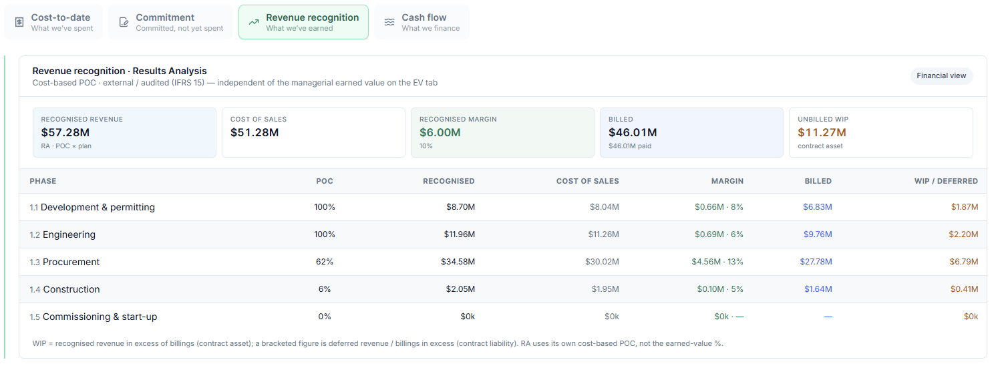

### The question this answers

A project can have spent a great deal of money, invoiced the client for a great
deal more, and still not be able to put either of those numbers in the profit
and loss account as revenue. **Revenue recognition** answers a precise,
audited question: *of this contract, how much revenue have we earned to date —
and therefore how much profit can we book?*

It is one of the three money questions AI PMO keeps deliberately separate:

- **Earned value** (Chapter A5) — how much *work* have we accomplished, for
  performance management?
- **Forecasting to EAC** (Chapter A6) — what will the job *finish* at?
- **Revenue recognition** (this chapter) — how much can we *recognise in the
  accounts* right now?

This is the chapter that turns project progress into a number an auditor will
accept.

### Why recognition is not the same as earned value

This is the single most important idea in the chapter, and the reason it is a
chapter of its own rather than a footnote to earned value.

Earned value is a *managerial* measure. It uses physical or schedule-based
progress to tell a project manager whether the work is ahead or behind and over
or under cost. It is internal, fast, and tuned for control.

Revenue recognition is a *financial* measure. It feeds the audited statements,
so it must follow an accounting standard (IFRS 15), use a consistent and
defensible basis, and reconcile to the general ledger. It is external, formal,
and tuned for assurance.

The two can legitimately give different "percent complete" figures for the same
project on the same day, because they are measuring different things for
different audiences. A project that is 60% complete by physical progress might
recognise revenue at 71% on a cost basis. **Neither is wrong.** Treating them as
interchangeable is the classic error that AI PMO is built to avoid — which is
why the app labels the Results Analysis panel "independent of the managerial
earned value on the EV tab," and computes it from its own posted figures rather
than reusing the earned-value percentage.

### The method: cost-based percentage-of-completion

AI PMO recognises revenue **over time** using the **cost-based
percentage-of-completion (POC)** method — the same mechanism SAP exposes as
*Results Analysis*. In plain terms: you recognise revenue in proportion to the
cost you have incurred against the total cost you expect to incur.

The method works phase by phase (at the WBS level), then rolls up:

1. **Percentage of completion.** For each phase,
   *POC = actual cost to date ÷ planned (or expected) cost*, capped at 100%.
   This is purely cost-based and is computed independently of earned value.

2. **Planned revenue.** Each phase carries a share of the total contract value,
   set by its planned margin, and scaled so the phases sum to the full contract.

3. **Recognised revenue.** *Recognised = POC × planned revenue.* This is the
   revenue you may book for the phase to date.

4. **Cost of sales.** The actual cost incurred — what it cost to earn that
   recognised revenue.

5. **Recognised margin.** *Margin = recognised revenue − cost of sales*, with the
   margin percentage being margin ÷ recognised revenue.

Because recognition is driven by cost incurred, a phase that has spent 71% of
its expected cost recognises 71% of its planned revenue — regardless of how the
scheduler rates its physical progress.

### Three numbers, three questions

On a mature project AI PMO holds three different "value earned / value billed"
numbers at once, and the discipline is to never confuse them:

| Figure | Basis | Question it answers |
| --- | --- | --- |
| Earned value (EV $) | Physical / schedule progress × budget | How much work have we *done*? |
| Recognised revenue | Cost-based POC × contract (IFRS 15) | How much can we *book*? |
| Billed to date | Invoices raised against the contract | How much have we *asked the client to pay*? |

These rarely match, and the *gaps between them* are themselves the insight — as
the next section shows.

### The balance-sheet side: WIP versus deferred revenue

Recognition and billing run on different clocks. You recognise revenue as you
earn it; you bill it according to the contract's payment milestones. The
difference between the two lands on the balance sheet:

- **WIP — work in progress (a contract asset).** When you have *recognised more
  than you have billed*, the excess is revenue you have earned but not yet
  invoiced. It is an asset: the client owes it to you even though no invoice has
  gone out. *WIP = recognised revenue − billed* (when positive).

- **Deferred revenue (a contract liability).** When you have *billed more than you
  have recognised* — front-loaded or milestone billing ahead of the work — the
  excess is money received (or invoiced) for work not yet earned. It is a
  liability: you still owe the client the work. *Deferred = billed − recognised
  revenue* (when positive).

AI PMO computes both automatically per phase and for the project, so a commercial
lead can see at a glance whether the project is a net lender to the client
(carrying WIP) or has been paid ahead (carrying deferred revenue) — a direct
read on cash and on commercial risk.

### Why IFRS 15

IFRS 15 ("Revenue from Contracts with Customers") is the governing standard, and
the method above is its application to long-duration construction-type contracts.
The standard's logic, in brief: revenue is recognised as the entity satisfies a
**performance obligation**. For an EPC contract the obligation is typically
satisfied **over time** (the asset is built on the customer's site / to the
customer's control as it progresses), so revenue is recognised progressively
rather than all at completion. A cost-based input method — cost incurred relative
to total expected cost — is an accepted way to measure that progress.

Using a standard, rather than an internal rule of thumb, is what makes the number
audit-ready: it is consistent across projects, defensible to a reviewer, and
reconcilable to the ledger.

### A worked example

Take a project mid-execution, as AI PMO's Results Analysis panel would show it:

- **Recognised revenue: $387.9M** — cost-based POC applied across the phases.
- **Cost of sales: $351.3M** — actual cost incurred to earn it.
- **Recognised margin: $36.6M (9%)** — recognised revenue minus cost of sales.
- **Billed to date: $440.7M** — invoices raised against the contract.
- **Deferred revenue: $52.8M** — because billed ($440.7M) exceeds recognised
  ($387.9M), the $52.8M difference is a *contract liability*: the project has
  been paid ahead of the work it has earned.

The story the numbers tell: the job is recognising a thin 9% margin so far, and
— importantly — it is **billed ahead of recognition by $52.8M**. That is healthy
for cash (the client has funded work not yet earned) but it is a liability to
discharge: that revenue can only be booked as the remaining cost is incurred. A
controller reading this knows not to mistake the strong billing position for
booked profit.

Had the position been reversed — recognised exceeding billed — the same panel
would instead show **WIP / unbilled** (a contract asset), flagging revenue earned
but not yet invoiced, and a prompt to get the billing out.

### How AI PMO implements it

True to its operating model, AI PMO **synthesises** recognition from data that
lives in the system of record; it does not own the ledger.

- It reads the posted Results Analysis figures per WBS phase (POC, recognised
  revenue, cost of sales, recognised margin), the contract value, and the billing
  events.
- It rolls the phases up to a project position, computes the margin percentage,
  and derives WIP versus deferred from recognised-minus-billed.
- It keeps the figure **independent of earned value by construction** — the
  recognition POC is cost-based and computed separately, so the managerial and
  financial views can never silently contaminate each other.
- It surfaces the result in the Cost tab's Revenue-recognition lens and lets the
  Cost Controller agent reason across all three figures — earned value,
  recognised revenue, and billing — when it writes commentary.

The system of record for the posting stays in SAP (Results Analysis); AI PMO adds
the cross-phase synthesis, the WIP/deferred read, and the plain-language
interpretation.

### What it deliberately does not do

AI PMO does not *post* revenue, run the RA calculation inside the ledger, or
override the auditor's basis. It consumes the recognised figures and explains
them. Recognition policy, cut-off, and the formal posting remain finance's and
SAP's responsibility — AI PMO's job is to make the earned-versus-billed-versus-
recognised picture legible and to connect it back to cost, schedule and change,
which the ledger alone never shows.

---

*Cross-reference: the computation is implemented in the Technical Edition's
results-analysis library (cost-based POC per phase; WIP = recognised − billed
when positive, deferred = billed − recognised when positive). Pairs with A5
(Earned value) and A6 (Forecasting to EAC) to complete the money-story arc.*

## Cash Flow & Funding Exposure

### How much money a project ties up, when funding peaks, and when it turns cash-positive

*Business Edition · Chapter A8 — pairs with the Technical Edition's cash-flow library*

### The question this answers

Profit and cash are not the same thing, and on a long EPC contract they can move
in opposite directions for months at a time. A project can be recognising healthy
margin and still be haemorrhaging cash — because it pays its suppliers and labour
long before the client pays it. **Cash-flow forecasting** answers the treasury
question that margin never does: *how much of our own money will this project tie
up, when does that funding requirement peak, and when does the project finally
start paying for itself?*

This completes the money-story arc:

- **Earned value** (A5) — how much work have we done?
- **Forecasting to EAC** (A6) — what will it finish at?
- **Revenue recognition** (A7) — how much can we book?
- **Cash flow** (this chapter) — how much cash does it consume, and when?

### Cash is not cost, revenue, or earned value

It is worth being explicit, because this is a fourth distinct lens on the same
project:

- **Cost** is what you have *committed and consumed*.
- **Recognised revenue** is what you may *book* (an accounting event).
- **Earned value** is *progress* against budget.
- **Cash flow** is *actual money moving in and out of the bank* — and it moves on
  the contract's **payment terms**, not on when work is done or revenue is
  recognised.

The defining feature of construction cash flow is **timing**. You incur cost now,
pay it on your supplier terms, bill the client on milestones, and collect on
their terms — typically later. The lag between paying out and collecting in is
the whole story.

### The two curves

AI PMO models a project's cash position as two cumulative curves over time:

**Cash out — cumulative payments.** This is the project's cost curve (actual cost
to date, then ramping to the forecast cost at completion, EAC) **shifted later by
the payment lag** — because you pay a cost some weeks after you incur it. In the
model the default payment lag is one month.

**Cash in — cumulative collections.** This is the project's billing curve (billed
to date, then ramping toward the contract value) **shifted later by the
collection lag** — the time between raising an invoice and the client's cash
arriving. The default collection lag is two months, and the curve is taken **net
of retention** (see below).

Both curves ramp smoothly between the latest actuals and their end points, so the
forecast portion is a believable glide rather than a straight line.

### The funding gap is working capital you finance

The vertical distance between the two curves is the heart of the chart:

> **Net cash position = cumulative cash in − cumulative cash out.**

While cash out runs above cash in — which it does for most of an EPC project's
life — the **net is negative**, and that shaded gap is **working capital the
contractor is financing out of its own balance sheet or facilities.** It is real
money, with a real cost: every dollar of that gap is a dollar borrowed or a
dollar of the firm's cash not earning elsewhere.

This is why a profitable project can still be a cash problem: margin tells you the
job will end up ahead; the funding gap tells you how much you must carry to *get*
there.

### Peak funding requirement

The single most important number on the chart is the **peak funding need** — the
deepest point of the negative net, the maximum amount of cash the project will
ever have tied up at once, and *when* it occurs. This is the figure a treasurer
sizes facilities against and a finance director wants on one line: "this job will
need up to $X of funding, worst around month Y." AI PMO reads it straight off the
trough of the net curve.

### The cash-positive crossover

As the project winds down, billing and collections catch up to (and overtake)
spending, the net curve climbs back through zero, and the project becomes
**cash-positive** — from that month on it is returning cash rather than consuming
it. AI PMO reports the crossover month. The shape — deep early funding, late
recovery — is the classic EPC cash curve, and seeing the crossover date lets a
business plan when the project stops being a drain on group cash.

### Retention

Construction contracts almost always withhold **retention** — a percentage of
each payment (the model uses 5%) held back by the client until completion or the
end of the defects period. It matters to cash because it is money you have earned
and billed but will **not collect until the very end**. AI PMO models the
collectible cash-in net of retention, so the cash-positive point and the peak
funding both reflect the cash you can actually expect — not the headline billing.

### A worked example

A project mid-build, as AI PMO's funding-exposure chart would show it:

- **Net cash position: −$77.6M** to date — the project is currently carrying
  $77.6M of working capital.
- **Peak funding need: −$91.7M, around March** — the deepest the hole gets; the
  firm must be able to fund roughly $92M at the worst point.
- **Cash-positive: June** — the forecast month the net crosses back above zero
  and the project starts returning cash.
- **Terms (assumed): collect 2 months / pay 1 month · 5% retention** — the levers
  behind the curves.

The story: this job consumes up to ~$92M of cash before it turns the corner in
June. That is not a margin problem — it is a *funding* problem, and it is exactly
the number that should be agreed with treasury before the project, not discovered
during it. It also points straight at the levers: pull the collection lag in by a
month, or de-front-load the retention, and the peak shrinks.

### The portfolio view

A single project's funding need is useful; the **portfolio's** is decisive,
because peaks that are survivable one at a time can collide. AI PMO rolls every
active project's cash curve onto one shared monthly timeline (a project
contributes nothing before it starts and its final position after it finishes)
to produce the whole book's funding shape — total working capital tied up, the
**portfolio** peak funding requirement and when it lands, and the aggregate
cash-positive crossover. It drills the same number down to segment and then to a
single project, so a treasurer can see not just *how much* funding the portfolio
needs but *which* projects and segments are driving the peak.

### How AI PMO implements it

Cash flow is pure **synthesis** — it introduces no new data and owns no ledger.

- It derives the two curves from data already present: the cost/EAC forecast
  (cash out) and the billing/contract figures (cash in), each shifted by the
  payment and collection lags and netted for retention.
- The lags and retention are **explicit, adjustable assumptions**, shown on the
  chart, not hidden — so the forecast is honest about what it depends on.
- It computes net position, peak funding (and its month), and the cash-positive
  crossover, and rolls them up across the portfolio with segment/project
  drill-down.

Because it is derived, it needs no migration or new generator and updates the
moment cost, billing, or the forecast move.

### What it deliberately does not do

AI PMO does not run treasury, manage facilities, or replace a cash-management
system. It forecasts the project-driven funding requirement from project data and
makes it legible — connecting the funding peak back to cost, billing terms and
the forecast. Actual cash positions, drawdowns and facility management stay with
finance; AI PMO's job is to see the peak coming.

---

*Cross-reference: implemented in the Technical Edition's cash-flow library
(cash out = cumulative cost lagged by payment terms; cash in = cumulative billing
net of retention, lagged by collection terms; net = funding exposure; trough =
peak funding; zero-crossing = cash-positive; a portfolio aggregator rolls many
projects onto a shared timeline). Completes the money-story arc with A5–A7.*

## Margin: As-Sold → As-Planned → As-Built

### Where the profit you signed up for actually goes

*Business Edition · Chapter A9 — pairs with the Technical Edition's margin library*

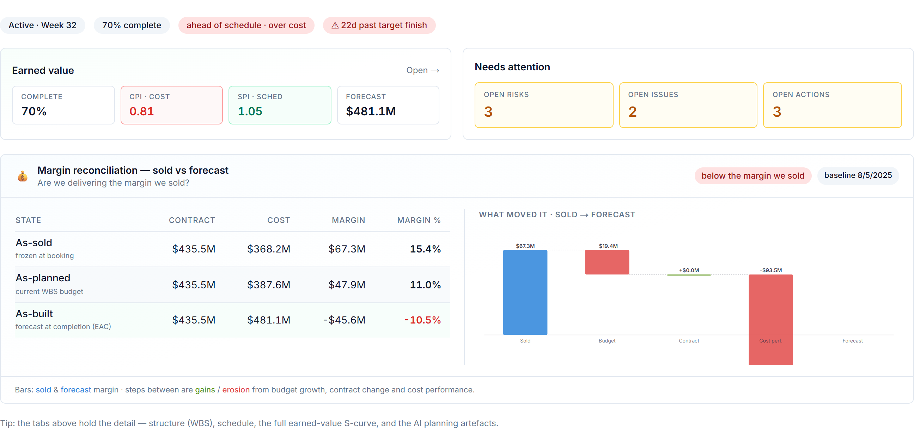

### The question this answers

Every project is won on a margin — the profit the bid promised. By completion it
has almost always become a *different* margin. The interesting question is never
just "what's our margin now?" but **"how did we get from the margin we sold to the
margin we're forecasting, and what moved it?"** A9 is the bridge that decomposes
that journey into named, attributable steps, so erosion is explained rather than
merely observed.

### Three margins, one project

AI PMO tracks the same project's margin at three points in its life:

- **As-sold** — the margin at booking: *sold contract value − the frozen baseline
  budget*. This is what the deal promised and what the business expects to keep.
- **As-planned** — the margin in the current plan: *current contract value −
  current WBS budget*. The team has detailed and re-estimated; the plan may have
  moved off the bid.
- **As-built** — the forecast margin at completion: *current contract value −
  estimate at completion (EAC)*. This is where the job is actually heading, given
  performance to date.

As-sold is the promise, as-planned is the intention, as-built is the truth. The
gaps between them are the story.

### The bridge: what moved the margin

Reading left to right from as-sold to as-built, AI PMO attributes the change to
named drivers — the same idea as a profit bridge in an annual report:

- **Budget growth** — where the as-planned budget grew above the as-sold baseline
  (re-estimation, scope detailing). Erodes margin if revenue didn't follow.
- **Change orders** — funded variations that move *both* revenue and cost; their
  net effect on margin can be accretive or dilutive.
- **Performance / forecast** — the move from as-planned to as-built, i.e. the
  cost over- or under-run the EAC now predicts versus the plan.

Each step is a labelled increment in the waterfall, so a reviewer sees not just
that margin fell from, say, 12% to 8%, but that *3 points went to budget growth on
the baseline and 1 point to a cost overrun the forecast now carries, partly offset
by an accretive change order.* That is a conversation about causes, not a number
to argue about.

### Why this matters

Margin erosion discovered at completion is a post-mortem; margin erosion
*attributed in-flight* is a management lever. If the bridge shows the loss is
budget growth on the baseline, that points to estimating discipline; if it is
performance, that points to execution; if it is dilutive change, that points to
commercial terms. The same headline number demands different responses depending
on *which step* moved it — and only the bridge tells you which.

It also keeps the three margins honest about provenance: as-sold comes from the
frozen booking baseline, as-planned from the live plan, as-built from the EAC —
each a different source, never silently blended.

### A worked example

Illustratively, a job booked at a 12% margin:

- **As-sold: 12%** — sold contract over the frozen baseline budget.
- **As-planned: 9%** — the baseline budget grew 3 points on re-estimation; revenue
  was unchanged, so margin fell.
- **As-built: 8%** — a cost overrun the EAC now forecasts costs a further point,
  partly offset by a small accretive change order.

The takeaway is specific: most of the erosion (3 of the 4 points) happened at
*planning* — the bid was optimistic against the detailed estimate — not in the
field. That sends the lesson upstream to estimating, where execution metrics alone
would have wrongly blamed the site team.

### How AI PMO implements it

Pure **synthesis**. AI PMO reads the frozen as-sold baseline (booking), the
current contract and WBS budget (the plan), and the EAC (the forecast), and
computes the three margins and the bridge increments between them — attributing
each to budget growth, change orders, or performance. It owns none of these
inputs; it composes them into the waterfall and the plain-language read. The
baseline is the system-of-record booking figure, so the "promise" end of the
bridge is auditable.

### What it does not do

It does not re-baseline the budget, approve changes, or set the forecast — those
live in the cost system and the change process. It explains the margin journey
those produce.

---

*Cross-reference: implemented in the Technical Edition's margin library
(as-sold = sold contract − baseline budget; as-planned = current contract −
current budget; as-built = current contract − EAC; bridge attributes the deltas to
budget growth, change orders, and performance). Builds on A6 (EAC) and A10
(Change & Trend).*

## Change & trend management — concept, justification, and the AI PMO model

*A capability chapter for the AI PMO book. Covers the conceptual model behind change and trend management, why it is modelled the way it is, and how AI PMO implements it.*

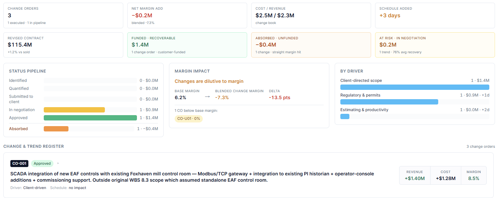

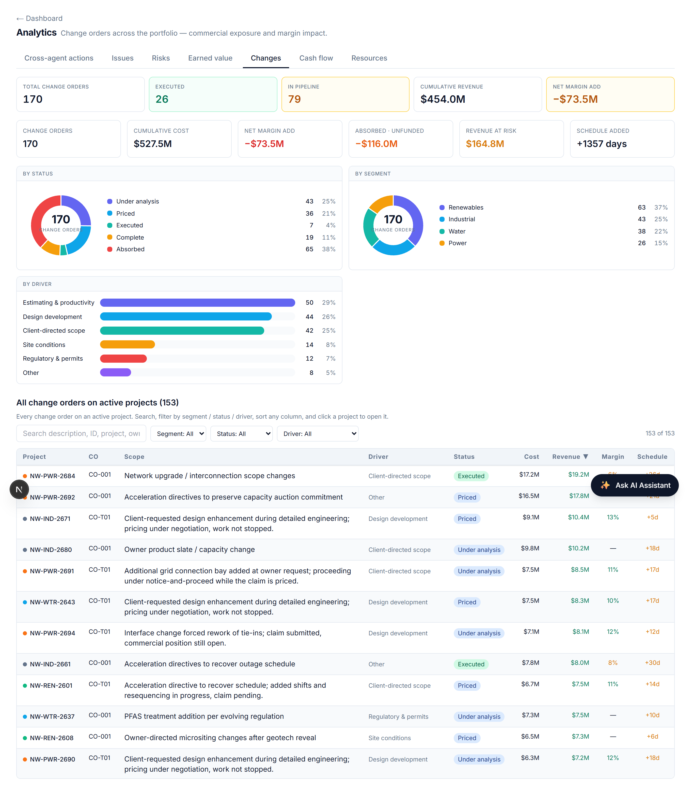

### The problem changes create

On any sizeable contract, the scope that gets delivered is never exactly the scope that was sold. Ground turns out different from the survey; the client asks for more; a design develops; an estimate proves light. Each of these moves cost — and sometimes revenue — away from the baseline. The discipline of capturing those movements, pricing them, and recovering what is recoverable is the difference between a project that holds its margin and one that quietly bleeds it.

The hard part is that most changes start life as a **grey area**. You rarely know at the moment of discovery whether the customer will pay. And critically, under most contracts you **cannot stop work** while you find out — the notice‑and‑proceed (or constructive‑change) obligation means you keep building, incurring cost, while the commercial outcome is still open. A change‑management model that only recognises a change once it has been formally agreed is therefore always behind reality.

### The certainty continuum

The cleanest way to think about changes is as a single continuum of **certainty**, not as separate registers competing for the same record:

| | Risk | Trend | Outcome |
| --- | --- | --- | --- |
| Nature | uncertain future event | emerging, near‑certain cost movement | resolved change |
| Probability | < 100% (P × I) | ≈ 100% (it is happening) | settled |
| Financial home | contingency (EMV) | cost forecast (EAC) | contract / margin |
| Resolves to | becomes a trend if it realises | a funded change order, or absorbed cost | — |

A risk that materialises becomes a trend. A trend, once worked, resolves into either a **funded change order** (the customer agrees to pay) or an **absorbed (unfunded) change** (the work was done but there is no recovery, so it lands as a straight margin hit). These are not three competing instruments — they are three points along one lifecycle.

### What a trend is, and the trend register

A **trend** is an emerging cost or schedule movement, logged the moment it is foreseen, before it has been formalised. The **trend register** is the ledger of those movements sitting between the budget baseline and the forecast at completion (EAC). It is the mechanism that explains *how the forecast moved* between formal change orders. Every potential change enters here first; the register then tracks each one through to its outcome.

Modelling changes trend‑first — rather than only recording change orders once executed — is what lets the forecast stay honest. The cost is recognised when it is foreseen, not when the paperwork catches up.

### Why an unfunded change is not a risk

It is tempting to push unfunded cost growth — an estimating error, rework, a productivity shortfall — into the risk register, which is already rich. That is wrong once the movement is certain, for three concrete reasons:

1. **It distorts the risk numbers.** A discovered error has a probability of one; logging it as a risk corrupts the expected‑monetary‑value exposure, which is meant to be *expected*, not *actual*.
2. **It double‑counts or misplaces the money.** Risk impact is covered by *contingency*; certain cost growth belongs in the *EAC*. Putting it in the risk register either double‑counts it or draws down contingency for something contingency was never meant to cover.
3. **It breaks an audit boundary.** Cost controllers and forecasters read the risk register and the cost forecast as distinct instruments. Blending certain cost growth into risks undermines the contingency‑drawdown discipline.

So: while a cost movement is genuinely uncertain, it is a risk (and is managed via mitigation and contingency). Once it is discovered and near‑certain, it leaves the risk register and becomes a trend.

### Working at risk: the proceed obligation

The proceed obligation is the heart of the model, not an edge case. Because work continues while the commercial position is unresolved, an open trend has a **split certainty**:

- The **cost is near‑certain** — you are spending it regardless — so it goes into the EAC now.
- The **revenue is uncertain** — it is a claim that depends on the customer agreeing — so it is carried *at risk* until settled.

This is where risk‑thinking legitimately re‑enters the picture: not on the cost, but on the **recovery**. Each open trend carries a **recovery confidence** — the probability that the customer funds it.

### Recovery confidence and revenue at risk

From recovery confidence, two honest forecast figures follow for the open (in‑negotiation) trends:

- **Expected recovery** = claimed revenue × recovery confidence.
- **Revenue at risk** = claimed revenue × (1 − recovery confidence).

Revenue at risk is the amount of cost already committed on unagreed changes that may never be recovered. It is the single most useful early‑warning number in change management, and it is invisible to any tool that only records changes once they are executed.

### The accounting gate: IFRS 15 variable consideration

The recovery‑confidence model is not just a controls convenience — it mirrors the revenue‑recognition rule. Under IFRS 15, a claim or unapproved variation is **variable consideration**, and revenue on it may not be recognised until recovery is *highly probable* of no significant reversal. Until that threshold is met, the cost is in the forecast but the revenue is **constrained**. A trend's recovery confidence is, in effect, the management view of that recognition gate: low confidence → constrained, no revenue taken; high confidence → recognisable.

### Mapping to SAP

The split maps cleanly onto an SAP‑centric estate, which is why it is faithful rather than abstract:

- A **funded change order** is an SD / contract change plus recognised PS revenue — the contract value grows.
- An **unfunded (absorbed) change** is **cost‑only on the WBS** — a budget supplement with no sales‑order change and no revenue.
- An **open trend** is forecast cost on the WBS with revenue held or blocked until the variation is approved.

The same data therefore reconciles to the SAP figures rather than living beside them.

### The AI PMO model

AI PMO implements the continuum as a single **change & trend register**. Every entry carries a lifecycle status and a recovery confidence, and resolves to one of three outcomes:

> **Identified → Quantified → Submitted to client → In negotiation →** then **Approved (funded change order)** · **Absorbed (unfunded — margin hit)** · **Withdrawn (no impact)**

From that single model the platform derives, with no extra data entry:

- a **funded / absorbed / at‑risk split** — recoverable revenue, absorbed cost (the margin hit), and revenue at risk with an average recovery confidence;
- a **status pipeline** from trend to outcome, with value at each stage;
- a **margin‑impact** read — whether the change book is accretive or dilutive against the project's base margin, with the absorbed and dilutive entries flagged;
- a **by‑driver** view (client‑directed scope, site conditions, design development, estimating & productivity, regulatory, supply & escalation);
- a **portfolio roll‑up** of the same, so exposure and revenue‑at‑risk are visible across every project at once.

A specialist agent (the change‑order reviewer) reasons over this register — change exposure, pricing, and margin protection — and the whole thing reconciles to the margin bridge (funded variations move the contract step; unfunded cost growth moves the budget and execution steps) and to earned value (an absorbed cost shows up as negative cost variance).

### Why it matters

Three reasons this model earns its place:

1. **Margin protection.** Absorbed cost is the silent killer of EPC margin. Making it a first‑class, named, quantified category — instead of an unexplained gap in the cost forecast — is what lets a team see it early and act.
2. **Forecast honesty.** Recognising cost when it is foreseen and revenue only when it is probable produces an EAC and a recognised‑revenue position that survive audit, rather than an optimistic one that unwinds later.
3. **A single source of truth across the lifecycle.** Risk, trend, and change order become states of one record, not three disconnected logs — so nothing falls between the registers, and the story of how margin moved from as‑sold to as‑built is complete.

# Part III — Risk, Issues & Performance

## Risk: Expected Value, Residual Exposure & Contingency

### Putting a number on uncertainty — and checking the buffer covers it

*Business Edition · Chapter A11 — pairs with the Technical Edition's risk-emv library*

### The question this answers

A risk register that only says "high / medium / low" cannot answer the question a
finance director actually asks: *how much money is this project's risk worth, has
our mitigation actually bought it down, and is our contingency enough to cover
what's left?* A11 makes risk quantitative and connects it to the contingency
buffer.

### Expected Monetary Value

The basic unit is **Expected Monetary Value (EMV)** — *probability × impact*. A
threat with a 30% chance of a $10M overrun carries an EMV of $3M. Summing EMV
across the register turns a list of worries into a single, comparable number: the
risk-weighted cost the project is carrying. Opportunities (favourable risks) carry
a positive EMV — potential upside — and are tracked separately from threats.

### Inherent versus residual: did mitigation work?

The same risk has two EMVs:

- **Inherent EMV** — *before* mitigation: the raw probability × impact.
- **Residual EMV** — *after* mitigation: the reduced probability (and/or impact)
  once the agreed actions are in place.

The gap between them is the **reduction** — *(inherent − residual) ÷ inherent* —
and it is the single most useful management number in the chapter, because it
quantifies what mitigation has actually achieved. A register where inherent and
residual are equal is a register where nothing has been *done*; a large reduction
is mitigation earning its keep. AI PMO rolls this up to a portfolio exposure:
total inherent, total residual, and the percentage bought down.

Only *live* risks — open or actively managed — count toward residual exposure;
risks that have not materialised carry no remaining exposure, and ones that *have*
materialised have become issues or realised cost (see A12).

### Is the contingency enough?

Quantified residual exposure lets AI PMO do what a colour-coded register cannot:
test the **adequacy of contingency.** Coverage is *remaining contingency ÷
residual exposure*, and it sorts projects into bands — **Adequate**, **Tight**,
**Exposed** — so a portfolio lead can see at a glance which projects are
under-buffered for the risk they still carry.

This is where **P50 / P80** thinking enters. Rather than buffering against the
single worst case, contingency is sized against a confidence level on the
aggregate risk distribution — enough to cover outcomes 50% (or 80%) of the time.
Residual EMV is the expected (P50-ish) draw; the buffer should sit comfortably
above it for the confidence the business wants. AI PMO surfaces the comparison so
the buffer is a calculated position, not a round-number guess.

### Why this matters

Three things a qualitative register can't give you, all here: a **portfolio risk
price** you can compare and trend, **evidence that mitigation is working** (the
buy-down), and an **early warning when the buffer is thin** for the exposure that
remains. Risk stops being a compliance artefact and becomes a number that
participates in the cost and contingency conversation.

### A worked example

Illustratively, a project's register:

- **Inherent EMV: $14M** — raw risk-weighted exposure.
- **Residual EMV: $9M** — after mitigation; a **36% reduction** — mitigation is
  working but $9M of live exposure remains.
- **Remaining contingency: $7M** → **coverage 0.78 → "Tight."** The buffer is
  below the residual exposure; the project is under-provisioned for an 80%
  confidence and should either draw down risk further or top up contingency.

### How AI PMO implements it

Synthesis over the risk register. AI PMO computes EMV per risk, separates threats
from opportunities and live from closed, rolls inherent and residual exposure to
the project and portfolio, derives the reduction percentage, and tests contingency
coverage into the adequacy bands. It reads the register; it does not run the risk
workshop.

### What it does not do

It does not assign probabilities or impacts (that's the team's judgement), run a
Monte Carlo simulation engine (a specialist tool's job — AI PMO consumes a P80 if
one exists), or set contingency policy. It prices, buys-down, and tests what the
register and the buffer already contain.

---

*Cross-reference: implemented in the Technical Edition's risk-emv library
(EMV per risk; inherent→residual reduction; live-threat exposure; contingency
coverage = remaining ÷ residual exposure → Adequate/Tight/Exposed). Connects to
A12 (a materialised risk becomes an issue) and the cost/contingency view.*

## Issue Management: Aging, SLA, Priority & Escalation

### Turning an issue log into a managed queue

*Business Edition · Chapter A12 — pairs with the Technical Edition's issue-metrics library*

### The question this answers

Most issue logs are a flat list that grows until someone panics. The questions
that matter — *which issues are overdue, which are about to be, what should I work
on first, and what needs to go up the chain right now?* — go unanswered because
the log carries no notion of time or urgency. A12 turns the log into a managed
queue with aging, service levels, priority and escalation.

### A risk that happened

First, the link to A11: an **issue is a risk that has materialised.** Risk
management is about things that *might* happen; issue management is about things
that *have*. When a live risk triggers, it leaves the register and enters the
issue log — which is why issues carry cost and schedule impact, and why a healthy
process tracks the hand-off rather than letting risks quietly disappear.

### Aging and SLAs

Every open issue has an **age** — how long since it was raised — and a **service
level (SLA)**: the number of weeks it *should* take to resolve, defaulted by
severity (a High issue gets a tighter SLA than a Low). Comparing the two sorts
every issue into an aging band:

- **On track** — comfortably within SLA.
- **At risk** — past 75% of its SLA; about to breach.
- **Overdue** — past SLA; breached.

This single derivation changes the log from "here is everything" to "here is what
is slipping," which is the only view a manager can act on.

### Priority: what to work on first

Not all open issues deserve equal attention. AI PMO scores **priority = severity ×
age (capped)** — so a high-severity issue that has been festering rises to the top,
while a fresh low-severity one sits below it. The queue sorts itself by genuine
urgency rather than by whoever shouted last.

### Escalation: what needs to go up now

Some issues shouldn't wait for the next review. AI PMO flags an issue for
**escalation** when it is open, high-severity, and either already overdue *or* has
no owner — and hasn't been escalated already. That rule catches exactly the two
failure modes that hurt: serious issues breaching their SLA, and serious issues
that nobody owns. Surfacing them automatically is the difference between
escalation-by-process and escalation-by-accident.

### Resolution speed (MTTR)

Looking backwards, **mean time to resolve (MTTR)** — the average weeks from raised
to closed — measures how fast the team actually clears issues. Trended, it shows
whether the project is keeping pace or falling behind, and it is the honest
counterpart to the open-queue view: a small open log with a worsening MTTR is not
the good news it appears to be.

### Why this matters

Aging plus SLA gives **early warning** before a breach; priority gives a **defensible
work order**; escalation gives a **safety net** for the serious and the orphaned;
MTTR gives a **throughput trend.** Together they convert an inert list into a
queue that tells the team what to do next and tells management what is at risk —
the operational complement to the financial chapters.

### A worked example

Illustratively, a project with 40 open issues:

- **6 overdue, 5 at risk** — eleven need attention now or imminently, not forty.
- **Top of the priority queue:** a high-severity interface issue, 9 weeks old
  against a 4-week SLA — high severity × large age puts it first.
- **3 flagged for escalation** — high-severity and overdue or unowned; these go up
  this week regardless of the review cycle.
- **MTTR trending from 3.1 → 3.8 weeks** — resolution is slowing even as the open
  count looks stable; a leading sign the team is losing ground.

### How AI PMO implements it

Synthesis over the issue log: it derives age, looks up the severity-based SLA,
assigns the aging band, scores priority, applies the escalation rule, and computes
MTTR — then rolls these into an issue-health panel and feeds them to the Issue
Logger agent. It reads the log; it does not run the issue workflow.

### What it does not do

It does not assign, resolve, or own issues, and it does not replace a ticketing or
field-issue system where one exists (it would consume that feed). It makes the
queue legible and the urgent visible.

---

*Cross-reference: implemented in the Technical Edition's issue-metrics library
(age vs severity-based SLA → On track / At risk / Overdue; priority = severity ×
age; escalation rule; MTTR). Receives materialised risks from A11.*

## Variance Analysis: CV, SV, VAC & the TCPI Reality Test

### Reading the gap between plan and performance — and what it takes to recover

*Business Edition · Chapter A13 — pairs with the Technical Edition's earned-value library*

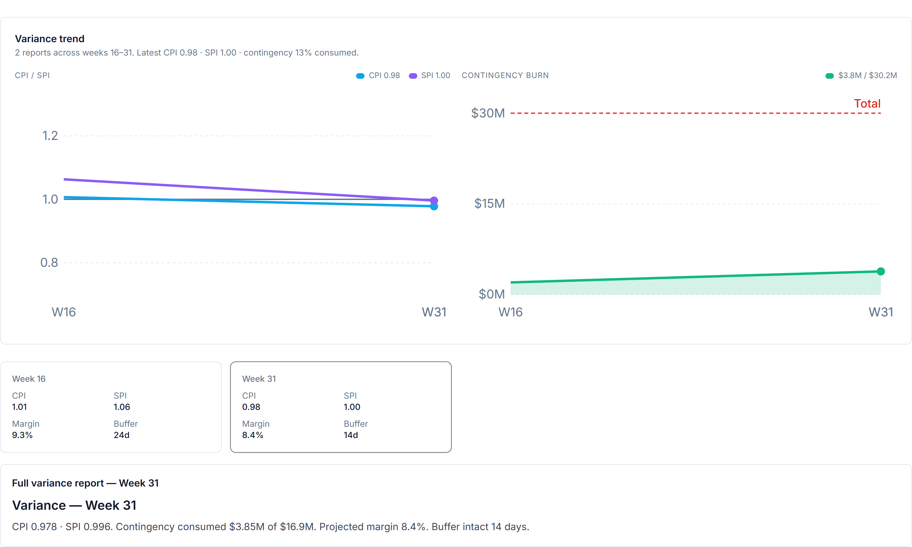

### The question this answers

Earned value (A5) gives the indices CPI and SPI; variance analysis turns those
into the management questions: *how many dollars and weeks are we off, how far off
will we finish, and — crucially — is recovery still realistic?* A13 is the chapter
that reads the gaps and applies the honesty test most reporting avoids.

### The variances: where we are

Two variances locate the project against its plan, both in money terms:

- **Cost variance (CV) = EV − AC.** Earned value minus actual cost. Negative means
  you have spent more than the work is worth — over cost.
- **Schedule variance (SV) = EV − PV.** Earned value minus planned value. Negative
  means you have accomplished less than planned by now — behind schedule.

Expressed as a money figure (and as a percentage of work done), these say not just
"behind" but "$8M of work behind" — a size, not an adjective.

### The forecast variance: where we'll end up

**Variance at completion (VAC) = BAC − EAC** — the budget at completion minus the
forecast at completion. It is the bottom line of variance analysis: the total
over- or under-run the project is heading for if nothing changes, with VAC% (VAC ÷
BAC) sizing it against the budget. CV tells you where you are; VAC tells you where
you'll land.

### The TCPI reality test

Here is the part most status reports quietly omit. The **To-Complete Performance
Index (TCPI)** asks: *what cost efficiency must the remaining work run at to still
hit the target?* AI PMO computes two:

- **TCPI to budget = (BAC − EV) ÷ (BAC − AC)** — the CPI the rest of the job needs
  to still finish on the original budget.
- **TCPI to forecast = (BAC − EV) ÷ (EAC − AC)** — the CPI needed to hit the
  current forecast.

The reality test is the comparison with current CPI. If a project is running at a
CPI of 0.90 and the TCPI to recover the budget is 1.15, the message is blunt: *you
have never performed better than 0.90, and now you'd need 1.15 for the rest of the
job — the budget is gone, stop pretending and re-baseline the forecast.* A TCPI
more than ~0.05 above demonstrated CPI is, in practice, not recoverable. This one
comparison prevents the most common reporting fiction — the perpetual "we'll claw
it back next quarter."

### Why this matters

CV and SV give an honest, sized statement of position; VAC commits to a landing
point; TCPI tests whether the recovery everyone hopes for is arithmetically
possible. Together they move a status conversation from optimism to evidence — and
they are the natural trigger for the forecasting (A6) and change (A10) processes
when the test says the plan no longer holds.

### A worked example

Illustratively, a project part-way through:

- **CV = −$6M (CPI 0.92)** — $6M over cost on the work done so far.
- **SV = −$4M (SPI 0.96)** — modestly behind plan.
- **VAC = −$18M (−4.5% of BAC)** — heading for an $18M overrun on current
  performance.
- **TCPI to budget = 1.14 vs CPI 0.92** — recovery to budget needs 1.14 efficiency
  the project has never shown; **not recoverable.** The honest action is to adopt
  the forecast (re-baseline to the EAC) and manage the $18M, not to promise it
  back.

### How AI PMO implements it

Synthesis over the earned-value inputs (BAC, PV, EV, AC): it derives CV, SV and
their percentages, VAC and VAC%, and both TCPIs, then compares TCPI against CPI to
classify recoverability — feeding the Variance Analyst agent's commentary. It owns
none of the inputs; it reads the gap and tells the truth about it.

### What it does not do

It does not re-baseline the project or set the forecast (that's the forecasting and
change processes); it diagnoses the variance and flags when recovery is no longer
credible, so those processes are triggered honestly.

---

*Cross-reference: implemented in the Technical Edition's earned-value library
(CV = EV − AC; SV = EV − PV; VAC = BAC − EAC; TCPI(BAC) = (BAC−EV)/(BAC−AC);
TCPI(EAC) = (BAC−EV)/(EAC−AC)). Builds directly on A5 (Earned value) and triggers
A6 (Forecasting).*

# Part IV — Communicating the Intelligence

## Proposal — colour‑coding KPIs by system of origin

*Status: proposed, mocked up, not implemented. Reversible — would ship behind a toggle, off by default.*

### Summary

A dashboard enhancement that tints each KPI by the system its data comes from — SAP PS, the external scheduler, or AI PMO's own synthesis — so a viewer can see at a glance where every number originates, and in particular which numbers AI PMO computes rather than passes through. It is a quiet provenance layer that sits alongside the existing health colours, not a replacement for them.

*Above: the proposed look with the "Show data sources" toggle on. Toggling it off returns the dashboard to today’s clean view.*

### Why it fits AI PMO

AI PMO already tags every record in its canonical model with the system it came from (the provenance behind the SAP ↔ scheduler ↔ AI PMO architecture). This proposal simply makes that invisible provenance visible on the dashboard. It reinforces the core positioning — AI PMO is an intelligence layer that reads the systems of record and synthesises the metrics they cannot produce alone — and it gives the audit‑minded viewer data lineage at a glance.

### How it works — two independent signals

The design keeps two meanings on two separate visual channels so they never collide:

- **Health / tone** stays on the number's colour — red for off track, amber for watch, green for on track — exactly as today.
- **Provenance** goes on a thin coloured left accent and a small named source tag (for example, "AI PMO").

Because the source is also written in words, colour is never the only signal (accessible and colour‑blind safe), and a green "AI PMO" accent is never mistaken for a green "on‑track" number. Worked example: Portfolio SPI shows a green accent (AI‑synthesised) with a red value (behind schedule) — both read clearly, side by side.

### Colour mapping

| System of origin | Colour | Example KPIs |
| --- | --- | --- |
| SAP PS — system of record | Blue | Approved budget, open commitment, recognised revenue, billed |
| Scheduler (P6 / MS Project) — system of record | Amber | % complete, schedule variance |
| AI PMO — reads + synthesises | Green | Portfolio CPI, SPI, forecast (EAC), forecast variance (VAC) |

The flagship indices — CPI, SPI, earned value — are deliberately green even though they are blends of SAP cost and scheduler progress. Rather than fudge a single source, they are marked as "computed by AI PMO from the systems of record." That contrast is the whole point: green marks where AI PMO adds something neither source system produces on its own.

### Interaction

A "Show data sources" toggle turns the provenance layer on and off — clean by default for a first glance, on when lineage matters. A small legend sits beside the KPI ribbon, and each card carries a hover tooltip naming the exact source and formula (for example, "CPI = EV ÷ AC, derived from SAP cost and scheduler progress").

### Variants

- **Full (recommended for the story):** left accent bar plus a named source tag — most informative at a glance.
- **Light:** a corner dot plus tooltip only — quieter and less busy, but the source is not named without hovering.

### Trade‑offs and open questions

The full variant adds some visual density (an accent and a tag on every card); the toggle and the light variant both mitigate that. Two decisions remain open: whether the layer should be always‑on or a toggle that defaults off, and whether to use the full bar‑and‑tag treatment or the lighter dot‑only one.

### Extending to individual project views

The same colour language extends naturally to a single project — and arguably lands harder there, because one project screen shows a richer mix of sources side by side: SAP cost, scheduler progress, AI‑synthesised earned value, and AI‑authored narrative all at once.

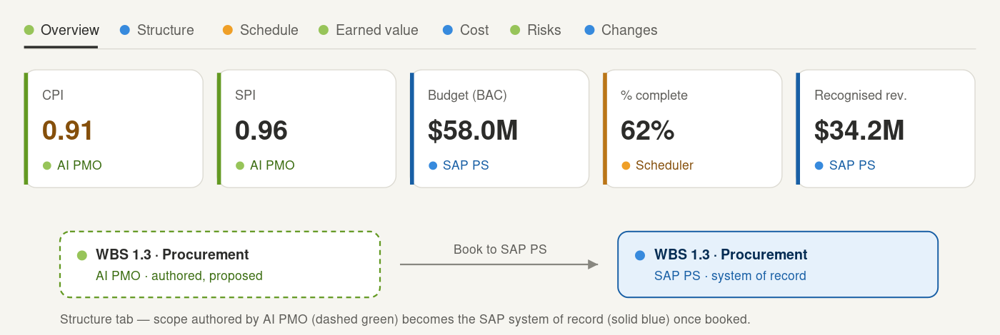

*Above: a project's tab bar (each tab dotted by its primary source), the Overview KPI strip, and the Structure‑tab provenance flip.*

The project tabs map onto the three sources almost one‑to‑one:

| Source | Project surfaces |
| --- | --- |
| SAP PS (blue) | Structure / WBS, Cost, Commitment, Billing, Results Analysis, budget & margin |
| Scheduler (amber) | Schedule / Gantt, % complete, resource demand |
| AI PMO (green) | Overview indices (CPI / SPI / EV), Variance, Risks, Issues, authored Charter & Planning narratives |

The standout is the Structure tab. AI PMO authors a proposed WBS, and "Book to SAP PS" turns it into the system of record — the record's source system going from APP to SAP PS. Colour‑coding makes that visible: green proposed scope literally becomes blue once booked. It is the one place provenance changes in front of the user, and the clearest single‑screen demonstration of the "author, then hand to the system of record" story.

This raises one design decision. At the project level green carries two meanings — "synthesised" (CPI / SPI / EV, derived) and "authored" (the proposed WBS, before booking). The mock distinguishes them with solid green for synthesised metrics and a dashed outline for authored‑but‑not‑yet‑booked scope. Worth deciding whether that distinction earns its keep or adds avoidable complexity.

Two guard‑rails carry over from the portfolio view. Apply the coding at the panel / tab grain — a source dot on each tab, an accent on each card — not per row; tagging every cost line or task would be noise. And drive every surface (dashboard, project, analytics) from the same legend and one global "Show data sources" toggle, so it reads as a single visual language rather than a per‑page feature.

### Questions to put to users during the demo

1. Does knowing each KPI's source system help you trust the number, or is it noise?
2. Does the "green = AI‑synthesised" distinction land — is it clear that CPI / SPI are computed, not raw figures?
3. Would you want this always on, or as a toggle you switch on when you care about lineage?
4. Full named tags, or just a subtle dot?
5. Are blue / amber / green the right mappings, or would your teams read other colours more naturally?

## Colour & Iconography

### How AI PMO makes a dense PMO legible at a glance

*Business Edition · Chapter A15 (appendix) — the visual design language*

### Why a visual language

A portfolio dashboard can show a hundred numbers; a good one lets you *read* them
without consciously decoding. AI PMO uses a consistent visual language so that
meaning is carried by colour and icon, not just by labels — a reader learns the
code once and then navigates by it everywhere in the product. This chapter records
that language so it stays consistent as the product grows.

### Colour carries meaning

Colour is never decorative; each hue maps to a concept, and that mapping holds
across every screen:

- **Amber — cost.** Where the money went; cost-to-date, the cost lens.
- **Emerald — earned / revenue.** Earned value, recognised revenue, things going
  right.
- **Sky blue — cash.** Cash flow, funding, financing.
- **Orange — commitment.** Committed but not yet spent (open POs).
- **Red — risk / threat.** Risk exposure, breaches, things requiring attention.
- **Fuchsia — change.** Change orders and trend exposure.
- **Rose — variance.** Deviation from plan.
- **Indigo — structure.** The WBS and project structure.
- **Violet — schedule.** Time, dates, the calendar.
- **Cyan — resources.** People and capacity.
- **Blue — planning.** Plans and artefacts.
- **Slate — overview / neutral.** Summary and context.

Because the mapping is fixed, a splash of red anywhere reads as risk, amber as
cost, sky as cash — before a single label is read.

### Iconography

Every capability carries an icon drawn from the same lexicon — a receipt for cost,
a rising line for earned value, waves for cash flow, a shield for risk, a gauge or
chart for performance — so tabs and cards are recognisable by shape as well as
colour. On the workspace tabs the icons sit muted until a tab is active, when both
the icon and its underline light up in the capability's colour; the active view
announces itself in its own hue.

### Caption discipline: what each thing answers

Alongside colour and icon, each capability earns a one-line caption that states the
*question it answers*, not the feature name — for example, on the cost lenses:

- **Cost-to-date — amber, receipt** — "what we've spent."
- **Revenue recognition — emerald, rising line** — "what we've earned."
- **Cash flow — sky, waves** — "what we finance."

The pattern — colour for theme, icon for recognition, caption for the question — is
what lets a non-specialist read a dense PMO screen the way a specialist does.

### Trustworthy numbers: provenance by colour

The same discipline extends to *where a number comes from.* A figure that is a
system-of-record fact reads differently from one AI PMO has synthesised or
forecast, and from one a human has overridden. Encoding provenance — fact vs
synthesis vs forecast vs human judgement — visually means a reader always knows how
much to trust a number, which is the foundation of the whole product's credibility
(see A14, KPI provenance).

### Why this matters

In an EPC portfolio the failure mode is not too little data, it is too much,
undifferentiated. A consistent visual language is the cheapest, highest-leverage
way to make a complex product *feel* simple — and it is a deliberate design
decision, not an accident of styling, which is why it is documented here as part
of the method rather than left to taste.

---

*Cross-reference: pairs with A14 (KPI provenance & trustworthy numbers). The colour
and icon tokens are implemented centrally in the Technical Edition (shared badge,
chart-palette and tab-accent definitions) so the language stays consistent by
construction.*

## Reading the Executive Dashboard

### Every KPI on the landing view — what it answers, and where it drills

*Business Edition · Chapter A16 — the guided tour of the portfolio dashboard*

### How the page is meant to be read

The landing dashboard answers "how is the portfolio, really?" in a single screen,
and it is laid out to be read **top to bottom as a narrowing funnel**: the headline
health first, then the money, then what needs attention now, then the patterns
underneath, then the detail. Two rules hold everywhere: **every KPI is clickable**
— it opens a drill modal of the underlying records with a link to the full
analytics page — and **colour carries meaning** (A15), so the eye is drawn to the
right hue before a label is read. This chapter walks each section in order; each KPI
notes the question it answers and the chapter that explains its method.

### The hero

The top band is the one-glance verdict: a **headline** health statement, a **segment
donut** (the portfolio's mix by segment), a **lifecycle bar** (how many projects sit
in each delivery stage), and a **health pulse**. It exists to answer "should I be
worried?" before any number is studied.

### Portfolio earned value — the pulse

The first measured section is the portfolio **earned value** card: aggregate CPI and
SPI rolled up across every active project, with the S-curve and a RAG read. This is
the single most honest "on track?" number on the page — cost and schedule combined,
ungameable by either alone (the method is A5). It is the pulse the rest of the page
elaborates.

### Portfolio financial position — the money

A ribbon of the cost-to-cash figures, left to right following the money:

- **Open commitment** — value of open purchase orders; forward cost not yet incurred.
- **Recognised revenue** — what may be booked to date (cost-based POC, IFRS 15; A7).
- **Recognised margin** — recognised revenue minus cost of sales, as a percentage
  (A7/A9).
- **Net unbilled (WIP)** *or* **Deferred / over-billed** — the balance-sheet read:
  a contract asset when revenue is recognised ahead of billing, a contract liability
  when billed ahead (A7).
- **Billed to date** — invoices raised.
- **Change orders** — total revenue impact plus how many are in flight (A10).
- **Absorbed · unfunded** — cost eaten on changes that couldn't be recovered;
  margin leakage. Clicks through to the change register (A10).

Read together, this ribbon is the project's commercial position in seven numbers.

### Segments

Cards for each segment (renewables, water, industrial, power), each clickable to drill
into that segment's projects. This is the portfolio's structure — where the work, and
the exposure, concentrates.

### Portfolio watchlist — what needs attention

Where the financial ribbon is the position, the watchlist is the **alarm panel** —
every tile is a count or amount of something going wrong, each drilling to the records:

- **Open H issues** — open high-severity issues (A12).
- **Realised risks** — risks that have materialised (A11 → A12).
- **Cost off-track** — projects running CPI < 0.95 (A5/A13).
- **Schedule off-track** — projects running SPI < 0.95 (A5/A13).
- **Contingency drawn** — total contingency consumed across the portfolio (A11).
- **Patterns at emergence** — cross-project signals reaching their threshold.
- **Revenue at risk** — open-trend revenue weighted by unlikely recovery; the change
  exposure that threatens margin (A10).

If a manager reads only one section in a hurry, it is this one.

### Portfolio insights — the patterns underneath

Five mini-charts turn the counts into distributions, each bar/band clickable:

- **Risks by category** — where risk concentrates by cross-cutting class, with total
  EMV (A11).
- **Issues by severity** — the open issue mix, Low/Medium/High (A12).
- **Contingency consumption** — projects banded by share of contingency used (A11).
- **Change exposure by segment** — open-trend revenue-at-risk plus absorbed cost, by
  segment: *where* the change exposure sits (A10).
- **Change exposure by driver** — the same exposure by root-cause driver: *why* it is
  happening (A10).

These answer "what is driving the headline?" — the diagnostic layer beneath the
watchlist.

### Hot list, activity and role KPIs

Below the insights sit the operational tail: a **hot list** of the handful of projects
most needing attention (a composite of CPI/SPI deviation, open high issues and realised
risks), **your recent activity** (the agent narratives you've generated), and a
**role-specific KPI strip** — tiles chosen for the colleague's role (commercial, risk,
HSE, …) that are net-new versus the shared ribbons above. The page closes with the
action ribbon, where cross-agent tasks are assigned and answered (B11).

### How the dashboard varies by role

The same portfolio, seen from different chairs. The shared sections above — earned
value, financial position, watchlist, insights — are **identical for every role**:
there is one portfolio truth, not a set of per-role silos. What personalises the page
is the *lens*, not the data:

- **Identity.** The header carries the colleague's role title (Senior PM, Commercial
  Manager, Portfolio Risk Analyst, VP Sponsor, and so on — ten seeded roles).
- **The role KPI strip.** A "Your {role} KPIs" band of tiles chosen for that remit and
  net-new versus the shared ribbons — the Commercial Manager sees change-order
  economics, the Risk Analyst sees open / high / mitigated risk counts, the HSE Manager
  sees HSE metrics.
- **Agent access.** Each role may invoke a curated subset of the agent roster relevant
  to its work, so the assistant offers the right tools rather than all of them.
- **Write capability.** Create-capable roles (PM, commercial, controls, …) can launch
  project intake, assign tasks and run agents that change state; read-only roles — the
  VP Sponsor, for instance — get the same visibility without the controls.
- **Section emphasis.** Each role definition names the dashboard sections most relevant
  to it, so the page leads with what that colleague came to see.

The same portfolio, three different chairs — note the role title in the header and the bespoke KPI strip in each:

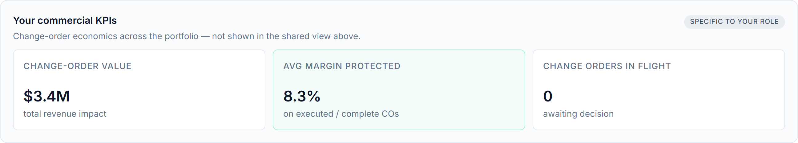

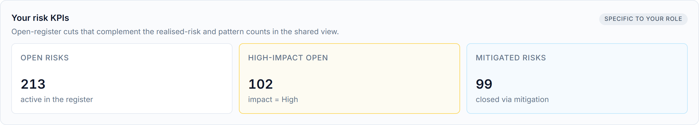

The design point: **one synthesis, many vantage points.** Access is conveyed by an
unguessable URL token per role, and the role definition (identity, agents, sections,
write permission) shapes the view — giving each colleague their relevant cut of a
single, shared portfolio truth.

### The two ideas that make it work

Everything above rests on two design choices covered elsewhere in this part:
**provenance** — every figure's source (system-of-record fact, AI synthesis, forecast,
human override) is encoded so the reader knows how much to trust it (A14) — and the
**visual language** — colour by theme, icon by capability, a one-line caption stating
the question each thing answers (A15). The dashboard is not a wall of numbers; it is a
single, readable argument about the health of the portfolio, and every number on it is
one click from the records behind it.

---

*Cross-reference: the dashboard composes the outputs of nearly every capability in
this book — earned value (A5), the money story (A7–A10), risk/issues/variance
(A11–A13) — behind the provenance (A14) and visual (A15) conventions. Implemented in
the Technical Edition across the dashboard page and client, reading the canonical
model via paginated portfolio queries (B18).*

## The Analytics Pages

### Portfolio deep-dives behind the dashboard

*Business Edition · Part IV — the deep-dive companion to the dashboard (A16)*

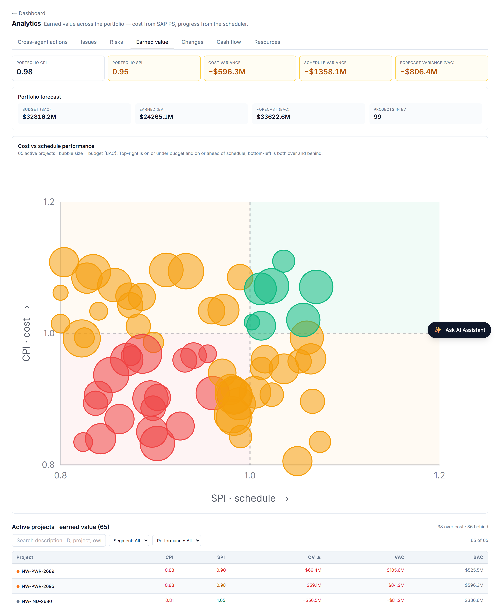

### Dashboard versus analytics

The dashboard (A16) is the one-screen summary: headline numbers, each one click from a
quick drill modal. The **Analytics pages** are where that click *lands in full* — a
dedicated, portfolio-wide page per domain, reached from every "see all" link and from
the analytics navigation. The relationship is deliberate: the dashboard answers "is
anything wrong?"; the analytics pages answer "show me everything, sorted and
filterable, so I can work it."

Every analytics page shares one shape: **charts on top, a register below.** The charts
give the distribution and the outliers; the register is a sortable, filterable table of
the underlying records across all active projects, each row linking to its project. One
layout, seven lenses.

### Earned value

The portfolio earned-value page plots every project on a **CPI × SPI quadrant** — the
four corners being on-track, over-cost, behind-schedule, and both — so the projects in
trouble separate themselves visually. Below it, a searchable **worst-performers
register** ranks projects by cost performance. This is where "Cost off-track" on the
dashboard becomes the full league table (method: A5/A13).

### Risks

The risk page totals **EMV exposure** across the portfolio, shows the **inherent vs
residual heatmap** (probability × impact, before and after mitigation), and lists the
full risk register — filterable by class, status and owner. It is the portfolio view of
A11: where the risk price sits and whether mitigation is buying it down.

### Changes

The changes page is the portfolio trend register: KPIs for total changes, executed and
in-pipeline, cumulative revenue and net margin, plus the exposure pair — **Absorbed
(unfunded)** and **Revenue-at-risk**. Donuts break changes down by status and segment, a
bar ranks them by driver, and the register lists every change order. This is the full
view behind the dashboard's change-exposure KPIs and mini-charts (A10).

### Cash flow

The cash-flow page is the portfolio funding-exposure explorer: the whole book's cash
curve — total working capital, peak funding requirement and cash-positive crossover —
with **drill-down from portfolio to segment to a single project** (A8). It answers the
treasurer's question at every level of zoom.

### Issues, resources and actions

Three further pages complete the set:

- **Issues** — portfolio issue health (aging, SLA breaches, severity mix) and the full
  issue register (A12).
- **Resources** — resource demand rolled up by role and segment, with segment
  drill-down — the visibility view over who is needed where.
- **Actions** — the cross-agent action analytics: open and closed assignments across the
  portfolio, the assign→respond loop made visible (B11).

### Why the pages matter

The dashboard is for *noticing*; the analytics pages are for *working*. Together they
give the two modes a portfolio lead actually needs — a glance that flags the problem and
a workbench that lets them sort, filter and act on every record behind it — without ever
leaving the synthesis layer for a spreadsheet. And because every page reads the full
portfolio, they all rely on paginated queries so no project is ever silently dropped
(B18).

---

*Cross-reference: the analytics pages are the portfolio expression of the capability
chapters — earned value (A5/A13), risk (A11), issues (A12), change (A10), cash flow (A8)
— and the destination of the dashboard's drill-throughs (A16).*

## The Project Workspace

### The individual-project view, tab by tab

*Business Edition · Part IV — the project-level companion to the portfolio dashboard (A16)*

### From portfolio to project

Click any project — from a dashboard drill, an analytics register, or the global search
— and you land in the **project workspace**: the single-project counterpart to the
portfolio dashboard. Where the dashboard answers "how is the *book*?", the workspace
answers "how is *this job*?" — and it does so through one tabbed page, colour-coded by
capability (A15), with a context-aware agent assistant floating alongside that already
knows which project you are looking at.

The tabs follow the project's own logic — structure, then time, then money, then the
registers, then the plan:

### Overview — the one-screen verdict

The landing tab leads with what matters: the project's **earned value** (CPI/SPI), a
**needs-attention** panel (open risks, high issues, actions awaiting response), the
**margin bridge** (as-sold → as-built; A9), and the **schedule envelope** (forecast
finish against the contract date). It is the project's health in one view, the same way
the hero is the portfolio's.

### Structure — the WBS

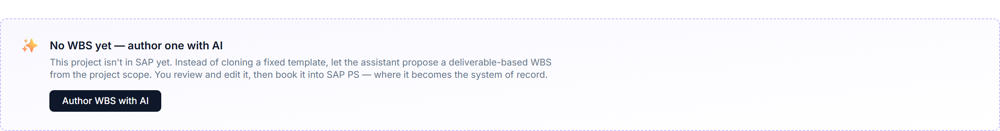

The canonical **work breakdown structure**: the colour-coded WBS tree that is the join
key between cost and schedule, with provenance showing which branches are booked to the
system of record and which were AI-authored and approved (the upstream bookend). Risks
and issues are shown mapped to their WBS branch.

### Schedule

The project timeline and milestones — the scheduler's contribution, framed as a
forecast-vs-contract reconciliation rather than a re-scheduling.

### Earned value

The flagship tab: the **S-curve** (PV/EV/AC), CPI/SPI and earned schedule, **EV by WBS
branch** (which branch carries the overrun), and the **forecast-trend** chart with the
margin-at-complete band (A5, A6).

### Cost

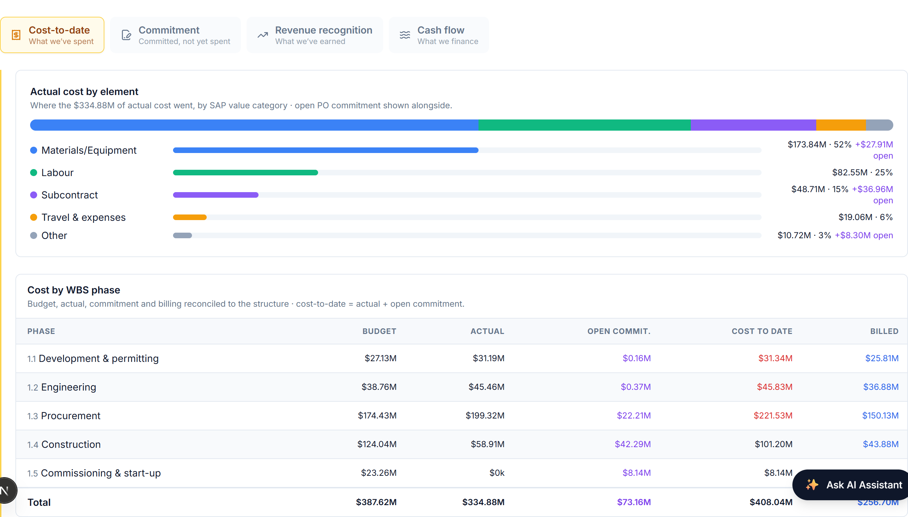

A single financial tab with four lenses behind a segmented control, telling the money
story in order: **Cost-to-date** (where it went, by element and WBS phase),
**Commitment** (open POs, committed but not spent), **Revenue recognition** (cost-based
POC, WIP/deferred; A7), and **Cash flow** (funding exposure; A8).

### Risks & issues, Changes, Variance

The registers and their synthesis:

- **Risks & issues** — the project risk register (inherent/residual EMV, mitigation;
  A11) and the issue queue (aging, SLA, priority; A12).
- **Changes** — the change & trend register: pipeline, margin impact, drivers,
  funded-vs-absorbed and recovery confidence (A10).
- **Variance** — CV/SV, VAC and the TCPI recovery test (A13).

### Planning

The AI-authored planning artefacts for the project — charter, schedule analysis, budget
basis, communications and the rest — each editable with provenance, produced by the
planning agents.

### Why a single workspace

Before AI PMO, answering "how is this project?" meant opening SAP for cost, the scheduler
for time, and a stack of spreadsheets for the registers. The workspace collapses that
into one navigable page where every tab is the same project seen through a different
capability — cost and schedule already reconciled on the WBS, the registers quantified,
and an assistant on hand to narrate any of it. It is the portfolio dashboard's logic
applied one level down: one synthesis, many lenses, no spreadsheet.

---

*Cross-reference: the workspace tabs are the project-level expression of the capability
chapters — structure, earned value (A5), forecasting (A6), the money lenses (A7–A9),
change (A10), risk/issues (A11/A12), variance (A13). Implemented in the Technical
Edition as the tabbed project page reading the canonical model.*

## The AI Agents — Your Specialist Team

AI PMO is not a single chatbot. It is a **roster of specialist agents** — fifteen of them — each one grounded in a recognised project‑management method and each responsible for a narrow, well‑understood job. One agent drafts a charter; another reasons about the critical path; another controls the cost‑to‑cash position; another reviews a change order four ways for commercial exposure. You never have to remember which is which: you type what you need in plain language and the system routes you to the right specialist.

This chapter explains **what the agents are, how you work with them, what they can read and write, and which agents each role is allowed to use** — the governance model that keeps a powerful capability safe.

### One surface for everything: the Ask AI Assistant

Every interaction with the agents happens in one place — the **Ask AI Assistant**, the floating panel in the bottom‑right of every page. There is deliberately no second console, no separate "create a risk" form, no admin screen. Whether you are *asking* a question, *raising* a risk, or *assigning* a task to a colleague, you do it by typing into the same assistant. This is the single most important design decision in the product: **one surface, so there is one place to learn, one place to govern, and one audit trail.**

The assistant is **context‑aware**. When you open it on a project page it works against that project's data; on the portfolio dashboard it works across the whole portfolio. The header always tells you which.

When the panel is empty it offers **role‑aware starter prompts** — a "Create / Update / Assign" row and an "Ask agent" row — so the actions available to you are discoverable without reading a manual. Pick one, edit it, and send.

> **Auto‑routing.** By default the assistant is set to **Auto**: you type, and a lightweight router reads your request and picks the right specialist. Power users can override the choice with the agent dropdown, but most of the time you should not have to think about which agent you need — that is the router's job.

### The roster

Each agent does a few things well and deliberately *not* others (so it never strays outside its competence). The table below is the quick reference; ask the assistant the example prompt to see any agent in action.

| Agent | What it answers | Try asking |
|---|---|---|
| **Charter Drafter** | The founding charter — scope, deliverables, milestones, governance | "Draft the charter for this project." |
| **Stakeholder Analyst** | Who has a stake, and how to engage each | "Build the stakeholder register." |
| **WBS Builder** | The work broken into deliverable packages | "Build the WBS to Level 1–3." |
| **Schedule Reasoner** | Critical path, float, sequencing risk | "What's the critical path, and what's most at risk?" |
| **Budget Builder** | Cost broken across the major categories | "Build the cost breakdown structure." |
| **Communications Planner** | Who hears what, how often, through which channel | "Build the comms plan." |
| **Issue Logger** | What open issues matter most, and why | "Summarise the open issues; flag overdue high‑severity ones." |
| **Variance Analyst** | Are we on cost and on schedule? (CPI/SPI) | "Summarise the variance position and flag concerns." |
| **Change Order Reviewer** | Is a change order commercially sound? | "Review CO‑U01 — is margin protected?" |
| **Risk Analyst** | The project risk register, made current and readable | "What are the top risks to watch, and why?" |
| **Lessons‑Learned Synthesiser** | The lessons worth adopting firm‑wide | "What are the top three firm‑level lessons here?" |
| **Closeout Reporter** | How the project actually went, vs baseline | "Draft the closeout executive summary." |
| **Portfolio Risk Reviewer** | Risk patterns that span *many* projects | "Where is cross‑cutting risk emerging across the portfolio?" |
| **Status Reporter** | The one‑page weekly status, tailored to the reader | "Write this week's status report for the sponsor." |
| **Cost Controller** | Commitment, cost‑to‑date, and earned‑vs‑billed | "Give me the cost and commitment position." |

Every agent is grounded in a standard — PMBOK knowledge areas for the planning and control agents, Earned Value Management for variance, a four‑frame commercial analysis for change orders, IFRS‑15 / results‑analysis for revenue. The methods are not improvised; they are the reason the answers are defensible.

### Two ways an agent helps: reading and writing

Most of what you ask an agent to do is **read‑and‑synthesise**: summarise the variance, surface the top risks, explain where the critical path runs. The agent reads the project's data and gives you a grounded answer — fast, between the formal monthly reviews.

But the agents can also **write** — and they do it through the same chat, never a separate form:

- **Raise an entry.** Type "log a vendor risk: the sole‑source transformer supplier may slip delivery by six weeks" and the Risk Analyst drafts a structured risk and shows you an editable **confirm card** in the chat. You review the inferred fields, correct anything, and click **Add to register**. The same flow raises **issues** and **change / trend entries**.
- **Assign a task.** Type "assign a task to Procurement: pre‑qualify a second transformer supplier — high urgency" and the agent drafts it into an **Assign actions** card; confirm, and it lands in that colleague's action queue.

Two principles govern every write:

> **Human in the loop.** The agent never writes silently. It *drafts*; you *confirm*. The confirm card is always the last step, so nothing reaches the register or a colleague's queue without your explicit click.

> **Provenance is honest.** AI PMO owns the things no ERP does — the **risk register and the issue log live here**, so a risk or issue you raise through the agent is simply **agent‑raised** in AI PMO’s own register. A **change order** is different: SAP PS is its system of record, so a change you raise is **provisional until it is booked into SAP PS**, and it round‑trips out through the existing export — clearly marked until then. Either way, everything you raise is tagged so its origin is never in doubt.

### Who can do what — agents by role

Not every role can use every agent. Each role is granted only the agents that fit its remit — a least‑privilege model — so the starter prompts and the create/assign actions a person sees are exactly the ones they are allowed to use. A read‑only role sees no create or assign actions at all.

The table below shows the **create and assign** capabilities by role (the read‑and‑analyse asks adapt the same way — Procurement sees the change‑order ask, the Cost Controller sees the cost‑and‑commitment ask, and so on).

| Role | Raise risk | Log issue | Change / trend | Assign task |
|---|:---:|:---:|:---:|:---:|
| **Senior PM (PMO Director)** | ✓ | ✓ | ✓ | ✓ |
| **Program Manager** | ✓ | ✓ | ✓ | ✓ |
| **Risk Analyst** | ✓ | ✓ | — | ✓ |
| **Procurement Strategist** | ✓ | — | ✓ | ✓ |
| **Commercial Manager** | — | — | ✓ | ✓ |
| **Construction Manager** | — | ✓ | ✓ | ✓ |
| **Engineering Manager** | ✓ | — | — | ✓ |
| **HSE Manager** | — | ✓ | — | ✓ |
| **Project Controls Manager** | — | — | — | ✓ |
| **VP Sponsor** | — | — | — | — |

Each cell follows directly from the agents the role holds: raising a **risk** needs the Risk Analyst, logging an **issue** needs the Issue Logger, a **change / trend** entry needs the Change Order Reviewer, and **assigning** a task needs write access. The **VP Sponsor** is read‑only by design — an executive who consumes status, variance and patterns but does not edit state — so the Sponsor sees analysis prompts only. The same gate is enforced on the server, not just hidden in the interface, so the permission is real.

### Where these work: project vs portfolio

The table above answers *what* a role may do. *Where* it can do it depends on the context the assistant is in — and the assistant adapts its starter prompts to match (the same role sees one set of chips on a project page and a different set on the portfolio dashboard).

The rule is simple: **a risk, issue or change entry is always raised against a specific project**, so those actions are offered only when you are inside one. Assigning a task and asking for analysis work in both places — the analysis simply widens from a single project to the whole portfolio.

| What you do | On a project page | On the portfolio dashboard |
|---|---|---|
| **Raise a risk / issue / change** | Yes — attached to that project | Open a project first (entries belong to a project) |
| **Assign a task** | Yes — scoped to the project | Yes — portfolio‑level |
| **Ask / analyse** | *This* project: variance, top risks, cost position | *Across* projects: which need attention, where risk 

# Part V — Justification & Governance

## Why These Formulas

### The standards behind AI PMO's numbers

*Business Edition · Chapter A17 — justification & governance*

### The point of this chapter

A recurring, fair question from anyone evaluating AI PMO is: *where do these
methods come from — did you invent them?* The answer, deliberately, is no. Every
calculation in the money story and the risk chapters is a recognised industry or
accounting standard, applied faithfully. Using standards rather than house rules is
what makes the numbers **defensible** — consistent across projects, familiar to
any reviewer, and reconcilable to the systems of record. This chapter names the
sources.

### Earned value — EVM / ANSI-EIA-748 and the AACE practices

The earned-value method (A5) and its variances (A13) are the established
**Earned Value Management** discipline, codified in the United States as
**ANSI/EIA-748** and embedded in **PMI's PMBOK Guide**. PV, EV, AC, CPI, SPI, CV,
SV, VAC and TCPI are not AI PMO inventions — they are the standard EVM formulae,
used verbatim. **AACE International** (the Association for the Advancement of Cost
Engineering) publishes the Recommended Practices that govern how the inputs —
progress measurement, estimate classes, forecasting — should be prepared. AI PMO's
contribution is the *synthesis and timeliness*, not the formulae.

### Forecasting to EAC — AACE forecasting practice

The three EAC methods (A6) — budget-at-completion over CPI; actuals plus remaining
budget; and the CPI×SPI-weighted forecast — are the standard EVM forecasting
formulae, with the choice between them guided by AACE's forecasting recommended
practice and the TCPI reality test (A13). Picking a forecast is a judgement; the
methods that bound it are standard.

### Revenue recognition — IFRS 15

Revenue recognition (A7) follows **IFRS 15, "Revenue from Contracts with
Customers"** — the governing accounting standard — applied as over-time recognition
by a cost-based input method (percentage-of-completion). The WIP/contract-asset and
deferred-revenue/contract-liability treatment is IFRS 15's, mirrored in SAP's
Results Analysis. This is the one area where the standard is not optional: it is the
basis the auditor will require.

### Risk — EMV and P50/P80 practice

The risk chapter (A11) uses **Expected Monetary Value** (probability × impact) and
inherent-to-residual reduction — standard quantitative risk-management technique
found in the PMBOK risk knowledge area — and sizes contingency against **P50/P80**
confidence levels, the convention used in quantitative risk analysis. Where a
formal Monte Carlo simulation exists, AI PMO consumes its output rather than
re-deriving it.

### Change and cash — contract and treasury convention

Change and trend management (A10) follows standard project-controls trend practice
and reflects IFRS 15's variable-consideration constraint in its recovery-confidence
treatment. Cash flow (A8) uses ordinary treasury convention — payment and
collection lags, retention — made explicit as adjustable assumptions.

### Why standards, not house rules

Three reasons, each load-bearing. **Defensibility:** a reviewer who knows EVM or
IFRS 15 can check AI PMO's numbers against a standard they already trust.
**Consistency:** the same method applied to every project makes cross-project
comparison valid. **Reconciliation:** standard methods tie back to the systems of
record, so the synthesis layer never drifts away from the ledger and the schedule.
The innovation in AI PMO is emphatically *not* in the formulae — it is in computing
the standard formulae continuously, across the seam, with a narrative on top.

---

*Cross-reference: this chapter underpins the whole money story (A5–A10) and the risk
and variance chapters (A11, A13), and connects to A18 (scope discipline) — standard
methods applied only to data AI PMO may legitimately synthesise or consume.*

# Appendices

## Glossary

### EPC, earned-value and financial terms used in this book

*Business Edition · Appendix*

**AC — Actual Cost.** The cost actually incurred for the work performed, from the
cost system (SAP PS).

**As-built margin.** Forecast margin at completion: current contract value minus
estimate at completion (EAC).

**As-planned margin.** Margin in the current plan: current contract value minus
current WBS budget.

**As-sold margin.** Margin at booking: sold contract value minus the frozen
baseline budget.

**BAC — Budget at Completion.** The total approved project budget.

**CPI — Cost Performance Index.** EV ÷ AC. Above 1.0 = under cost; below = over.

**CV — Cost Variance.** EV − AC. Negative = over cost.

**Contract asset (WIP).** Revenue recognised in excess of amounts billed — earned
but not yet invoiced.

**Contract liability (deferred revenue).** Amounts billed in excess of revenue
recognised — invoiced ahead of the work earned.

**Contingency.** Budget set aside to cover identified risk; sized against residual
exposure at a P50/P80 confidence level.

**EAC — Estimate at Completion.** The forecast total cost of the project.

**EMV — Expected Monetary Value.** Probability × impact; the risk-weighted cost of
a risk.

**EV — Earned Value.** The budgeted cost of the work actually performed; physical
progress priced at budget.

**Earned schedule.** Schedule performance measured in time units rather than cost,
correcting SPI's end-of-project drift.

**EVM — Earned Value Management.** The standard cost/schedule performance
discipline (ANSI/EIA-748, PMBOK).

**IFRS 15.** The accounting standard governing revenue recognition from customer
contracts.

**Inherent / residual EMV.** Risk-weighted exposure before / after mitigation.

**MTTR — Mean Time To Resolve.** Average time from an issue being raised to closed.

**Peak funding requirement.** The maximum cash a project ties up at once — the
trough of the net cash position.

**POC — Percentage of Completion.** Progress measure; cost-based POC = actual cost
÷ expected cost, used for revenue recognition.

**PV — Planned Value.** The budgeted cost of the work planned to be done by now;
the baseline.

**Recognised revenue.** Revenue that may be booked to date: POC × contract value
(IFRS 15).

**Residual exposure.** Risk-weighted cost remaining after mitigation, for live
risks only.

**Retention.** A percentage of each payment withheld by the client until completion
or end of the defects period.

**SPI — Schedule Performance Index.** EV ÷ PV. Above 1.0 = ahead; below = behind.

**SV — Schedule Variance.** EV − PV. Negative = behind schedule.

**TCPI — To-Complete Performance Index.** The cost efficiency the remaining work
must achieve to hit a target (budget or forecast); the recovery reality test.

**Trend.** A potential change identified before it becomes a funded change order or
an absorbed (unfunded) cost.

**VAC — Variance at Completion.** BAC − EAC; the forecast total over- or under-run.

**WBS — Work Breakdown Structure.** The hierarchical breakdown of project scope;
the code on which cost (SAP) and schedule (P6/MSP) are joined.

**WIP — Work in Progress.** See *Contract asset*.
