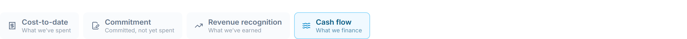
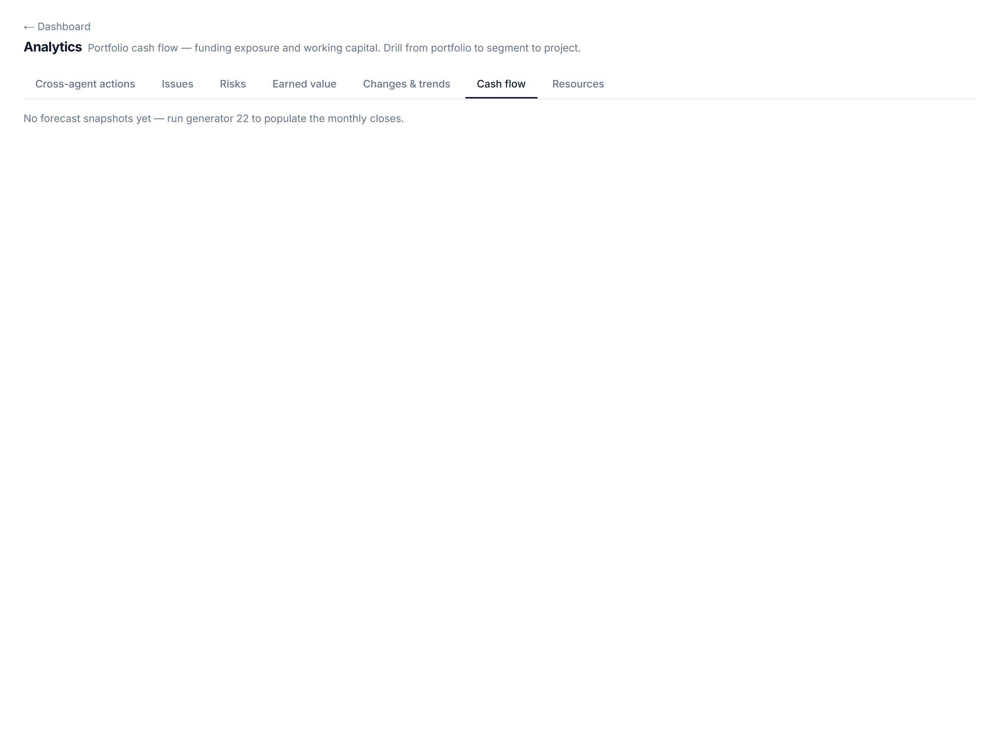

# Cash Flow & Funding Exposure

## How much of our own money will this project tie up, when does funding peak, and when does it turn cash-positive?

Profit and cash are not the same thing, and on a long EPC contract they can move in opposite directions for months. A project can be recognising healthy margin and still be haemorrhaging cash — because it pays its suppliers and labour long before the client pays it. **Cash-flow forecasting** answers the treasury question margin never does: *how much of our own money will this project tie up, when does that funding requirement peak, and when does the project finally start paying for itself?*

## Cash is not cost, revenue, or earned value

This is a distinct lens on the same project:

- **Cost** is what you have *committed and consumed*.
- **Recognised revenue** is what you may *book* — an accounting event.
- **Earned value** is *progress* against budget.
- **Cash flow** is *actual money moving in and out of the bank* — and it moves on the contract's **payment terms**, not on when work is done or revenue is recognised.

The defining feature of construction cash flow is **timing**. You incur cost now, pay it on your supplier terms, bill the client on milestones, and collect on their terms — typically later. The lag between paying out and collecting in is the whole story.

## The two curves

AI PMO models a project's cash position as two cumulative curves over time, synthesised from data already in SAP and the forecast — no new ledger, no new entry:

**Cash out — cumulative payments.** The project's cost curve (actual cost to date, then ramping to the forecast cost at completion, EAC) **shifted later by the payment lag**, because you pay a cost some weeks after you incur it. The default payment lag is one month.

**Cash in — cumulative collections.** The project's billing curve (billed to date, then ramping toward the contract value) **shifted later by the collection lag** — the time between raising an invoice and the client's cash arriving. The default collection lag is two months, and the curve is taken **net of retention**.

Both curves ramp smoothly between the latest actuals and their end points, so the forecast portion is a believable glide rather than a straight line.

## The funding gap is working capital you finance

The vertical distance between the two curves is the heart of the chart:

> **Net cash position = cumulative cash in − cumulative cash out.**

While cash out runs above cash in — which it does for most of an EPC project's life — the **net is negative**, and that shaded gap is **working capital the contractor is financing out of its own balance sheet or facilities.** It is real money with a real cost: every dollar of that gap is a dollar borrowed, or a dollar of the firm's cash not earning elsewhere. This is why a profitable project can still be a cash problem: margin tells you the job will end up ahead; the funding gap tells you how much you must carry to *get* there.

## Peak funding and the cash-positive crossover

The single most important number on the chart is the **peak funding need** — the deepest point of the negative net, the maximum cash the project will ever have tied up at once, and *when* it occurs. This is the figure a treasurer sizes facilities against and a finance director wants on one line: *"this job will need up to $X of funding, worst around month Y."* AI PMO reads it straight off the trough of the net curve.

As the project winds down, billing and collections catch up to and overtake spending, the net curve climbs back through zero, and the project becomes **cash-positive** — from that month on it returns cash rather than consuming it. AI PMO reports the crossover month. Deep early funding, late recovery: the classic EPC cash curve, and seeing the crossover date lets a business plan when the project stops being a drain on group cash.

## Retention

Construction contracts almost always withhold **retention** — a percentage of each payment (the model uses 5%) held back by the client until completion or the end of the defects period. It matters to cash because it is money you have earned and billed but will **not collect until the very end**. AI PMO models the collectible cash-in net of retention, so both the peak funding and the cash-positive point reflect the cash you can actually expect — not the headline billing.

## A worked example

A project mid-build, as AI PMO's funding-exposure chart would show it:

- **Net cash position: −$77.6M** to date — the project is currently carrying $77.6M of working capital.
- **Peak funding need: −$91.7M, around March** — the deepest the hole gets; the firm must be able to fund roughly $92M at the worst point.
- **Cash-positive: June** — the forecast month the net crosses back above zero and the project starts returning cash.
- **Terms (assumed): collect 2 months / pay 1 month · 5% retention** — the levers behind the curves.

The story: this job consumes up to ~$92M of cash before it turns the corner in June. That is not a margin problem — it is a *funding* problem, and exactly the number that should be agreed with treasury before the project, not discovered during it. It also points straight at the levers: pull the collection lag in by a month, or de-front-load the retention, and the peak shrinks.

## The portfolio view

A single project's funding need is useful; the **portfolio's** is decisive, because peaks that are survivable one at a time can collide. AI PMO rolls every active project's cash curve onto one shared monthly timeline — a project contributes nothing before it starts and its final position after it finishes — to produce the whole book's funding shape: total working capital tied up, the portfolio peak funding requirement and when it lands, and the aggregate cash-positive crossover. It drills the same number down to segment and then to a single project, so a treasurer sees not just *how much* funding the portfolio needs but *which* projects and segments are driving the peak.

Because cash flow is pure synthesis — the two curves derived from the cost/EAC forecast and the billing/contract figures, each shifted by the lags and netted for retention — it updates the moment cost, billing, or the forecast move. The lags and retention are **explicit, adjustable assumptions**, shown on the chart, not hidden, so the forecast is honest about what it depends on. Actual cash positions, drawdowns and facility management stay with finance; AI PMO's job is to see the peak coming.

> **A profitable project can still be a cash problem** — margin says the job ends ahead, but the funding gap says how much of your own money you must carry to get there.

*Worked figures use the synthetic demonstration portfolio.*
