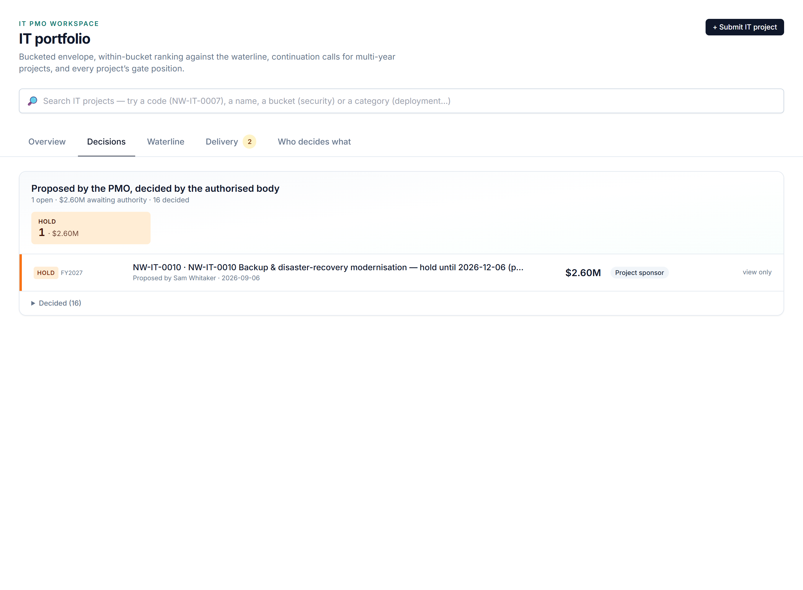

# Who Decides What — Delegation of Authority

## The question it answers

*For this decision, at this amount, at this point in the project's life — who is allowed to say yes, who must be consulted first, and can we prove afterwards that it happened that way?*

Company money attracts company rules. In most organisations those rules live in a delegation-of-authority document that few people have read and none can check against what actually happened. The IT workspace turns that document into something the application enforces: every funding or lifecycle decision is **proposed** by one person, **routed** by a matrix to a named body, **concurred** where required, and **decided** by someone with the authority to do so — and the record of all four steps is kept.

## The bodies

Seven kinds of decision body exist for IT, each with a defined membership and, where it matters, a quorum:

| Body | Who | Owns |
|---|---|---|
| **IT investment board** | CIO (chair), the Finance controller and the bucket owners; **quorum 3** | The envelope and its split by bucket; the waterline above the CIO threshold; large continuations and commits; post-commit cancellations; displacing change orders |
| **CIO** | One person | The mid-band: decisions between the bucket owner's limit and the board's threshold; in-year reserve draws within limit |
| **Bucket owner** (one per bucket: Infrastructure, Applications, Security, Compliance) | One person each | Ranking within the bucket; small envelopes, commits and reserve draws within delegation; post-commit holds; pre-commit cancellations |
| **Project sponsor** | The business executive who owns the benefit | Changes inside the project's own contingency; pre-commit holds; chairs the later gates. **Cannot approve their own funding** |
| **Finance** | The IT finance partner | **Concurrence, not approval**: the numbers before ranking, the capital / expense split at commit, AuC settlement at a post-commit cancellation |
| **Architecture & security review** | Design authority | Concurrence at the design gate |
| **IT PMO** | The portfolio manager | Proposes and records; a **non-voting** seat — the PMO can never decide |

A body decides only when one of its **voting** members records the decision. The PMO sits in the room for every board and prepares every package, but its seat is explicitly non-voting: proposing and deciding are kept in different hands.

## The matrix

The routing rule is a table — the **authority matrix** — keyed by the kind of decision, the amount band, and where relevant the funding source and whether the project has passed its commit gate. The IT matrix as shipped:

| Decision | Condition | Decides | Must concur |
|---|---|---|---|
| Envelope split by bucket, reserves | always | Investment board | Finance |
| Waterline (fund / defer within a bucket) | up to $500k | Bucket owner | — |
| | $500k – $2M | CIO | — |
| | above $2M | Investment board | — |
| Continuation (next-year slice) | same bands | Bucket owner / CIO / Board | **Finance** |
| Commit baseline (Stage Gate 1) | same bands | Bucket owner / CIO / Board | **Finance** — capital / expense split |
| Change order | from project contingency | Sponsor | — |
| | from bucket reserve, up to $250k | Bucket owner | — |
| | from bucket reserve, above $250k | CIO | — |
| | by displacing another project | Investment board | — |
| Reserve draw (urgent, in-year) | up to $500k | CIO | — |
| | above $500k | Investment board | — |
| Hold | before commit | Sponsor | — |
| | after commit | Bucket owner (two quarters max) | — |
| Cancel | before commit | Bucket owner | — |
| | after commit | Investment board | **Finance** — AuC settlement |

Three design choices are worth noticing. The bands are the same for waterline, continuation and commit, so a project is judged by the same level of authority throughout its life. Finance concurs on every decision that changes what will be capitalised, and on nothing else — concurrence is a check on the *numbers*, not a second vote. And the two lifecycle decisions, hold and cancel, are cheap before commit and expensive after it, with the approver chosen accordingly.

The matrix is reference data, not code. The **Who decides what** tab on the IT portfolio page shows it in full, so any user can see the rule before they ask for something.

## How a decision moves

Every decision in the workspace follows the same four steps, whichever body it goes to.

**1. Propose.** Someone with a writing role raises the request from where the work is — *Submit waterline* on the portfolio page, *Go* at the commit gate, *Raise a change order* on the project — and the workspace creates a **decision record**: what is proposed, the amount, who proposed it and when. If the matrix says the proposer's own authority covers it, the decision applies immediately and the record says so.

**2. Route.** The matrix resolves the body from the decision kind, amount, funding source and commit state. The record now says *awaiting the CIO* or *awaiting the Bucket owner — Security*, and the rule that put it there is shown on the card, so nobody has to wonder why.

**3. Concur.** If the rule names a concurring body, its member records **Concur** or **Object** with a note. For the decider, *Approve* stays locked until every required concurrence is in — the card says exactly whose is missing. *Return for more work* and *Reject* never wait for concurrence; a bad package can be sent back at once.

**4. Decide.** A voting member of the named body records **Approve**, **Return for more work** or **Reject**, with minutes and any conditions. For the investment board the decider also lists the **attendees**, and an approval below quorum is refused. On approval the workspace applies the effect — grants the envelope, locks the baseline, approves the change order, defers the displaced project — and writes the sanction event that makes it auditable.

Two protections run underneath. The **proposer is never the decider** — the workspace flags any record where they coincide, with one designed exception: a sponsor approving a change inside their own project contingency, which the matrix explicitly allows. And a request that is still open can be **withdrawn** only by the person who raised it.

## Knowing what is yours to do

A delegation model only works if the people it names actually see their queue. The workspace does three things about that.

The header carries a **For you** pill for every role: the count of items awaiting *your* decision or concurrence, one click from the list. The IT portfolio page's Decisions tab lists **yours first**, and each card you can act on is marked **You are deciding** — the decider sees the full proposal (the project, its lifecycle state, the amount, the rows above and below the line) before the buttons. And on an IT project page an action banner tells each role what is mandatory for them right now: the Finance partner sees *concurrence owed on the commit baseline*; the sponsor sees *a hold request awaiting you*; the project manager sees *this year's slice has not been requested*.

## Reading the record afterwards

Because every step is recorded, the decision history is itself data. The portfolio can show, for the last ninety days, how many decisions each body took, how long the median one waited, whether any board approval fell below quorum, whether any hold ran past its time box, and whether any running project has failed to request its next-year slice. Those measures are how a leadership team tells the difference between governance that is *designed* well and governance that is *working*, and they are what an audit of the delegation itself would ask for.

> **Authority by amount, concurrence by consequence, one record per decision.** Small choices are made close to the work and large ones by a board with a quorum; Finance checks what will be capitalised; and every approval carries the names of who proposed it, who concurred, and who decided.
