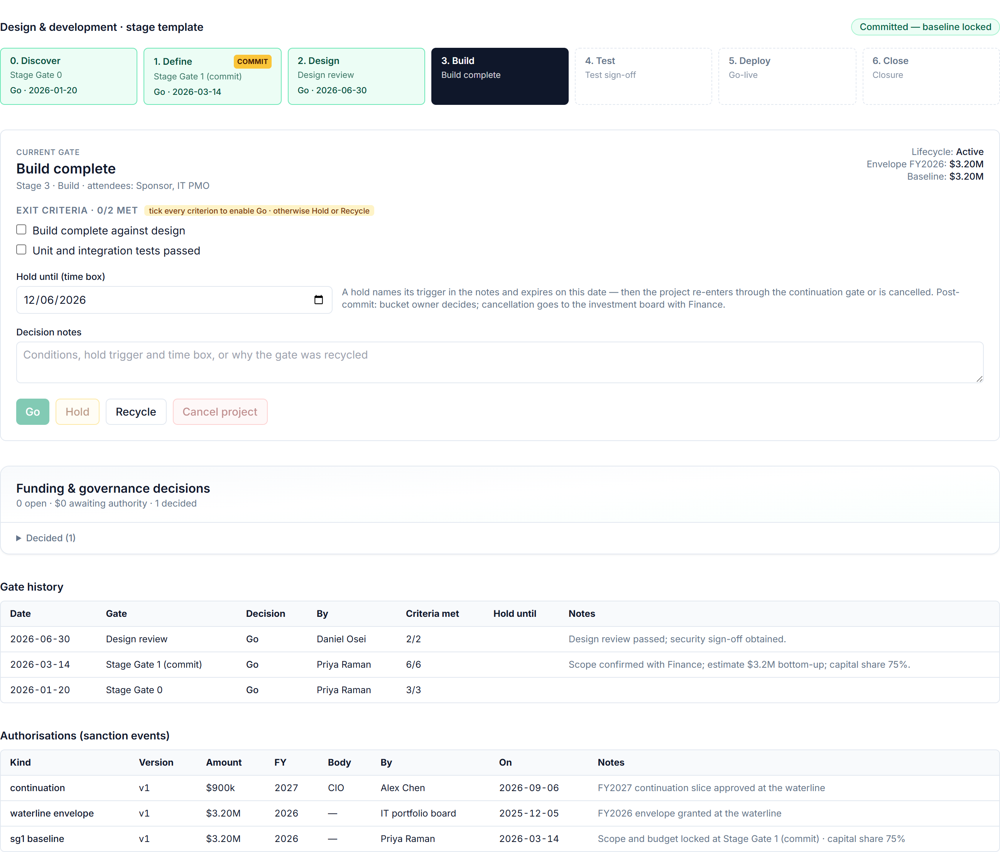
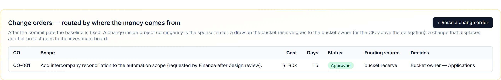

# The Delivery Clock — Stage Gates, the Commit Baseline and Change Orders

## The question it answers

*Where is this project in its life, has it been committed to yet, and if something changes — who pays and who says yes?*

Being above the waterline grants a project money for the year. It does not commit the company to spending it. That commitment is made on the **delivery clock**: a sequence of stage gates chosen by the project's category, with one of them — the commit gate — locking scope and budget into a baseline that every later change is measured against.

## Three templates, one commit gate each

An IT project's **category** picks its stage-gate template at intake. The workspace ships with three, and the number of gates varies with how much uncertainty the category carries:

**Design & development** — new capability, built or configured. Seven stages: *Discover* (Stage Gate 0) → *Define* (**Stage Gate 1, commit**) → *Design* (design review) → *Build* (build complete) → *Test* (test sign-off) → *Deploy* (go-live) → *Close* (closure). Discover exists precisely so that a project can spend a little to find out whether it should spend a lot.

**Deployment / rollout** — installing or rolling out something that already exists. Five stages: *Plan* (**Stage Gate 1, commit**) → *Pilot* → *Rollout* → *Stabilise* → *Close*. There is no discovery stage: the uncertainty is in the estimate and the sites, not the solution.

**Maintenance / upgrade** — fixing or improving an existing system. Five stages: *Assess* (**Stage Gate 1, commit**) → *Plan* → *Implement* → *Validate* → *Close*.

Every stage has a **gate** at its end with named **exit criteria** and named attendees. The commit gate's criteria are the strictest, and they are the same idea in each template: scope confirmed, a bottom-up estimate verified, the **capital / expense split agreed with Finance**, feasibility confirmed, a resource plan committed, and — for design work — a **benefits owner named**. The closure gate's criteria are also constant: assets under construction settled to fixed assets or expense posted, lessons learned recorded, benefits tracking started.

## The gate decision

At each gate the project manager scores the exit criteria on the **Gates** tab and records one of four outcomes:

- **Go** — proceed to the next stage. Go is only enabled when **every exit criterion is ticked**. This is not bureaucracy; it is the whole point of a gate. If the package is not ready, the honest outcomes are the other three.
- **Hold** — pause, with a **time box**: a date by which the hold must be lifted or turned into a cancellation. The form proposes three months; a post-commit hold is limited to two quarters. A hold always needs a note saying why.
- **Recycle** — send the package back to the current stage for more work.
- **Cancel** — stop. Before commit this is cheap and meant to be ordinary; after commit it is an asset write-off decision (see below).

A hold is lifted with **Resume**, by the same authority that granted it. Holds that will expire within thirty days are flagged on the portfolio page, and a hold past its time box is a governance finding — nothing is allowed to drift.

## Stage Gate 1 — the commit baseline

The commit gate is different from every other gate in one respect: a **Go** here does not simply advance the stage. It **submits the baseline for decision** — the amount becomes a proposed *commit baseline*, routed by the delegation matrix to the bucket owner (up to $500k), the CIO ($500k–$2M) or the investment board (above $2M), and in every band it needs **Finance to concur on the capital / expense split first**. Approve is not even offered to the decider until Finance has signed.

Two guards sit on the button. If a commit is already awaiting decision, a second cannot be raised. And if the proposed baseline exceeds the fiscal-year envelope granted at the waterline **by more than ten percent**, the page refuses the Go and says so: a project that has grown that much since ranking goes back to the portfolio, not through the gate.

When the baseline is approved, scope and budget are **locked** — recorded as a sanction event against the project, with the approved budget and its contingency — and the project becomes *active*. From this moment on there are no quiet adjustments. Every change to scope, cost or time is a **change order**.

## Change orders — who pays decides who approves

A change order on an IT project carries the usual description (scope summary, driver — scope clarification, business request, regulatory, technical constraint, vendor, estimate error — cost and schedule days) and one field that revenue change orders do not have: a **funding source**. The funding source determines the approver, because the question *who pays?* is the question *whose money is it?*

| Funding source | What it means | Who decides |
|---|---|---|
| **Project contingency** | Absorbed inside the locked baseline | The **sponsor** — it is their contingency; the approved budget does not move |
| **Bucket reserve** | Drawn from the reserve held back at the waterline | **Bucket owner** up to $250k; **CIO** above — the approved budget increases |
| **Displacement** | Paid for by taking money from another named project | The **investment board** — a portfolio decision, never a project one |

A displacement-funded change names the project it displaces. When the board approves, that project is **deferred** automatically if it has not yet committed, with a gate record explaining why — so the money trail is visible on both projects, the one that gained and the one that gave way.

Two smaller rules keep the change-order queue honest. There is **one live request per change order**: while a request is awaiting decision the buttons lock, and if a duplicate slips through, the decision on one supersedes the other. And only the person who raised a request can **withdraw** it.

Separately from change orders, an urgent in-year need can be met by a **reserve draw** — the CIO up to $500k, the board above — with the board notified retrospectively. It is the release valve that lets the reserve do its job without reopening the waterline.

## Cancelling, and what it costs

Cancelling **before commit** is a bucket-owner decision and is meant to be routine: the discovery money is spent, the answer was no, the company learned something cheaply. Cancelling **after commit** is an investment-board decision with **Finance concurrence**, because by then costs have been capitalised as assets under construction and the cancellation is a write-off. The workspace routes the two cases differently for exactly that reason.

## When people are pulled away — the displacement log

IT projects rarely slip because of money. They slip because the SAP Basis engineer was pulled onto an incident, or the integration lead was borrowed by a higher-priority project. The **displacement log** on the project's Overview records each such event: who, with what skill, **why** (incident or run work, a higher-priority project, an audit or compliance demand, a revenue project's priority or liquidated-damages exposure, or other), from when, and how many schedule days it cost. An open entry shows as *still displaced* until it is closed.

The point is attribution. When the project misses its date, the log says how much of the slip was caused by decisions made elsewhere — and the portfolio page counts *people displaced* alongside holds and open decisions, because it is a portfolio problem, not a project one.

## After go-live — benefits

The business case promised an annual benefit and named a benefits owner. Once the project closes, the **benefits** section on the Overview lets that owner record what was actually realised against the plan, period by period. The portfolio page counts projects whose benefits are behind plan. This closes the loop the funding clock opened: next year's business cases are judged by people who can see whether last year's promises were kept.

> **The commit gate is the hinge between the two clocks.** Money is granted by the year; commitment is made once, at Stage Gate 1, on a package that Finance has checked — and everything after that is a change order with a funding source, an amount band and a named approver.
