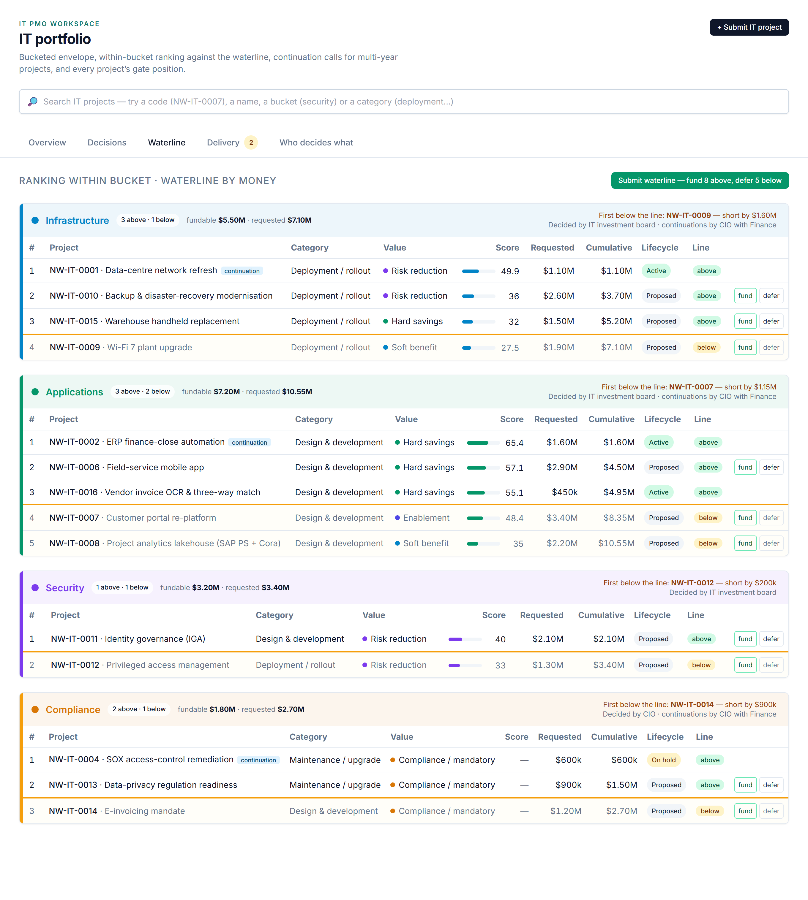

# The Funding Clock — Buckets, Business Cases and the Waterline

## The question it answers

*Of everything IT could do next year, which projects get money — and how do we know the decision was made fairly?*

The funding clock is the annual cycle. It starts when the company sets the IT envelope, runs through business cases and ranking, ends with a waterline decision per bucket, and then starts again the following year for every project that is still running. This chapter follows the money from the envelope down to a single project's approved slice.

## Step 1 — The envelope and its buckets

The IT envelope for a fiscal year is split into **buckets by business technology**. The workspace ships with four:

| Bucket | What it funds | How it is ranked |
|---|---|---|
| **Infrastructure** | Data-centre, network, end-user and platform work | Discretionary — by score |
| **Applications** | Business systems: ERP, CRM, portals, analytics | Discretionary — by score |
| **Security** | Identity, endpoint, privileged access, detection | Discretionary — by score |
| **Compliance** | Work the company must do — audit findings, regulatory dates | **Mandatory lane** — by cost-to-comply and deadline |

Each bucket has two numbers set at the start of the year: the **allocated amount** and a **reserve** held back inside it. The money available to rank against — the **fundable amount** — is the allocation minus the reserve. The reserve is not spent at the waterline; it is kept for in-year change orders and urgent draws, so that a surprise in March does not have to unpick a decision made in December.

Setting the split of the envelope by bucket, and the reserves, is always an **investment board** decision with Finance concurring. It is the one funding decision that cannot be delegated downward.

## Step 2 — The business case

Every candidate enters through the **IT intake form** with a business case attached. The form is deliberately plain — this is data capture, not reasoning — and asks for what a ranking actually needs:

- **Category** — design & development, deployment / rollout, or maintenance / upgrade. This chooses the stage-gate template the project will follow (see the next chapter).
- **Bucket** and **fiscal year** — where it competes and when.
- **Value type** — one of *hard savings*, *soft benefit*, *risk reduction*, *enablement* (it makes another investment possible) or *compliance / mandatory*. Naming the type honestly is the single most useful thing a sponsor can do; the review agent will challenge a "hard saving" that is really a soft one.
- **Requested budget** for the year, the **annual benefit** once live, a **strategic score** from 0 to 100, the **expected capital share**, and a **benefits owner** — a named person who will report realisation after go-live.
- The problem being solved, the outcome when done, the systems affected and any hard deadline.
- For a project already running, **continuation of** — the project whose next-year slice this is.

From budget and annual benefit the workspace computes two figures and keeps them current whenever the budget changes:

**Three-year ROI** = (3 × annual benefit − budget) ÷ budget. A $1.6M project returning $1.25M a year has a three-year ROI of (3.75 − 1.6) ÷ 1.6 = **134.4%**.

**Simple payback** = budget ÷ annual benefit, in months. The same project pays back in 1.6 ÷ 1.25 × 12 = **15.4 months**.

Three years is the conventional horizon for comparing IT cases: long enough for a benefit to show, short enough that nobody is rewarded for a benefit promised in year seven.

## Step 3 — The ranking score

Inside a discretionary bucket every candidate gets one number, the **ranking score**, so that the order is explainable rather than argued:

> **Score = ½ × strategic score + ½ × (three-year ROI, capped at 300%, scaled to 0–100) + 2 if the value type is hard savings or enablement.**

Strategic fit and financial return are weighted equally. The ROI is capped so that a tiny project with an absurd percentage cannot outrank a strategic one; the two-point tiebreak reflects that a CFO trusts a hard saving or an enabler more than a soft benefit of the same size. Worked through for the example above with a strategic score of 82: ½ × 82 + ½ × (134.4 ÷ 3) + 2 = 41 + 22.4 + 2 = **65.4**.

The **compliance lane** does not use the score at all. Work the company must do is not competing on return; it is ranked on **shortest payback first, then smallest amount** — in effect, cost-to-comply and how soon the deadline bites.

Two kinds of project are placed before the score is even consulted:

- **Continuations first.** A running project's next-year slice is ranked ahead of every new idea in the bucket. The company has already sunk money into it; the question for a continuation is *cost-to-complete against benefit still achievable*, not *is this a good idea*.
- **Parked projects last, and outside the count.** A project deferred at an earlier waterline keeps its business case but releases its money. It sits at the bottom of its bucket, visibly, and its amount is **not** added to the cumulative — so it can be picked up at a later waterline without distorting this one.

## Step 4 — Drawing the waterline

With the bucket ranked, the workspace runs the cumulative requested amount down the list. Every project whose cumulative total fits inside the fundable amount is **above the waterline**; the first that does not fit is the **first below**, and the difference between its request and the money left is the bucket's **shortfall** — the figure a bucket owner takes to the CIO when arguing for more.

One rule matters here: **the waterline is a line, not a shopping list.** Once the first project fails to fit, nothing smaller below it is allowed to slip in ahead of it. Cherry-picking below the line is exactly the behaviour a ranking exists to prevent; if the company wants the smaller project, it should rank it higher.

A worked example, Applications bucket, one fiscal year, $8.0M allocated with $0.8M reserve, so **$7.2M fundable**:

| Rank | Project | Kind | Score | Request | Cumulative | Result |
|---|---|---|---|---|---|---|
| 1 | ERP finance-close automation, year 2 | Continuation | — | $1.6M | $1.6M | Above |
| 2 | Customer portal re-platform | New, enablement | 78 | $3.4M | $5.0M | Above |
| 3 | Field-service mobile app | New, hard savings | 71 | $2.9M | $7.9M | **First below** — shortfall $0.7M |
| 4 | Project analytics lakehouse | New, soft benefit | 60 | $2.2M | $10.1M | Below |
| — | Legacy reporting rewrite | Parked (deferred last year) | 44 | $0.9M | — | Outside the count |

The bucket owner's question to the CIO is now precise: *$0.7M more funds the mobile app; nothing less does.*

## Step 5 — The decision

The ranking is a proposal until someone with authority approves it. **Submit waterline** on the Waterline tab turns each bucket's ranking into a **decision record** for that bucket and fiscal year — *fund these above, defer those below* — routed to whoever the delegation-of-authority matrix names for the **total being funded**: the **bucket owner** up to $500k, the **CIO** from $500k to $2M, the **investment board** above $2M. Submitting again merges the new ranking into the open record rather than creating a second one, so there is always exactly one live waterline proposal per bucket per year.

Continuations travel as their own record for the bucket, routed by the same bands but additionally requiring **Finance concurrence** — someone independent of the sponsor confirms that cost-to-complete and remaining benefit are what the case says they are.

When the decision body approves, three things happen at once. Every project above the line is **granted its envelope** for the year — recorded as a sanction event, the auditable trail of who authorised how much and when — and moves to *approved*. Every project below the line is **deferred**: parked, not killed, its case intact for the next waterline. And an older, still-open proposal that would have funded a since-deferred project can never resurrect it by accident: an approval only funds projects that are still candidates on the day it is signed.

## Next year, again

Granting an envelope is not committing to the project — that is the commit gate on the delivery clock. And it is not permanent: a project that runs into a second fiscal year must **request its next-year slice** from its project page, which enters it into that bucket's next waterline as a continuation. A running project whose slice has not been requested is flagged on the portfolio page in amber, because the alternative — a project that silently keeps spending on last year's approval — is the failure mode the funding clock exists to prevent.

> **The waterline is the fairness mechanism.** One score, one line per bucket, one live proposal, one named approver by amount — and every project that did not make it parked in plain sight rather than quietly forgotten.
