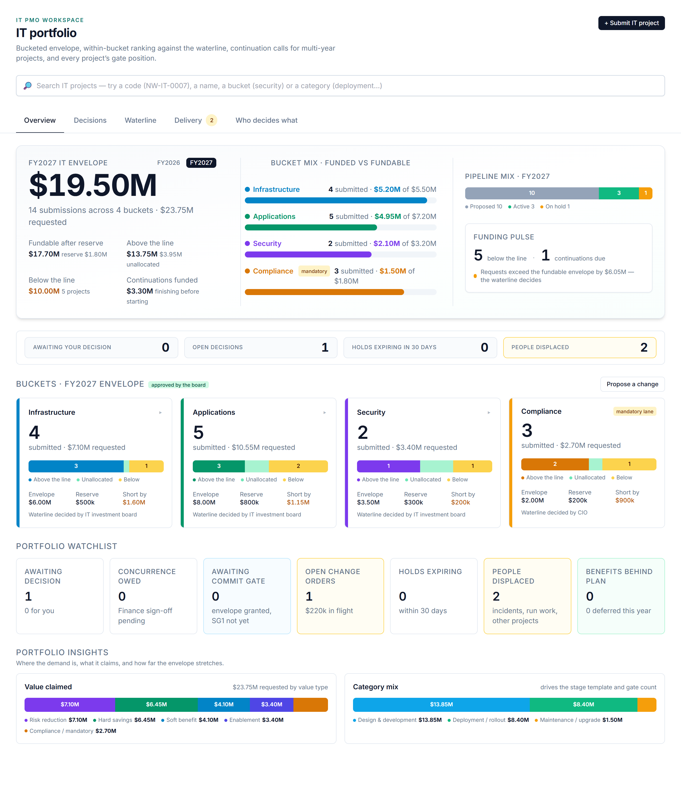
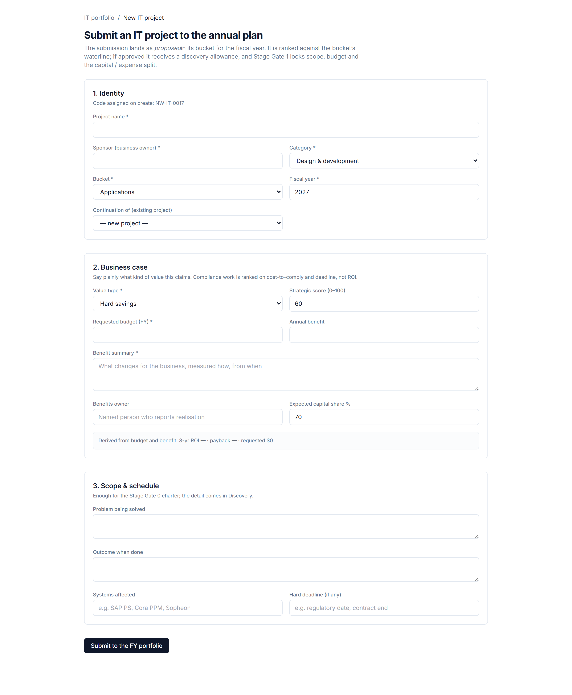
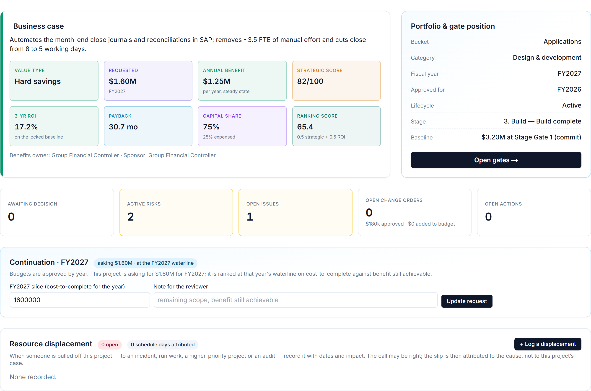

# The IT Workspace, Role by Role

## Two pages and a form

The IT workspace is deliberately small: one **portfolio page** for the annual cycle, one **project page** per project for its delivery, and one **intake form** for getting a new idea into the system. Everything else — the assistant, search, reports, the header's *For you* pill — is the platform you already know. This chapter walks the three surfaces and then describes a week in the life of each of the six IT roles.

## The IT portfolio page

The page opens on the current planning year and is organised as tabs, each with a badge when something inside it needs a decision.

**Overview.** A hero shows the fiscal-year **IT envelope**: the total, what is *fundable after reserve*, what is *above the line* and what remains *unallocated*, with one card per bucket showing its allocation, reserve, the requests against it, and whether requests exceed the fundable amount (*the waterline decides*) or everything fits. Below it a ribbon counts the seven things that need attention — awaiting decision (and how many are for you), concurrence owed, awaiting the commit gate, open change orders and the money in flight, holds expiring within thirty days, people displaced, and benefits behind plan — each a link into the tab that resolves it. The lifecycle mix (proposed, approved, active, on hold, deferred) and the value-type and category mix round out the picture.

**Decisions.** Every open decision record, **yours first**. Each card shows what is being decided — the project, its lifecycle state, the amount, and for a waterline the rows above and below the line — the body it is routed to and the rule that routed it, and who has concurred so far. If it is yours, the card says *You are deciding* and offers the actions your seat allows.

**Waterline.** The ranking within each bucket for the planning year, with the cumulative amount running down to the line, the *first below* and the shortfall. Continuations are marked, parked projects sit at the bottom outside the count, and the mandatory lane is ranked on payback. **Submit waterline — fund N above, defer M below** turns it into a decision record; the *Waterline* tab's badge shows how many waterline and continuation records are still open.

**Delivery.** The running projects with their gate position — which stage, whether committed, whether on hold and until when — then the **holds** with their time boxes and the **displacement** register. The badge counts holds expiring soon plus people currently displaced.

**Who decides what.** The delegation-of-authority matrix and the bodies with their members and quorum, exactly as the previous chapter describes them, so a user can check the rule before raising a request.

## The intake form

New IT projects enter through **Intake → IT**: a single form with the business case fields listed in the funding-clock chapter. It is intentionally a form and not a conversation — the sponsor knows the numbers, and the workspace's job is to record them faithfully and compute ROI and payback. The intelligence comes afterwards, when the **Business Case Reviewer** challenges what was entered. On submission the project is created as *proposed* in its bucket and year, with the stage template for its category attached and its first gate ready.

## The IT project page

The project page is the revenue project workspace with the money tabs swapped for the IT ones. A revenue project shows *Earned value*, *Cost*, *Changes & trends* and *Variance*; an IT project shows **Gates** and **Change orders** instead, and keeps *Structure*, *Schedule*, *Resources*, *Risks & issues* and *Planning* unchanged. The Overview is IT-specific:

- **Business case** — value type, requested budget, annual benefit, the live three-year ROI and payback, strategic score, capital share, benefits owner.
- **Portfolio & gate position** — bucket, fiscal years approved, lifecycle state, current stage and gate, the current approved budget and its contingency, and a personalised tile telling *you* what is yours to do on this project.
- **Continuation request** — for a running project, the plain form that asks for next year's slice; the page says which years are already approved and whether this year's request has been made.
- **Displacement log** — who was pulled away, why, from when, and the schedule days attributed.
- **Benefits** — after closure, the realised benefit by period against the plan, recorded by the benefits owner.

The **Gates** tab is the delivery clock made visible: the stage rail with done, current and to-do stages, the current gate's exit criteria as tick-boxes, the Go / Hold / Recycle / Cancel controls with their rules enforced, the history of every gate decision, and — at the commit gate — the routing of the baseline for decision. The **Change orders** tab lists every change with its funding source, routing and state, and offers *Raise a change order* to writing roles.

A guided setup checklist that helps a new revenue project get its charter and WBS in place is hidden on committed IT projects that have not used the planning artefacts, so the page stays about gates and money.

## Forms where data is captured, the assistant where it reasons

A principle runs through the whole workspace. **Plain forms** are used for anything that is simply data — a continuation request, a displacement, a benefits report, a change order's details. The **Ask AI Assistant** is used where a judgement is needed — is this business case honest, where should the waterline fall, is the gate package ready, should this project be funded next year. The assistant knows which IT project you are on, offers IT-specific starter prompts, and can record IT entries when you ask it to; but nobody is made to talk to a chatbot to type a date.

## Six roles, one week

The IT roles are seeded with demonstration users so that each can be tried. Every one of them sees IT projects only, and every one has *write* access to the parts of the workspace their seat owns.

**IT portfolio manager** (the PMO). Runs the annual cycle. Monday: reviews new intakes and asks the Business Case Reviewer to challenge each. Wednesday: runs the Waterline Ranker across the planning year, adjusts strategic scores with the bucket owners, and *submits the waterline* for each bucket. Through the year: raises continuation records for running projects, records holds and cancellations the bodies have decided, watches the ribbon for holds expiring and people displaced, and keeps the matrix and memberships current. Proposes everything; decides nothing — the seat is non-voting.

**IT project manager.** Delivers through the gates. Prepares the Stage Gate 1 package — asks the Gate Reviewer to assemble and score it — ticks the exit criteria and submits the baseline. Runs to the locked baseline; raises change orders with an honest funding source; logs displacements when people are pulled away; requests next year's slice before the waterline; closes with AuC settled and lessons recorded.

**Project sponsor.** Owns the benefit. Writes the business case at intake and defends it when the reviewer challenges it. Decides what is theirs: change orders inside the project's own contingency, and hold requests before commit. Chairs the later gates. Cannot approve their own funding, and the workspace will not let them.

**Bucket owner.** Accountable for one bucket. Ranks within it, argues the shortfall with the CIO, and approves within delegation — small waterlines, commits and reserve draws, post-commit holds, pre-commit cancellations. Sits on the investment board for everything larger.

**IT investment board member.** The CIO chairs the board and also holds the mid-band authority alone; the Finance controller and bucket owners are members. The board owns the envelope split, the waterline above the CIO threshold, large continuations and commits, post-commit cancellations and displacing change orders. Decisions are recorded with attendees, and an approval below quorum is refused.

**IT finance partner.** Concurs, never approves. Validates business-case numbers before ranking, must concur on the capital / expense split before any commit-gate Go, on the numbers behind any continuation, and on AuC settlement before a post-commit cancellation. Sees *Concurrence owed* on the ribbon and *concur as Finance* on the card.

> **Three surfaces, six seats, one rule.** The portfolio page runs the year, the project page runs the delivery, the intake form starts it all — and every seat sees what is mandatory for it without asking.
