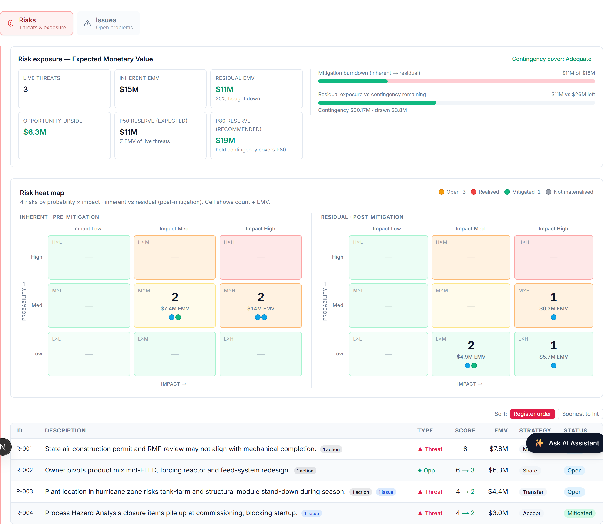
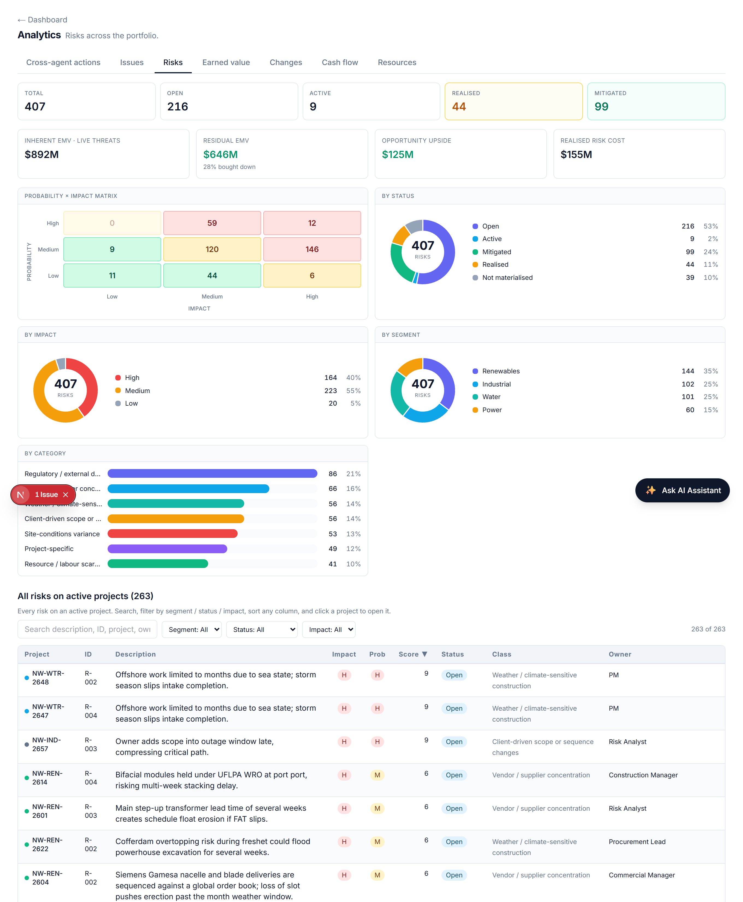

# Risk: Expected Value, Residual Exposure & Contingency

## Putting a number on uncertainty — and checking the buffer covers it

*Business Edition · Chapter A11 — pairs with the Technical Edition's risk-emv library*

## The question this answers

A risk register that only says "high / medium / low" cannot answer the question a
finance director actually asks: *how much money is this project's risk worth, has
our mitigation actually bought it down, and is our contingency enough to cover
what's left?* A11 makes risk quantitative and connects it to the contingency
buffer.

## Expected Monetary Value

The basic unit is **Expected Monetary Value (EMV)** — *probability × impact*. A
threat with a 30% chance of a $10M overrun carries an EMV of $3M. Summing EMV
across the register turns a list of worries into a single, comparable number: the
risk-weighted cost the project is carrying. Opportunities (favourable risks) carry
a positive EMV — potential upside — and are tracked separately from threats.

## Inherent versus residual: did mitigation work?

The same risk has two EMVs:

- **Inherent EMV** — *before* mitigation: the raw probability × impact.
- **Residual EMV** — *after* mitigation: the reduced probability (and/or impact)
  once the agreed actions are in place.

The gap between them is the **reduction** — *(inherent − residual) ÷ inherent* —
and it is the single most useful management number in the chapter, because it
quantifies what mitigation has actually achieved. A register where inherent and
residual are equal is a register where nothing has been *done*; a large reduction
is mitigation earning its keep. AI PMO rolls this up to a portfolio exposure:
total inherent, total residual, and the percentage bought down.

Only *live* risks — open or actively managed — count toward residual exposure;
risks that have not materialised carry no remaining exposure, and ones that *have*
materialised have become issues or realised cost (see A12).

## Is the contingency enough?

Quantified residual exposure lets AI PMO do what a colour-coded register cannot:
test the **adequacy of contingency.** Coverage is *remaining contingency ÷
residual exposure*, and it sorts projects into bands — **Adequate**, **Tight**,
**Exposed** — so a portfolio lead can see at a glance which projects are
under-buffered for the risk they still carry.

This is where **P50 / P80** thinking enters. Rather than buffering against the
single worst case, contingency is sized against a confidence level on the
aggregate risk distribution — enough to cover outcomes 50% (or 80%) of the time.
Residual EMV is the expected (P50-ish) draw; the buffer should sit comfortably
above it for the confidence the business wants. AI PMO surfaces the comparison so
the buffer is a calculated position, not a round-number guess.

## Why this matters

Three things a qualitative register can't give you, all here: a **portfolio risk
price** you can compare and trend, **evidence that mitigation is working** (the
buy-down), and an **early warning when the buffer is thin** for the exposure that
remains. Risk stops being a compliance artefact and becomes a number that
participates in the cost and contingency conversation.

## A worked example

Illustratively, a project's register:

- **Inherent EMV: $14M** — raw risk-weighted exposure.
- **Residual EMV: $9M** — after mitigation; a **36% reduction** — mitigation is
  working but $9M of live exposure remains.
- **Remaining contingency: $7M** → **coverage 0.78 → "Tight."** The buffer is
  below the residual exposure; the project is under-provisioned for an 80%
  confidence and should either draw down risk further or top up contingency.

## How AI PMO implements it

Synthesis over the risk register. AI PMO computes EMV per risk, separates threats
from opportunities and live from closed, rolls inherent and residual exposure to
the project and portfolio, derives the reduction percentage, and tests contingency
coverage into the adequacy bands. It reads the register; it does not run the risk
workshop.

## What it does not do

It does not assign probabilities or impacts (that's the team's judgement), run a
Monte Carlo simulation engine (a specialist tool's job — AI PMO consumes a P80 if
one exists), or set contingency policy. It prices, buys-down, and tests what the
register and the buffer already contain.

---

*Cross-reference: implemented in the Technical Edition's risk-emv library
(EMV per risk; inherent→residual reduction; live-threat exposure; contingency
coverage = remaining ÷ residual exposure → Adequate/Tight/Exposed). Connects to
A12 (a materialised risk becomes an issue) and the cost/contingency view.*
