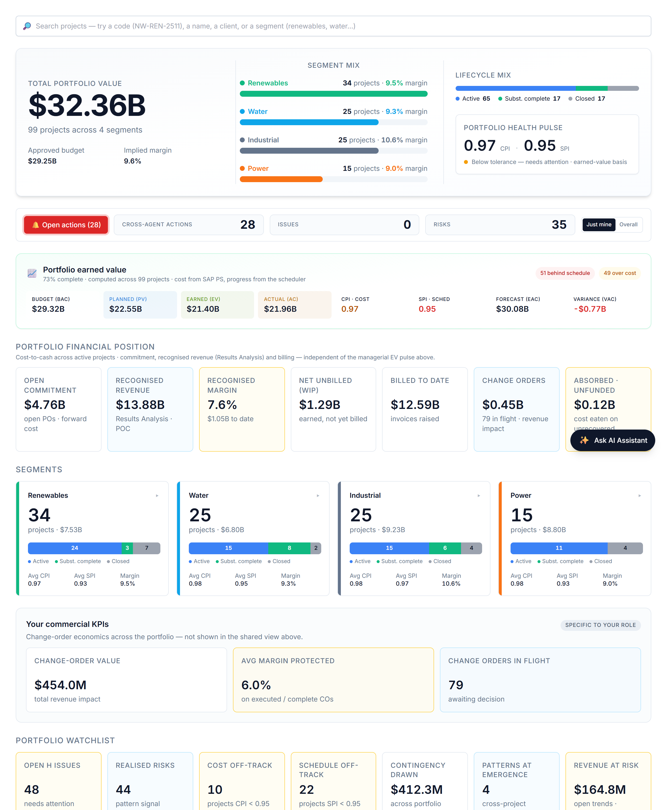

# Your dashboard

When you sign in you land on a view weighted to your role. You can read everything you have access to, and act through the assistant.

# Your AI agents

You interact with everything through one place — the **Ask AI Assistant** (bottom-right). It auto-routes your request to the right specialist; you can override with the agent dropdown. These are the agents your role can call:

| Agent | What it does | Try asking |
|---|---|---|
| **Change Order Reviewer** | Raises change/trend entries and reviews a CO four ways. | "Review the open change orders — which threaten margin?" |
| **Variance Analyst** | CPI/SPI, cost & schedule variance, contingency, projected margin. | "Summarise the variance position and flag concerns." |
| **Cost Controller** | Commitment, cost-to-date, cost by element, earned-vs-billed. | "Give me the cost and commitment position." |

# What you can do — and where

Your write actions, and the context each one needs:

| Action | Allowed | Where |
|---|:---:|---|
| Raise a risk | — | On a project page |
| Log an issue | — | On a project page |
| Raise a change / trend entry | ✓ | On a project page |
| Assign a task | ✓ | Project page or portfolio dashboard |
| Ask / analyse | ✓ | Project (this project) or portfolio (across projects) |

Risk, issue and change entries always attach to a **project**, so those actions appear only when you are inside one. Assigning a task and asking for analysis work on the **portfolio dashboard** too — the analysis just widens to the whole portfolio. Everything you create is tagged **agent-raised** and you confirm it before it is saved — risks and issues live in AI PMO’s own register; a change order stays provisional until it is booked into SAP PS.

# Indicative prompts

The assistant shows role-aware starter chips when the chat is empty; these are the kinds of things to type.

## Create / update / assign

- "Add a change/trend entry: client-directed scope addition, recoverable."
- "Assign a task to Procurement: confirm vendor lead times for the change — high urgency."

## Ask the agent

- "Review CO-U01 — is margin protected, and what approval routing do you recommend?"
- "Which change orders are dilutive to margin, and why?"
- "Summarise the change book: net margin add, absorbed cost, and revenue at risk."
- "Give me the cost and commitment position — cost-to-date, open commitment, net unbilled."
- "At the latest reporting week, is projected margin holding?"

# A worked example

Type *"add a change/trend entry: client-directed switchyard addition"* → confirm. Then *"review the open change orders — which threaten margin?"* to get the four-frame read and approval routing.

# Tips & hand-offs

Vendor risk → **Procurement**; sponsor sign-off items → the **VP Sponsor**.

> Every entry you raise and every task you assign is drafted by the agent and **confirmed by you** before it is saved — nothing is written silently. Risks and issues you raise live in AI PMO’s own register; a change order stays provisional until it is booked into SAP PS.
