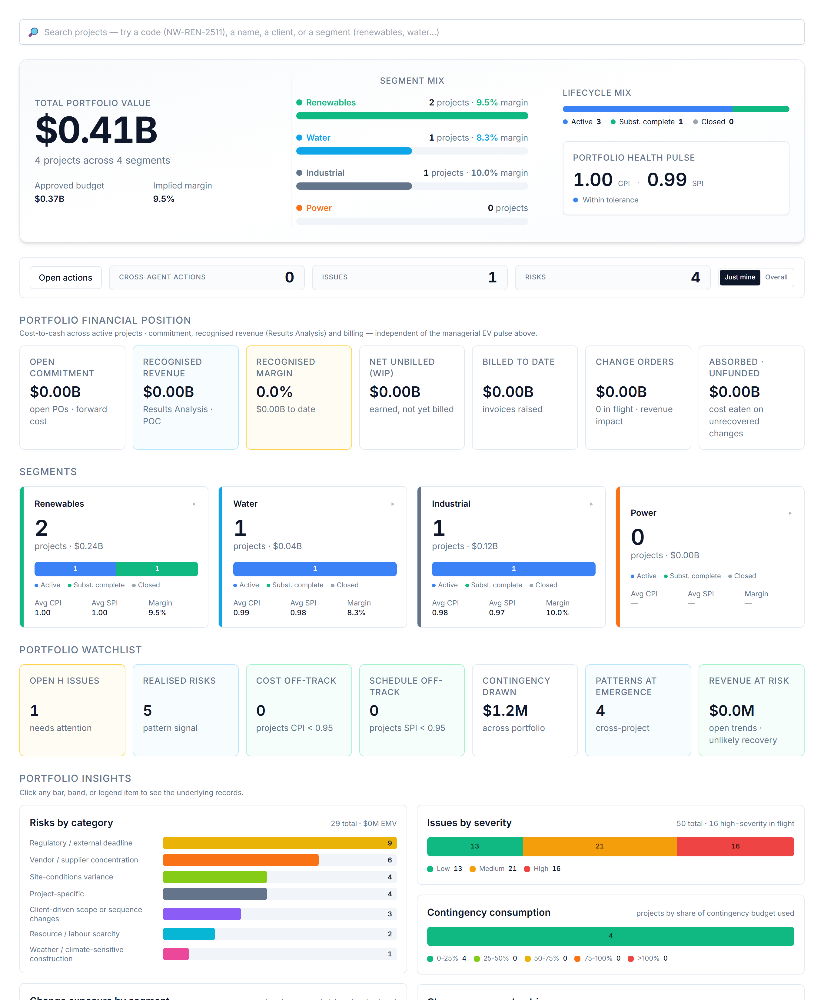

# Your dashboard

When you sign in you land on a view weighted to your role. You can read everything you have access to, and act through the assistant.

# Your AI agents

You interact with everything through one place — the **Ask AI Assistant** (bottom-right). It auto-routes your request to the right specialist; you can override with the agent dropdown. These are the agents your role can call:

| Agent | What it does | Try asking |
|---|---|---|
| **Charter Drafter** | Drafts the project charter — scope, milestones, governance. | "Draft the charter for this project." |
| **Stakeholder Analyst** | Builds the stakeholder register and engagement approach. | "Build the stakeholder register." |
| **WBS Builder** | Breaks scope into a deliverable WBS (Level 1–3). | "Build the WBS to Level 1–3." |
| **Risk Analyst** | Raises risks and keeps the project risk register current. | "What are the top risks to watch, and why?" |

# What you can do — and where

Your write actions, and the context each one needs:

| Action | Allowed | Where |
|---|:---:|---|
| Raise a risk | ✓ | On a project page |
| Log an issue | — | On a project page |
| Raise a change / trend entry | — | On a project page |
| Assign a task | ✓ | Project page or portfolio dashboard |
| Ask / analyse | ✓ | Project (this project) or portfolio (across projects) |

Risk, issue and change entries always attach to a **project**, so those actions appear only when you are inside one. Assigning a task and asking for analysis work on the **portfolio dashboard** too — the analysis just widens to the whole portfolio. Everything you create is tagged **agent-raised** and you confirm it before it is saved — risks and issues live in AI PMO’s own register; a change order stays provisional until it is booked into SAP PS.

# Indicative prompts

The assistant shows role-aware starter chips when the chat is empty; these are the kinds of things to type.

## Create / update / assign

- "Log a risk: an interface gap between two packages threatens the install sequence."
- "Assign a task to Construction: confirm the install sequence for WBS 1.4 — medium urgency."

## Ask the agent

- "Draft the charter for this project from the intake data."
- "Build the WBS to Level 1–3."
- "Build the stakeholder register and engagement approach."
- "What are the top engineering risks to watch?"

# A worked example

Type *"build the WBS to Level 1–3"* — the WBS Builder proposes a deliverable-oriented breakdown you can review and book. If a technical interface looks risky, type *"log a risk: interface gap between the GSU and the switchyard scope"* and confirm.

# Tips & hand-offs

Field execution issues → **Construction Manager**; cost loading of the WBS → **Project Controls**.

> Every entry you raise and every task you assign is drafted by the agent and **confirmed by you** before it is saved — nothing is written silently. Risks and issues you raise live in AI PMO’s own register; a change order stays provisional until it is booked into SAP PS.
