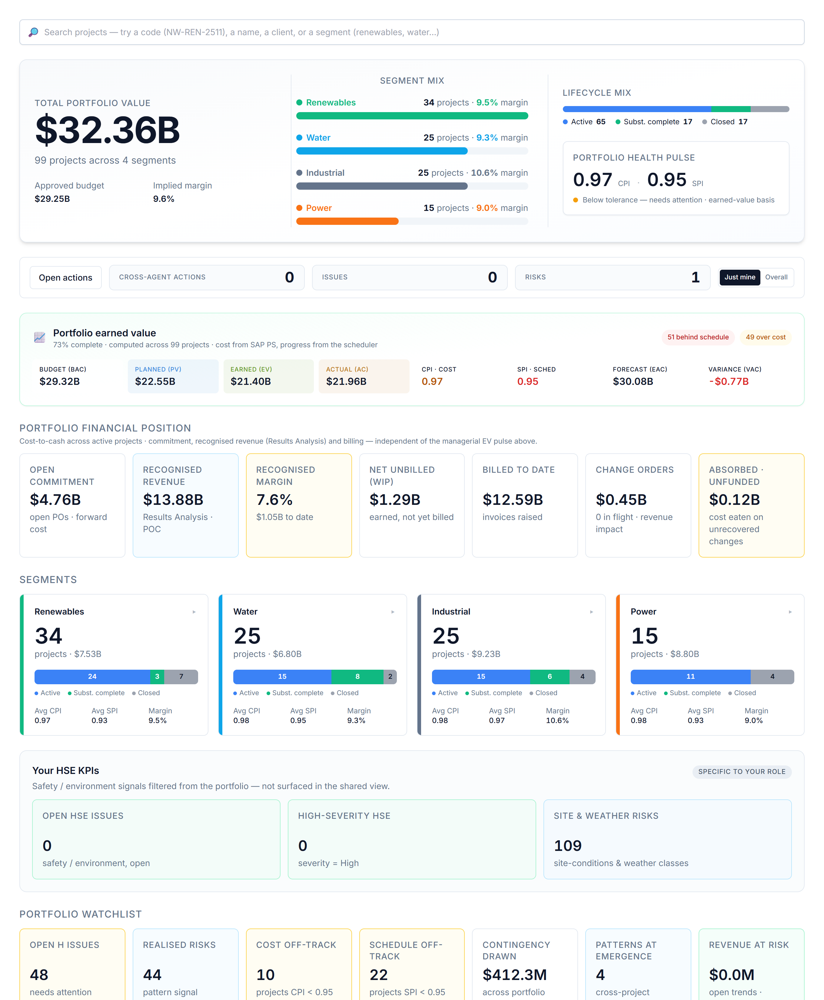

# Your dashboard

When you sign in you land on a view weighted to your role. You can read everything you have access to, and act through the assistant.

# Your AI agents

You interact with everything through one place — the **Ask AI Assistant** (bottom-right). It auto-routes your request to the right specialist; you can override with the agent dropdown. These are the agents your role can call:

| Agent | What it does | Try asking |
|---|---|---|
| **Issue Logger** | Raises issues and triages the log (severity, age, ownership). | "Summarise the open issues; flag overdue high-severity ones." |
| **Portfolio Risk Reviewer** | Spots risk patterns that span multiple projects. | "Where is cross-cutting risk emerging across the portfolio?" |

# What you can do — and where

Your write actions, and the context each one needs:

| Action | Allowed | Where |
|---|:---:|---|
| Raise a risk | — | On a project page |
| Log an issue | ✓ | On a project page |
| Raise a change / trend entry | — | On a project page |
| Assign a task | ✓ | Project page or portfolio dashboard |
| Ask / analyse | ✓ | Project (this project) or portfolio (across projects) |

Risk, issue and change entries always attach to a **project**, so those actions appear only when you are inside one. Assigning a task and asking for analysis work on the **portfolio dashboard** too — the analysis just widens to the whole portfolio. Everything you create is tagged **agent-raised** and you confirm it before it is saved — risks and issues live in AI PMO’s own register; a change order stays provisional until it is booked into SAP PS.

# Indicative prompts

The assistant shows role-aware starter chips when the chat is empty; these are the kinds of things to type.

## Create / update / assign

- "Log an issue: a near-miss during a heavy lift requires a stand-down and review."
- "Assign a task to Construction: stand down and re-inspect the lift plan — high urgency."

## Ask the agent

- "Summarise the open HSE issues; flag the overdue high-severity ones."
- "Across the portfolio, where are HSE patterns emerging (vendor, site-conditions, weather)?"

# A worked example

Type *"log an issue: near-miss on a heavy lift — crane availability and rigging plan in question."* Confirm to file it (I-A01), then *"assign a task to Construction: stand down and re-inspect the lift plan — high urgency."*

# Tips & hand-offs

Cross-cutting safety patterns are best escalated to the **PM** or **Program Manager** for portfolio action.

> Every entry you raise and every task you assign is drafted by the agent and **confirmed by you** before it is saved — nothing is written silently. Risks and issues you raise live in AI PMO’s own register; a change order stays provisional until it is booked into SAP PS.
