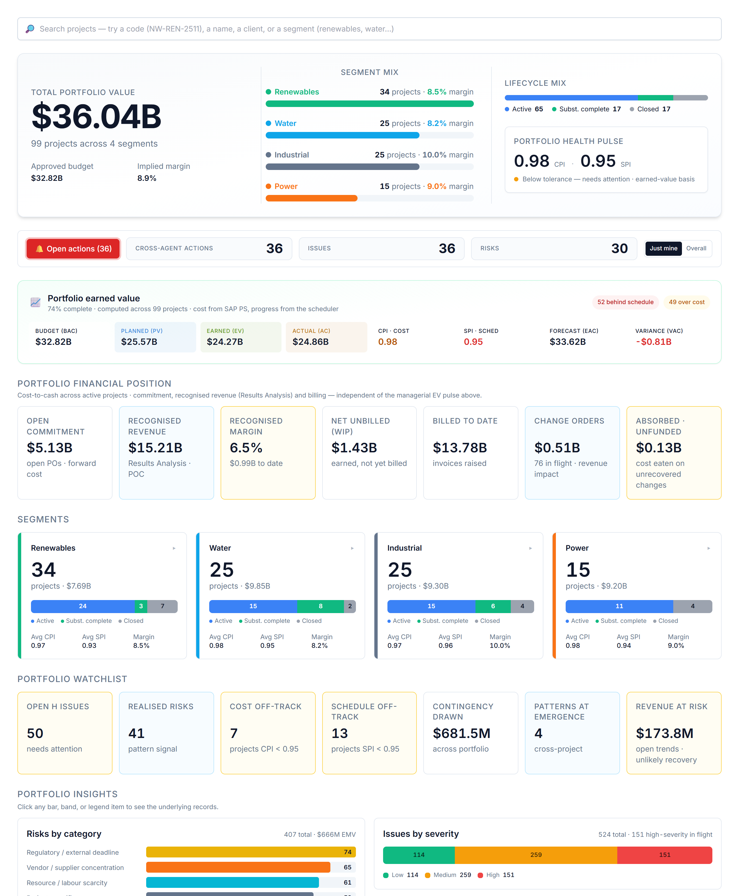

# Your dashboard

When you sign in you land on a view weighted to your role. You can read everything you have access to, and act through the assistant.

# Your AI agents

You interact with everything through one place — the **Ask AI Assistant** (bottom-right). It auto-routes your request to the right specialist; you can override with the agent dropdown. These are the agents your role can call:

| Agent | What it does | Try asking |
|---|---|---|
| **Risk Analyst** | Raises risks and keeps the project risk register current. | "What are the top risks to watch, and why?" |
| **Variance Analyst** | CPI/SPI, cost & schedule variance, contingency, projected margin. | "Summarise the variance position and flag concerns." |
| **Change Order Reviewer** | Raises change/trend entries and reviews a CO four ways. | "Review the open change orders — which threaten margin?" |
| **Portfolio Risk Reviewer** | Spots risk patterns that span multiple projects. | "Where is cross-cutting risk emerging across the portfolio?" |

# What you can do — and where

Your write actions, and the context each one needs:

| Action | Allowed | Where |
|---|:---:|---|
| Raise a risk | ✓ | On a project page |
| Log an issue | — | On a project page |
| Raise a change / trend entry | ✓ | On a project page |
| Assign a task | ✓ | Project page or portfolio dashboard |
| Ask / analyse | ✓ | Project (this project) or portfolio (across projects) |

Risk, issue and change entries always attach to a **project**, so those actions appear only when you are inside one. Assigning a task and asking for analysis work on the **portfolio dashboard** too — the analysis just widens to the whole portfolio. Everything you create is tagged **agent-raised** and you confirm it before it is saved — risks and issues live in AI PMO’s own register; a change order stays provisional until it is booked into SAP PS.

# Indicative prompts

The assistant shows role-aware starter chips when the chat is empty; these are the kinds of things to type.

## Create / update / assign

- "Log a risk: sole-source vendor may slip delivery by ~6 weeks."
- "Add a change/trend entry: supplier escalation passed through on bulks."
- "Assign a task to the Commercial Manager: confirm the pass-through clause — medium urgency."

## Ask the agent

- "Across the portfolio, which vendor categories appear in the most realised risks?"
- "Review the open change orders — which are procurement-driven and threaten margin?"
- "Summarise the variance attributable to procurement scope."

# A worked example

Type *"log a risk: sole-source transformer vendor may slip six weeks"* → confirm → R-A01. If the slip triggers a priced recovery, type *"add a change/trend entry: expedite premium for the transformer"* and confirm.

# Tips & hand-offs

Contractual terms and margin protection → **Commercial Manager**; the issue log → the **Risk Analyst** or **PM**.

> Every entry you raise and every task you assign is drafted by the agent and **confirmed by you** before it is saved — nothing is written silently. Risks and issues you raise live in AI PMO’s own register; a change order stays provisional until it is booked into SAP PS.
