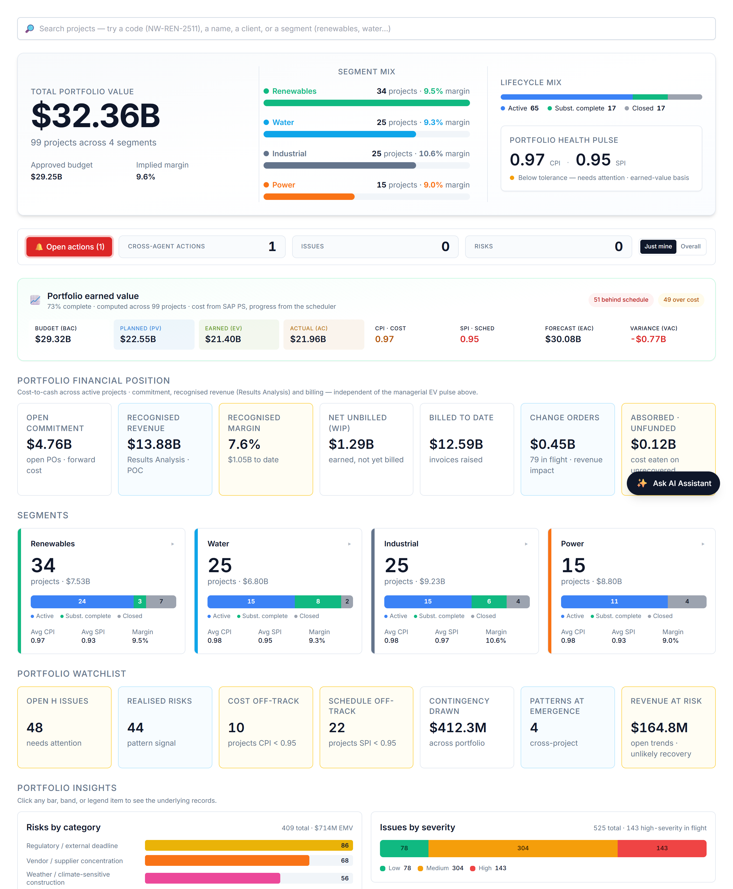

# Your dashboard

When you sign in you land on a view weighted to your role. You can read everything you have access to, and act through the assistant.

# Your AI agents

You interact with everything through one place — the **Ask AI Assistant** (bottom-right). It auto-routes your request to the right specialist; you can override with the agent dropdown. These are the agents your role can call:

| Agent | What it does | Try asking |
|---|---|---|
| **Stakeholder Analyst** | Builds the stakeholder register and engagement approach. | "Build the stakeholder register." |
| **Schedule Reasoner** | Reasons about the critical path, float and sequencing risk. | "What's the critical path, and what's most at risk?" |
| **Cost Planner** | Allocates an approved or quoted cost total across the cost categories and time-phases it. | "Allocate the approved budget across the major cost categories." |
| **Communications Planner** | Builds the communications plan. | "Build the comms plan." |
| **Issue Logger** | Raises issues and triages the log (severity, age, ownership). | "Summarise the open issues; flag overdue high-severity ones." |
| **Variance Analyst** | CPI/SPI, cost & schedule variance, contingency, projected margin. | "Summarise the variance position and flag concerns." |
| **Change Order Reviewer** | Raises change/trend entries and reviews a CO four ways. | "Review the open change orders — which threaten margin?" |
| **Risk Analyst** | Raises risks and keeps the project risk register current. | "What are the top risks to watch, and why?" |
| **Portfolio Risk Reviewer** | Spots risk patterns that span multiple projects. | "Where is cross-cutting risk emerging across the portfolio?" |
| **Closeout Reporter** | Drafts the closeout report against baseline. | "Draft the closeout executive summary." |
| **Status Reporter** | Writes the one-page weekly status, tailored to the reader. | "Write this week's status report for the sponsor." |
| **Cost Controller** | Commitment, cost-to-date, cost by element, earned-vs-billed. | "Give me the cost and commitment position." |

# What you can do — and where

Your write actions, and the context each one needs:

| Action | Allowed | Where |
|---|:---:|---|
| Raise a risk | ✓ | On a project page |
| Log an issue | ✓ | On a project page |
| Raise a change / trend entry | ✓ | On a project page |
| Assign a task | ✓ | Project page or portfolio dashboard |
| Ask / analyse | ✓ | Project (this project) or portfolio (across projects) |

Risk, issue and change entries always attach to a **project**, so those actions appear only when you are inside one. Assigning a task and asking for analysis work on the **portfolio dashboard** too — the analysis just widens to the whole portfolio. Everything you create is tagged **agent-raised** and you confirm it before it is saved — risks and issues live in AI PMO’s own register; a change order stays provisional until it is booked into SAP PS.

# Indicative prompts

The assistant shows role-aware starter chips when the chat is empty; these are the kinds of things to type.

## Create / update / assign

- "Log a risk: shared transmission-owner dependency threatens two projects."
- "Log an issue: a permit slip is blocking back-feed on the lead project."
- "Add a change/trend entry: client resequencing across the programme."
- "Assign a task to Construction: confirm the revised lift plan — medium urgency."

## Ask the agent

- "Which of the programme’s projects need attention this week, and why?"
- "Summarise the variance position across the programme."
- "Write this week's status report for the sponsor."
- "Where is cross-cutting risk emerging across my projects?"

# A worked example

On a project page, type *"log an issue: the transmission-owner network upgrade slipped, deferring back-feed."* Confirm the card to file it, then *"assign a task to Project Controls: re-baseline the back-feed milestone — high urgency."*

# Tips & hand-offs

Hand Charter and WBS authoring to the **Engineering Manager**; route commercial change reviews to the **Commercial Manager**.

> Every entry you raise and every task you assign is drafted by the agent and **confirmed by you** before it is saved — nothing is written silently. Risks and issues you raise live in AI PMO’s own register; a change order stays provisional until it is booked into SAP PS.
