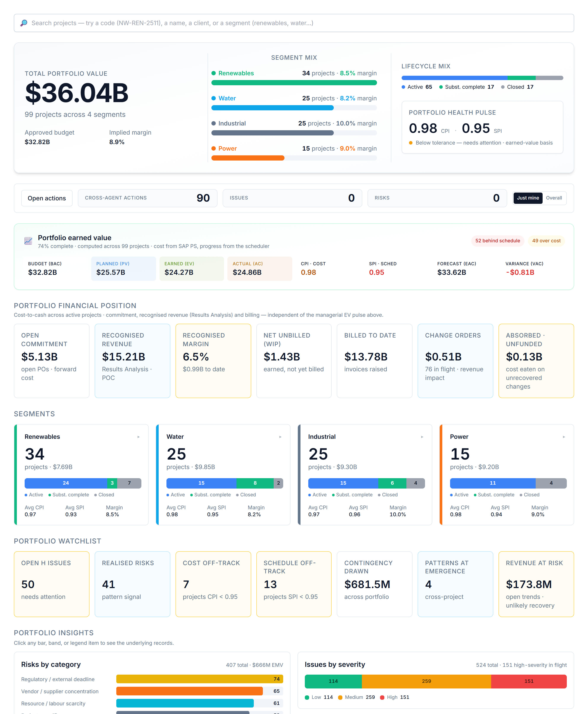

# Your dashboard

When you sign in you land on a view weighted to your role. You can read everything you have access to, and act through the assistant.

# Your AI agents

You interact with everything through one place — the **Ask AI Assistant** (bottom-right). It auto-routes your request to the right specialist; you can override with the agent dropdown. These are the agents your role can call:

| Agent | What it does | Try asking |
|---|---|---|
| **Variance Analyst** | CPI/SPI, cost & schedule variance, contingency, projected margin. | "Summarise the variance position and flag concerns." |
| **Schedule Reasoner** | Reasons about the critical path, float and sequencing risk. | "What's the critical path, and what's most at risk?" |
| **Budget Builder** | Allocates budget across the cost categories. | "Build the cost breakdown structure." |
| **Cost Controller** | Commitment, cost-to-date, cost by element, earned-vs-billed. | "Give me the cost and commitment position." |

# What you can do — and where

Your write actions, and the context each one needs:

| Action | Allowed | Where |
|---|:---:|---|
| Raise a risk | — | On a project page |
| Log an issue | — | On a project page |
| Raise a change / trend entry | — | On a project page |
| Assign a task | ✓ | Project page or portfolio dashboard |
| Ask / analyse | ✓ | Project (this project) or portfolio (across projects) |

Risk, issue and change entries always attach to a **project**, so those actions appear only when you are inside one. Assigning a task and asking for analysis work on the **portfolio dashboard** too — the analysis just widens to the whole portfolio. Everything you create is tagged **agent-raised** and you confirm it before it is saved — risks and issues live in AI PMO’s own register; a change order stays provisional until it is booked into SAP PS.

# Indicative prompts

The assistant shows role-aware starter chips when the chat is empty; these are the kinds of things to type.

## Create / update / assign

- "Assign a task to the PM: confirm the revised back-feed baseline — medium urgency."
- "Assign a task to Procurement: chase the open commitment on long-lead items — medium urgency."

## Ask the agent

- "Summarise the variance position and flag any threshold breaches."
- "What's the critical path, and which deliverables carry the most schedule risk?"
- "Give me the cost and commitment position — cost-to-date and open commitment."
- "Build the cost breakdown structure for this project."

# A worked example

Type *"summarise the variance position and flag concerns."* If CPI is sliding, raise the follow-up by delegation: *"assign a task to the PM: review the recovery plan for the back-feed milestone — high urgency."*

# Tips & hand-offs

You don’t own the registers — to get a risk or issue raised, **assign the task to the owning role** (Risk Analyst, Construction Manager) and they raise it.

> Every entry you raise and every task you assign is drafted by the agent and **confirmed by you** before it is saved — nothing is written silently. Risks and issues you raise live in AI PMO’s own register; a change order stays provisional until it is booked into SAP PS.
