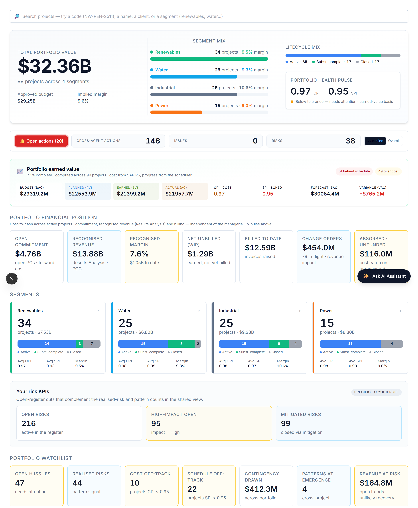

# Your dashboard

When you sign in you land on a view weighted to your role. You can read everything you have access to, and act through the assistant.

# Your AI agents

You interact with everything through one place — the **Ask AI Assistant** (bottom-right). It auto-routes your request to the right specialist; you can override with the agent dropdown. These are the agents your role can call:

| Agent | What it does | Try asking |
|---|---|---|
| **Risk Analyst** | Raises risks and keeps the project risk register current. | "What are the top risks to watch, and why?" |
| **Portfolio Risk Reviewer** | Spots risk patterns that span multiple projects. | "Where is cross-cutting risk emerging across the portfolio?" |
| **Lessons-Learned Synthesiser** | Synthesises lessons worth adopting firm-wide. | "What are the top firm-level lessons here?" |
| **Issue Logger** | Raises issues and triages the log (severity, age, ownership). | "Summarise the open issues; flag overdue high-severity ones." |

# What you can do — and where

Your write actions, and the context each one needs:

| Action | Allowed | Where |
|---|:---:|---|
| Raise a risk | ✓ | On a project page |
| Log an issue | ✓ | On a project page |
| Raise a change / trend entry | — | On a project page |
| Assign a task | ✓ | Project page or portfolio dashboard |
| Ask / analyse | ✓ | Project (this project) or portfolio (across projects) |

Risk, issue and change entries always attach to a **project**, so those actions appear only when you are inside one. Assigning a task and asking for analysis work on the **portfolio dashboard** too — the analysis just widens to the whole portfolio. Everything you create is tagged **agent-raised** and you confirm it before it is saved — risks and issues live in AI PMO’s own register; a change order stays provisional until it is booked into SAP PS.

# Indicative prompts

The assistant shows role-aware starter chips when the chat is empty; these are the kinds of things to type.

## Create / update / assign

- "Log a risk: vendor concentration on the GT/ST OEM slot."
- "Log an issue: a realised risk has now materialised as a live issue."
- "Assign a task to Procurement: secure a framework price for the alternate supplier — high urgency."

## Ask the agent

- "What are the top risks to watch on this project through the warranty tail?"
- "Where is cross-cutting risk emerging across the portfolio?"
- "What are the top firm-level lessons from this project?"
- "Which vendor categories appear in the most realised risks?"

# A worked example

Type *"log a risk: the GSU transformer vendor is fragile — delivery may slip and compress commissioning."* The Risk Analyst drafts it (and often cross-links to related issues); confirm to add R-A01. Then ask *"where is cross-cutting risk emerging across the portfolio?"* to flag it as a pattern candidate.

# Tips & hand-offs

Commercial impact of a risk → **Commercial Manager**; the field response → **Construction Manager**.

> Every entry you raise and every task you assign is drafted by the agent and **confirmed by you** before it is saved — nothing is written silently. Risks and issues you raise live in AI PMO’s own register; a change order stays provisional until it is booked into SAP PS.
