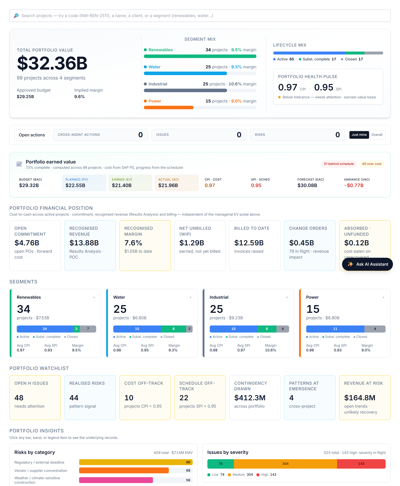

# Your dashboard

When you sign in you land on a view weighted to your role. You have a read-only, executive view across the portfolio.

# Your AI agents

You interact with everything through one place — the **Ask AI Assistant** (bottom-right). It auto-routes your request to the right specialist; you can override with the agent dropdown. These are the agents your role can call:

| Agent | What it does | Try asking |
|---|---|---|
| **Closeout Reporter** | Drafts the closeout report against baseline. | "Draft the closeout executive summary." |
| **Portfolio Risk Reviewer** | Spots risk patterns that span multiple projects. | "Where is cross-cutting risk emerging across the portfolio?" |

# What you can do — and where

Your write actions, and the context each one needs:

| Action | Allowed | Where |
|---|:---:|---|
| Raise a risk | — | On a project page |
| Log an issue | — | On a project page |
| Raise a change / trend entry | — | On a project page |
| Assign a task | — | Project page or portfolio dashboard |
| Ask / analyse | ✓ | Project (this project) or portfolio (across projects) |

Risk, issue and change entries always attach to a **project**, so those actions appear only when you are inside one. Assigning a task and asking for analysis work on the **portfolio dashboard** too — the analysis just widens to the whole portfolio. Everything you create is tagged **agent-raised** and you confirm it before it is saved — risks and issues live in AI PMO’s own register; a change order stays provisional until it is booked into SAP PS.

# Indicative prompts

The assistant shows role-aware starter chips when the chat is empty; these are the kinds of things to type.

## Create / update / assign

_None — this role is read-only and does not create or assign. Use the Ask prompts below._

## Ask the agent

- "Give me a one-page executive briefing on portfolio health — what needs my attention?"
- "Which projects need attention this week, and why?"
- "Where is cross-cutting risk emerging across the portfolio?"
- "Draft the closeout executive summary for this project."

# A worked example

From the portfolio dashboard, type *"give me a one-page executive briefing on portfolio health — what needs my attention?"* The assistant returns an exception-based read; pop it out to keep it beside you while you drill in.

# Tips & hand-offs

Anything that needs an action belongs with the **PM** or **Program Manager** — as Sponsor you direct, they execute.

> Every entry you raise and every task you assign is drafted by the agent and **confirmed by you** before it is saved — nothing is written silently. Risks and issues you raise live in AI PMO’s own register; a change order stays provisional until it is booked into SAP PS.
