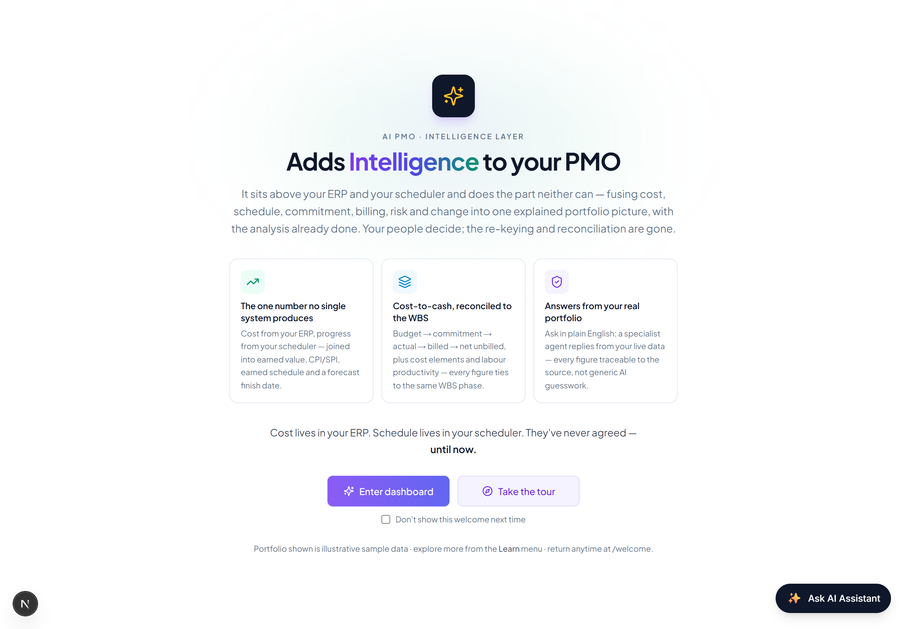

# The Problem AI PMO Solves

## The seam between the cost system and the schedule

*Business Edition · Chapter A1 — the opening chapter*

## Two systems of record, one project

Every large EPC contractor runs its projects on two authoritative systems that do
not talk to each other in the way the work demands.

On one side sits the **ERP — SAP Project System (PS)**: the system of record for
the **commercials** — the WBS, the budget, commitments and purchase orders, actual
cost, billing, and revenue recognition. It knows, to the cent, what the project
has cost and what it is owed.

On the other side sits the **scheduler — Primavera P6 or Microsoft Project**: the
system of record for **time** — the activity network, the logic, the critical
path, and physical progress. It knows when things happen and how far along they
are.

Both are excellent at their jobs. Neither, on its own, can tell you whether the
project is actually *healthy* — because health lives in the **combination**.

## The seam is where the answers live

The questions executives and project controls leads actually ask all sit across
the seam between cost and time:

- *Are we getting value for the money we've spent?* — needs cost (SAP) **and**
  progress (scheduler).
- *What will this finish at, and when?* — needs the cost run-rate **and** the
  schedule trajectory.
- *How much revenue can we book, and how much cash will it tie up?* — needs
  contract and cost **and** billing timing.
- *Is our risk and change exposure eroding the margin we sold?* — needs the
  commercial baseline **and** the live registers.

None of these can be answered inside either system alone. In most organisations
they are answered — slowly, monthly — by an analyst exporting both systems into a
spreadsheet, reconciling them by hand, and writing a narrative. That spreadsheet
*is* the missing layer. It is fragile, late, person-dependent, and invisible to
everyone but its author.

## What AI PMO is

AI PMO is that missing layer, built properly: an **AI-assisted PMO intelligence
layer** that sits across the SAP PS ↔ scheduler seam, joins the two systems on the
WBS code, and **synthesises** the answers — earned value, forecasts, revenue
recognition, cash flow, margin bridges, risk and change exposure — with a
plain-language narrative and recommendations on top.

It does not replace either system of record. It consumes their authoritative data
and produces the decision-grade synthesis neither can produce alone.

## What AI PMO is not

It is not an ERP and not a scheduler. It does not own the cost ledger, run the
critical-path engine, or store transactional truth. The discipline that keeps it
honest — covered in A4 — is that a capability belongs in AI PMO only if it is
**synthesised** from a system of record or **consumed** from a named source. The
moment it would need to *own* transactional data, it has left its lane.

## Why now

Two things make this layer buildable today that weren't a few years ago: the data
in SAP PS and the schedulers is now reliably accessible through modern APIs, and
large language models can turn reconciled numbers into the narrative and
recommendations that used to require a senior analyst. AI PMO is what you get when
you point those two capabilities at the seam that every EPC business already feels
but few have systematised.

The rest of the Business Edition walks the capabilities that layer provides —
starting with the money story (A5–A10), then risk, issues and performance
(A11–A13), how the intelligence is presented (A14–A16), and the justification and
governance that keep it disciplined (A17–A19).
