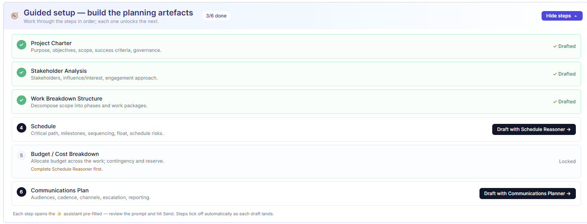

# The Project Workspace

## One page that answers "how is this job?"

Click into any project — from a dashboard drill, an analytics register, or the global search — and you land in the **project workspace**: the single-project counterpart to the portfolio view. Where the dashboard answers *"how is the book?"*, the workspace answers *"how is this one job?"* — through a single tabbed page, colour-coded by capability, with a context-aware agent assistant floating alongside that already knows which project you are looking at.

The tabs follow the project's own logic — structure, then time, then money, then the registers, then the plan.

## Overview — the one-screen verdict

The landing tab leads with what matters: the project's **earned value** (CPI/SPI), a **needs-attention** panel (open risks, high issues, actions awaiting response), the **margin bridge** (as-sold to as-built), and the **schedule envelope** (forecast finish against the contract date). It is the project's health in one view.

## Structure — the WBS

The canonical **work breakdown structure**: the colour-coded WBS tree that is the join key between cost and schedule, with provenance showing which branches are booked to the system of record and which were AI-authored and approved. Risks and issues are shown mapped to their WBS branch.

## Schedule

The project timeline and milestones — the scheduler's contribution, framed as a forecast-versus-contract reconciliation rather than a re-scheduling.

## Earned value

The flagship tab: the **S-curve** (PV/EV/AC), CPI/SPI and earned schedule, **EV by WBS branch** (which branch carries the overrun), and the **forecast-trend** chart with the margin-at-complete band.

## Cost

A single financial tab with four lenses behind a segmented control, telling the money story in order: **Cost-to-date** (where it went, by element and WBS phase), **Commitment** (open POs, committed but not spent), **Revenue recognition** (cost-based POC, WIP and deferred), and **Cash flow** (funding exposure).

## Risks & issues, Changes, Variance

The registers and their synthesis:

- **Risks & issues** — the project risk register (inherent/residual EMV, mitigation) and the issue queue (aging, SLA, priority).
- **Changes** — the change & trend register: pipeline, margin impact, drivers, funded-versus-absorbed and recovery confidence.
- **Variance** — CV/SV, VAC and the TCPI recovery test.

## Planning

The **Planning** tab holds the AI-authored planning artefacts for the project — charter, stakeholder analysis, budget basis, communications plan, and later the lessons learned and closeout report — each editable with provenance, produced by the planning agents. An inner selector switches between them, with a count on each showing how many drafts exist.

## Guided setup — standing up a new project

For a project that has just been created, the question is not *"where are the artefacts?"* but *"in what order do I make them?"* That is what the **guided setup** answers. On a new project — one raised through the intake form, or one still at week zero — the project page opens with a panel headed **Guided setup — build the planning artefacts**: the six planning artefacts as a checklist in dependency order, with a running count of how many are done. On an established project the same panel sits collapsed behind a *Show steps* button, and once all six are drafted its header simply reads *All planning artefacts drafted*.

The order is PMBOK's own planning logic. Each step names the agent that produces it and the artefacts it builds on:

| Step | Artefact | Produced by | Unlocked when |
|---|---|---|---|
| 1 | **Project Charter** — purpose, objectives, scope, success criteria, governance | Charter Drafter | Always available |
| 2 | **Stakeholder Analysis** — stakeholders, influence/interest, engagement approach | Stakeholder Analyst | Charter drafted |
| 3 | **Work Breakdown Structure** — scope decomposed into phases and work packages | WBS Builder | Charter drafted |
| 4 | **Schedule** — critical path, milestones, sequencing, float, schedule risks | Schedule Reasoner | WBS drafted |
| 5 | **Budget / Cost Breakdown** — budget allocated across the work, with contingency and reserve | Cost Planner | WBS and Schedule drafted |
| 6 | **Communications Plan** — audiences, cadence, channels, escalation, reporting | Communications Planner | Stakeholder Analysis drafted |

Each step is in one of four states, and the panel shows which. **Drafted** (a green tick): an artefact of that type already exists for the project. **Ready**: its prerequisites are drafted and your role is allowed to run that agent, so the step carries a *Draft with …* button. **Locked**: a prerequisite is missing, and the step says which one — *Complete Schedule Reasoner first*. And occasionally a step that is ready but not for you: it names the agent a colleague with the right role needs to run.

Pressing *Draft with Schedule Reasoner* does not run anything by itself. It opens the Ask AI Assistant already switched to that specialist and pre-filled with a prompt seeded from the project — its name and code, the instruction to work from the intake data sheet, and a pointer to what has already been drafted (*"based on the WBS already drafted"*). You read the prompt, change what you want, and press **Send**. The human stays in the loop at exactly the point that matters: the instruction.

When the draft lands it is saved as a planning artefact of that type, and the step ticks itself off. The tick is driven by the artefact existing, not by the button having been pressed — so an artefact produced by asking the assistant directly, without the checklist, ticks the step just the same, and a step with no artefact stays open however many times it was attempted. Each artefact appears where it belongs: the charter, stakeholder analysis, budget and communications plan under the **Planning** tab; the WBS on the **Structure** tab, where its AI-authored branches carry provenance and can be reviewed and booked to SAP PS; the schedule narrative alongside the timeline on the **Schedule** tab. All of them are editable, with the AI draft preserved and the human correction recorded. A further run adds another draft alongside the first rather than replacing it.

> **Why it matters.** A new project manager gets the complete planning set in an afternoon, in the right order, each artefact grounded on the ones before it — and the PMO gets charters, WBSs and budgets that are built the same way on every project. The checklist is the agents' *planning* half made into a route rather than a menu.

On the IT side the same panel exists, but it is hidden on committed IT projects that never used it, so that a running IT project's page stays about gates and money (see *The IT Workspace, Role by Role*).

## Why a single workspace

Before AI PMO, answering "how is this project?" meant opening SAP for cost, the scheduler for time, and a stack of spreadsheets for the registers. The workspace collapses that into one navigable page where every tab is the same project seen through a different capability — cost and schedule already reconciled on the WBS, the registers quantified, and an assistant on hand to narrate any of it.

> **The workspace applies the portfolio's logic one level down** — one synthesis, many lenses, no spreadsheet.
